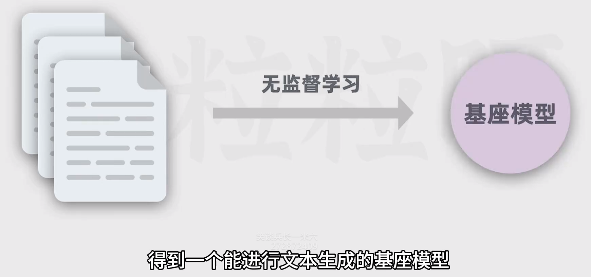
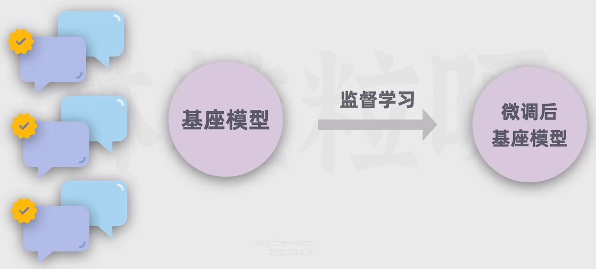
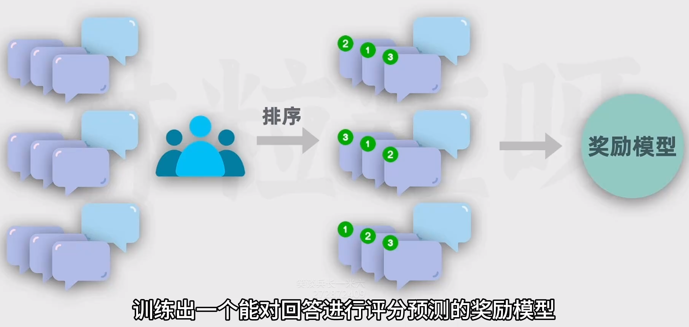
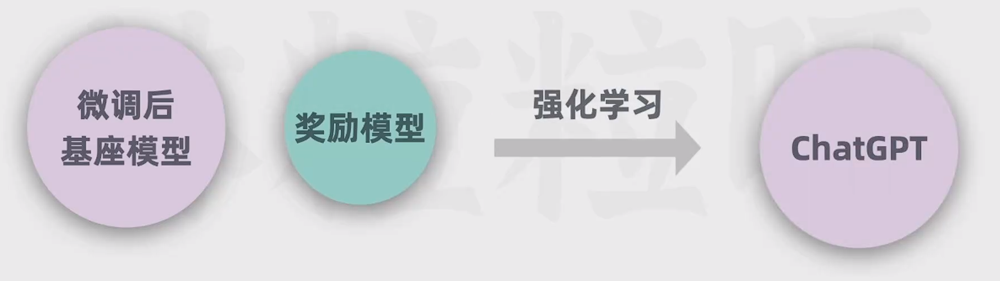
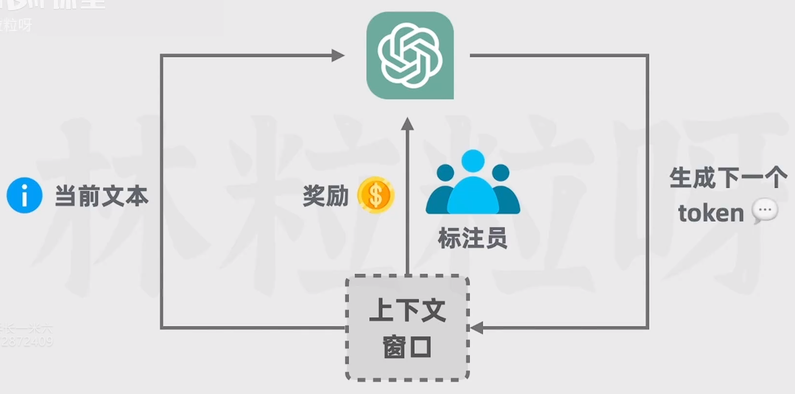
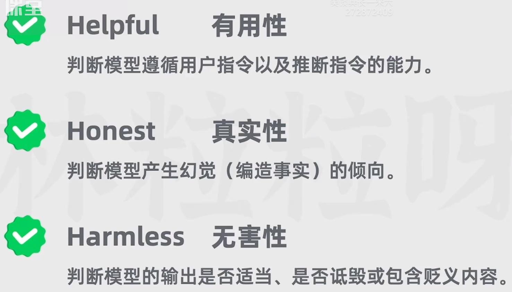
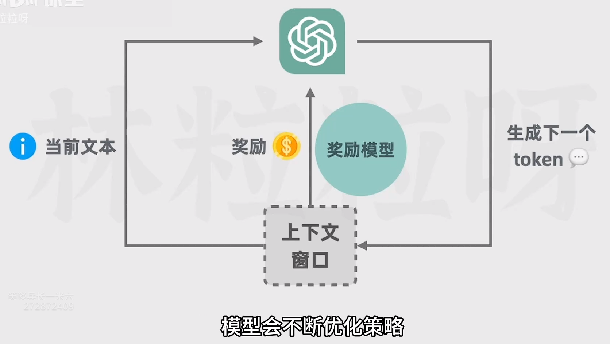

# 训练AI的方式

## 第一步：无监督预训练

基座模型并不等同于ChatGPT背后的对话模型，因为此时模型有预测下一个token的能力，会根据上文补充文本，但不具备对话能力。可能给它一个问题，它会模仿上文继续生成更多类似的问题，但不回答你的问题

## 第二步：监督微调

微调的成本比预训练低很多，因为需要的训练数据的规模更小，训练时常更短。训练结束后会得到一个监督微调模型SFT(Supervised Fine-Tuning)，它会比训练一得到的模型更擅长问题的回答

## 第三步：训练奖励模型+强化学习训练

通过给模型输出结果打分的方式，让模型观察动作和奖惩之间的联系，从而自我优化

打分方式基于3H原则

更为高效的方式可以通过训练一个奖励模型，通过模型给模型打分，提高效率。这个模型是从回答和回答对应的评分里面学习的，得到评分数据的方式是让微调后的SFT模型对问题生成多个回答，让人类标注员对回答质量进行比较排序，有了足够的排序数据，就可以把数据用在奖励模型上了。这样更为高效的训练模型，模型会不断的优化策略，回答的质量会进一步提升

