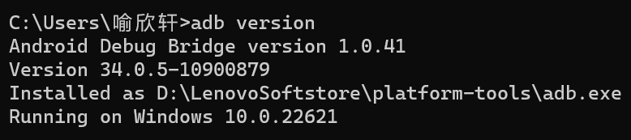

# adb安装

## 下载地址

- Windows版本：https://dl.google.com/android/repository/platform-tools-latest-windows.zip
- Mac版本：https://dl.google.com/android/repository/platform-tools-latest-windows.zip
- Linux版本：https://dl.google.com/android/repository/platform-tools-latest-linux.zip

## 配置环境变量

## 检查版本号

