# Appium环境配置

## 安装Appium

因为Appium是使用js编写的，所以有两种安装方式

- 一是安装独立的应用，附带ui界面和所需的运行环境
- 二是通过node.js安装源代码库即可

### 下载应用安装

下载应用：[Releases · appium/appium-desktop · GitHub](https://github.com/appium/appium-desktop/releases?page=1)

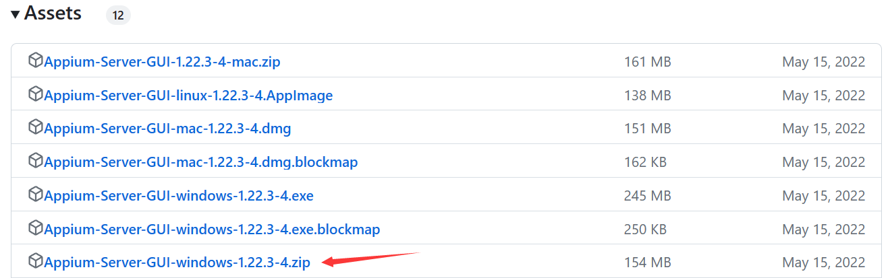

> 解压运行即可，无需安装

安装元素查看器：

> Appium Desktop升级到1.22.0版本，服务和元素查看器已经分开了

下载应用：[Releases · appium/appium-inspector (github.com)](https://github.com/appium/appium-inspector/releases)

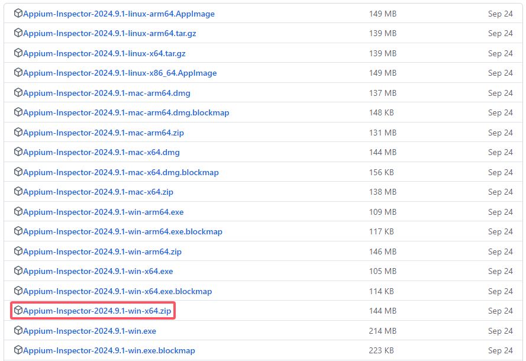

> 解压运行即可，无需安装

### node.js安装

```
npm install -g appium
```

## 安装SDK

SDK下载地址：[AndroidDevTools - Android开发工具 Android SDK下载 Android Studio下载 Gradle下载 SDK Tools下载](https://www.androiddevtools.cn/)

选择对应平台：

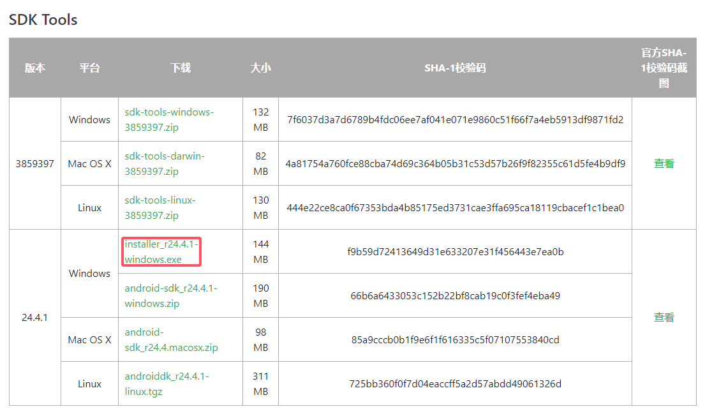

自动检测已经安装Java环境：

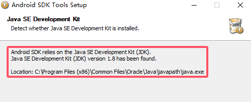

安装目录用于后续配置环境变量：

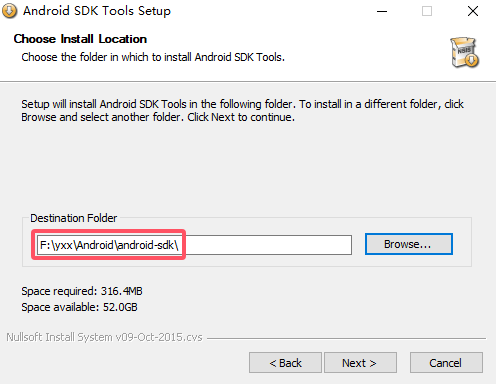

安装完成运行`SDK Manager.exe`：

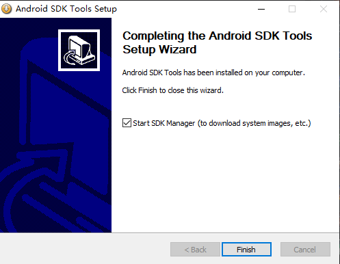

保持默认勾选：

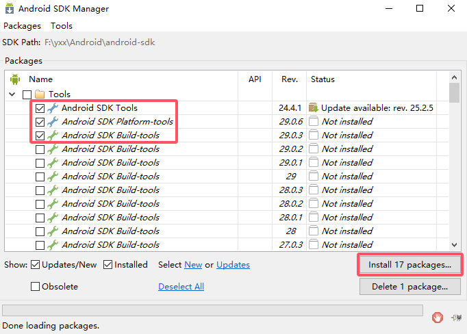

全部接受：

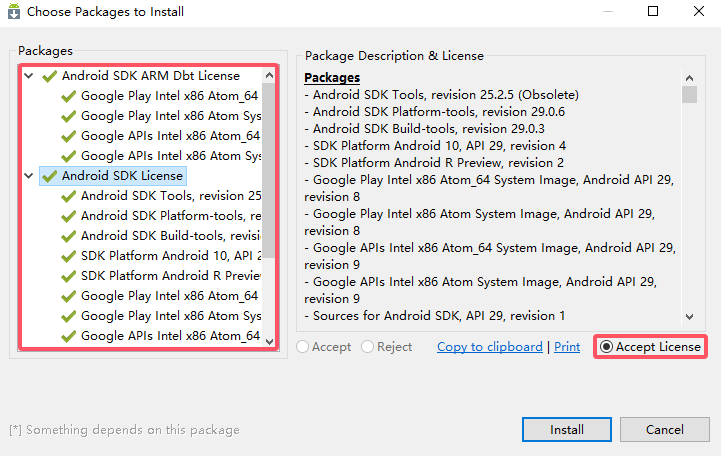

等待下载完成：

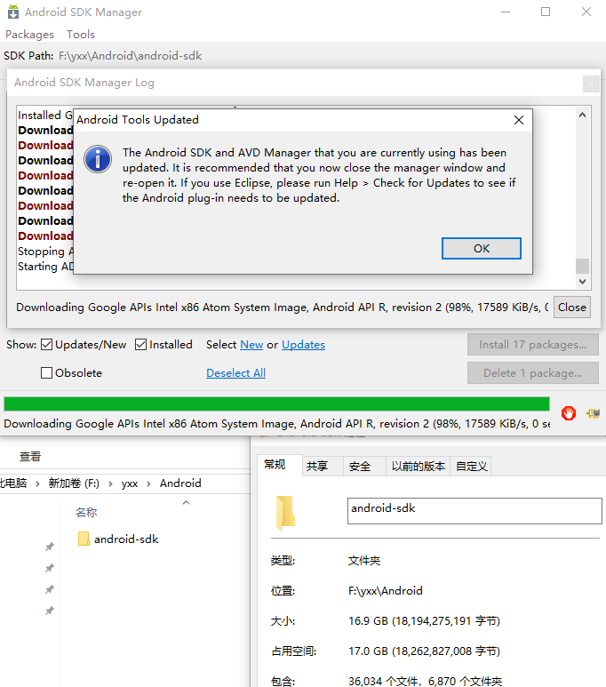

### 添加环境变量

系统变量：

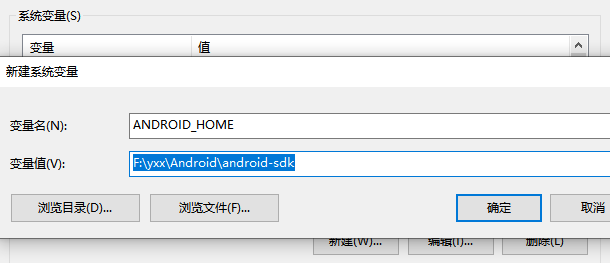

> 还应该配置JAVA_HOME变量

Path变量：

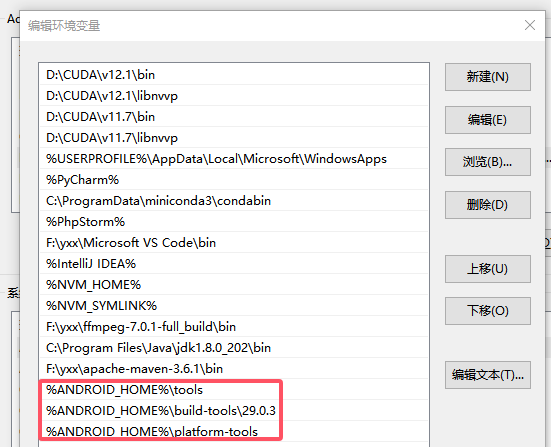

环境验证：

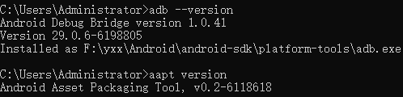

> 如果在此之前有配置adb环境，需要删除或者往后移动，防止版本兼容问题

## 安装Python库

```
pip3 install Appium-Python-Client -i https://pypi.tuna.tsinghua.edu.cn/simple
```

## 参考博客

- [APP自动化测试——Appium环境搭建及基础脚本编写（极其详细）_appnium课程-CSDN博客](https://blog.csdn.net/qq_37688023/article/details/106581218)
- [Appium 环境配置 - 三只松鼠 - 博客园 (cnblogs.com)](https://www.cnblogs.com/shenh/p/11758917.html)
- [appium下载安装及环境配置及夜神模拟器下载、nodejs安装_小龚的测试之路的博客-CSDN博客](https://blog.csdn.net/weixin_45638642/article/details/131470157)
- [Appium----基于Windows系统安装Android SDK_windows安装appium_redrose2100的博客-CSDN博客](https://blog.csdn.net/redrose2100/article/details/129097301)