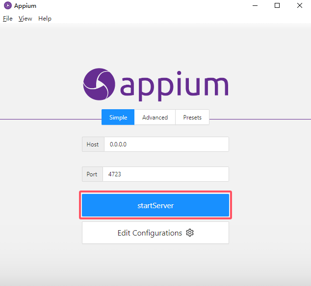
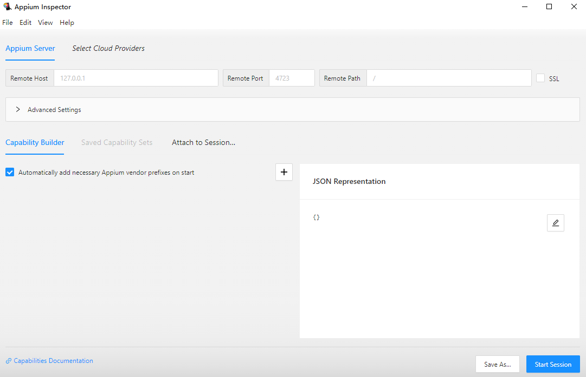
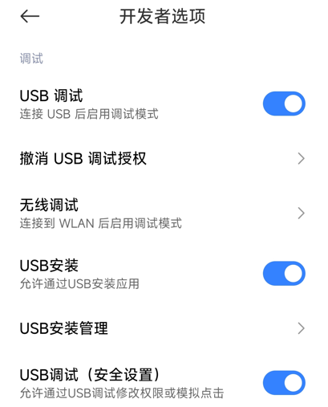
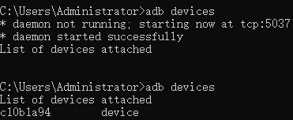
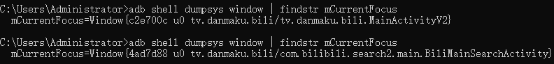
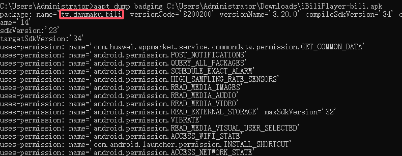
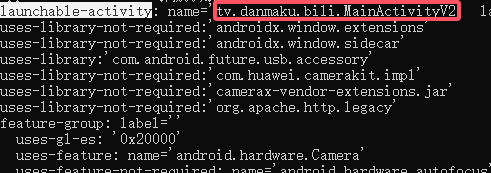
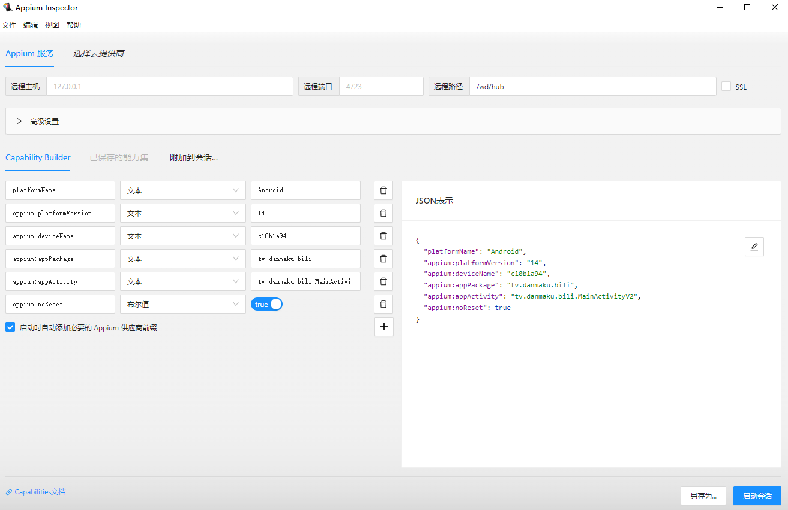
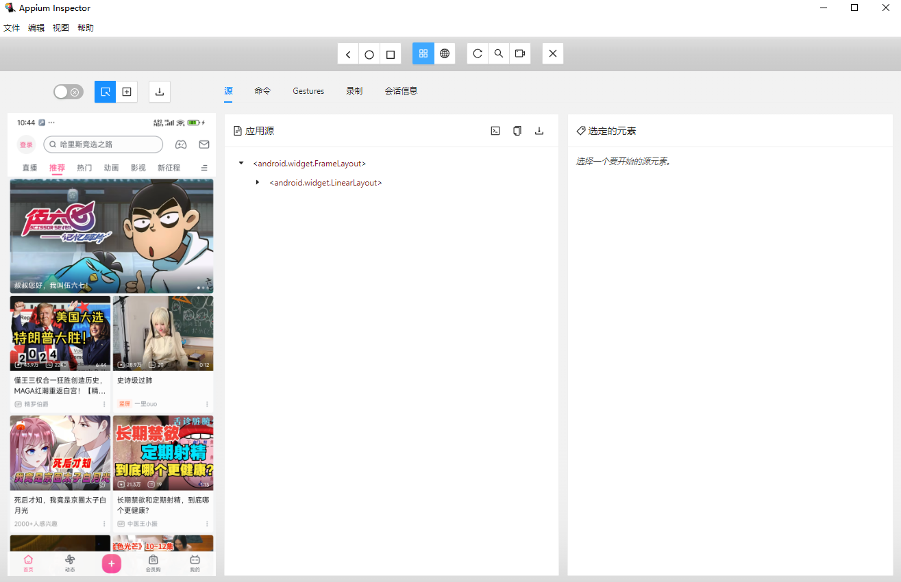
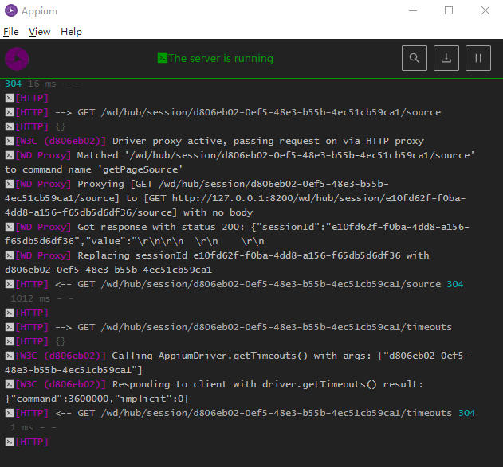

# Appium基本使用

## 服务配置

启动服务Appium：



启动Inspector：



开启USB调试，并提供所有权限：



## 获取信息

移动设备的名称：



移动设备系统版本：

```
adb shell getprop ro.build.version.release
```

> 

包名和活动页面(命令针对于Windows)：

```
adb shell dumpsys window | findstr mCurrentFocus
```

> 
>
> 解包获取信息：
>
> ```
> aapt dump badging C:\Users\Administrator\Downloads\iBiliPlayer-bili.apk
> ```
>
> 
>
> 

## 开启会话

配置信息：



```json
{
  "platformName": "Android",
  "appium:platformVersion": "14",
  "appium:deviceName": "c10b1a94",
  "appium:appPackage": "tv.danmaku.bili",
  "appium:appActivity": "tv.danmaku.bili.MainActivityV2",
  "appium:noReset": true
}
```

连接效果：



Appium日志信息：



## 示例代码

```python
from appium import webdriver
from appium.options.common.base import AppiumOptions
from appium.webdriver.common.appiumby import AppiumBy


def create_driver():
    """
    AppiumOptions():
        用于配置 Appium 测试的通用选项，可用于 Android 和 iOS 平台
        可以设置通用的测试选项，如平台名称、版本、自动化引擎等
    """
    # 创建 AppiumOptions 对象
    options = AppiumOptions()
    # 加载测试的配置选项和参数(Capabilities配置)
    options.load_capabilities({
        # 自动化测试的引擎
        "automationName": "uiautomator2",
        # 平台名称
        "platformName": "Android",
        # 系统版本
        "platformVersion": "14",
        # 设备的名称
        "deviceName": "c10b1a94",
        # 待测试应用的包名
        "appPackage": "tv.danmaku.bili",
        # 待测试应用的活动（Activity）名称
        "appActivity": "tv.danmaku.bili.MainActivityV2",
        # 每次启动不重置应用
        "noReset": True,
        # 设置使用 Unicode 编码方式发送字符串到设备的键盘
        # "unicodeKeyboard": "false",
        # 设置重置设备的软键盘状态并隐藏键盘
        # "restKeyboard": "false"
    })

    # Appium服务器地址端口，本地用http://127.0.0.1:4723
    appium_host = 'http://127.0.0.1:4723/wd/hub'

    return webdriver.Remote(appium_host, options=options)


def close_driver(driver):
    """关闭驱动"""
    if driver:
        driver.quit()


if __name__ == "__main__":
    driver = create_driver()
    # 设置隐式等待时间为10秒
    driver.implicitly_wait(10)

    # 元素定位代码...
    xpath = '(//android.widget.ImageView[@resource-id="tv.danmaku.bili:id/cover"])[1]'
    element = driver.find_element(AppiumBy.XPATH, xpath)
    element.click()
    # 关闭驱动
    close_driver(driver)

```

## 所有参数

- **platformName**：指定移动设备平台的名称，例如 Android 或 iOS。必填参数
- **deviceName**：指定移动设备的名称。必填参数
- **appPackage**：指定应用程序的包名。必填参数
- **appActivity**：指定应用程序的启动页面名称。必填参数
- platformVersion：指定移动设备的操作系统版本。可选参数
- app：指定要安装到设备上的应用程序文件的路径。可选参数
- **noReset**：指定是否在每次启动应用程序时重置应用程序的状态。可选参数，默认为 false(**设置为true才不会一直重置应用**)
- skipDeviceInitialization：跳过初始化操作
- automationName：指定 Appium 使用的自动化测试框架的名称。可选参数，默认为 Appium
- udid：指定移动设备的唯一设备标识符。可选参数
- newCommandTimeout：指定新命令的超时时间，以毫秒为单位。可选参数，默认为 60 秒
- autoGrantPermissions：指定是否在启动应用程序时自动授予所有权限。可选参数，默认为 false
- unicodeKeyboard：指定是否启用 Unicode 输入法，用于支持非英语语言的输入。可选参数，默认为 false
- resetKeyboard：指定是否在测试结束后重置输入法设置。可选参数，默认为 false
- fullReset：指定是否在测试结束后完全重置应用程序的状态和数据。可选参数，默认为 false
- browserName：指定要在设备上启动的浏览器的名称。可选参数
- chromeOptions：指定要传递给 Chrome 浏览器的选项。可选参数
- safariAllowPopups：指定是否允许 Safari 浏览器弹出窗口。可选参数，默认为 false
- nativeWebTap：指定是否在原生应用中使用原生的 web 点击事件。可选参数，默认为 false
- disableWindowAnimation：指定是否禁用设备窗口动画。可选参数，默认为 false
- ignoreUnimportantViews：指定是否忽略屏幕上的不相关视图，以加速测试执行。可选参数，默认为 false
- androidScreenshotPath：指定 Android 设备上截图的存储路径。可选参数
- networkSpeed：指定模拟设备的网络速度。可选参数

参考博客：

- [APP自动化测试-Appium Inspector入门操作指南-CSDN博客](https://blog.csdn.net/m0_64598636/article/details/136635804)
- [Python之Appium 2自动化测试（Android篇）_appium2-CSDN博客](https://blog.csdn.net/qq_45664055/article/details/134712607)