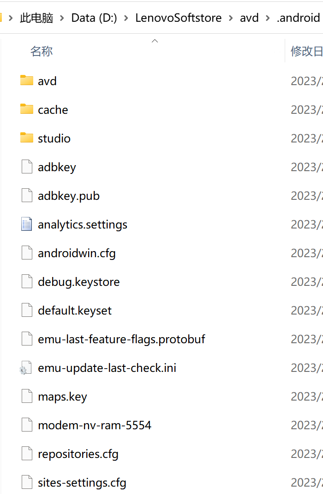
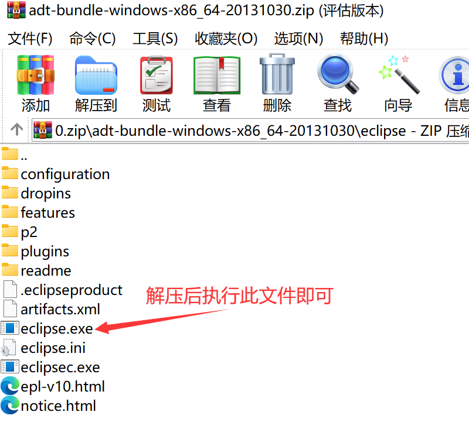
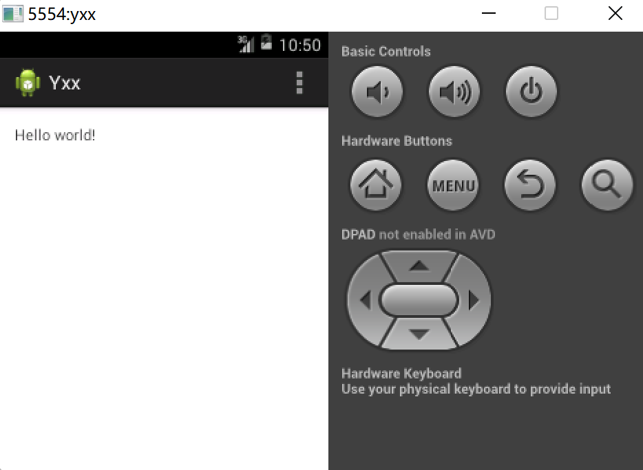

# Android环境搭建

## 完整版

### 安装Android Studio

- 直接打开文件进行安装-->**这里不选择安装SDK，后面选择自己的SDK**

- 选择已有的SDK**（一定不能有中文和数字目录以及任何的特殊字符）**

- 选择安装目录**（一定不能有中文和数字目录以及任何的特殊字符）**

- 直接下一步

### 配置Android Studio

- 运行Android Studio-->不导入配置文件

- 这里不进行配置

- 确认选择

- 显示页面

- Configure-->Project Defaults-->Project Structure

- 新建项目**（项目目录得全英文，不能有空格、中文、或者数字）**

- 选择最低要求的安卓版本

- 等待短暂的下载

- 选择创建的窗口

- 直接下一步

## 修改镜像地址

添加环境变量ANDROID_SDK_HOME

修改文件存储的地址

迁移过去并重启电脑，重启并迁移后的结构目录

### 工作界面

## 创建虚拟机(此版本不支持AMDcpu)

英特尔CPU只需要在BIOS设置中开启虚拟机功能即可

- 控制面板-->程序和功能-->启动或关闭Windows功能

- 选择创建

- 创建一个虚拟机

- 选择虚拟机屏幕尺寸

- 点击下载

- 等待下载完毕

## 最新版(AMDcup)

- 不打开老项目

- 不下载SDK

- 自定义设置

- 选择JDK

- 配置SDK

- 同意许可

- 等待下载

- 创建新项目

- 添加虚拟设备，等待下载完成

- 启动虚拟机

**需要更改Maven地址才能下载完依赖**

## 免安装版

- 通过Eclipse创建安卓项目

- 新建虚拟机

（创建虚拟机时——VM Heap为64）

- 配置运行策略

- 配置当前项目进去

或者：

- 修改安装超时时间：Windows-->Preferences，修改为20秒(默认为5秒)

- 运行

- 运行结果

