# Flex布局

## 布局对比

传统布局

- 兼容性好
- 布局繁琐
- 局限性，不能在移动端很好的布局

flex弹性布局

- 操作简单，布局极为方便，移动端应用很广泛
- PC端可能会存在一定的兼容性问题，但是随着时间发展都会支持
- IE 11或更低版本，不支持或仅部分支持

## 示例代码

```html
<html>
    <head>
        <title>flex布局</title>
        <style>
            div {
                display: flex;
                background-color: pink;
                width: 80%;
                height: 300px;
                /* 设置主轴子元素平分剩余空间 */
                justify-content: space-around;
            }
            div span {
                /* 宽度默认是最小占用(x轴为主轴) */
                width: 200px;
                /* 高度默认是和父盒子对齐(x轴为主轴) */
                /* height: 30px; */
                background-color: purple;
                margin-right: 5px;
                /* 设置flex后宽度属性失效，表示相对其它子盒子的占比大小 */
                flex: 1;
            }
        </style>
    </head>

    <body>
        <div>
            <span>1</span>
            <span>2</span>
            <span>3</span>
        </div>
    </body>
</html>
```

> 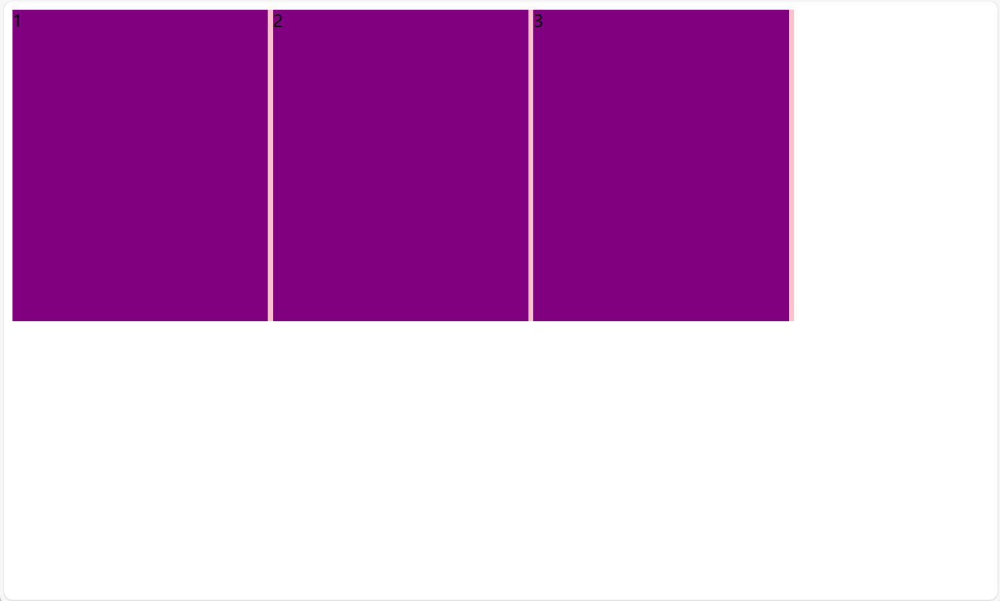

## 布局原理

flex是flexible Box的缩写，意为”弹性布局“，用来为盒状模型提供最大的灵活性，任何一个容器都可以指定为flex布局

- 当为父盒子设为flex布局以后，子元素的float、clear和vertical-align属性将失效
- 伸缩布局 = 弹性布局 = 伸缩盒布局 = 弹性盒布局 = flex布局

采用Flex布局的元素，称为Flex容器(flex container)，简称"容器"。它的所有子元素自动成为容器成员，称为Flex项目(flex item)，简称"项目"

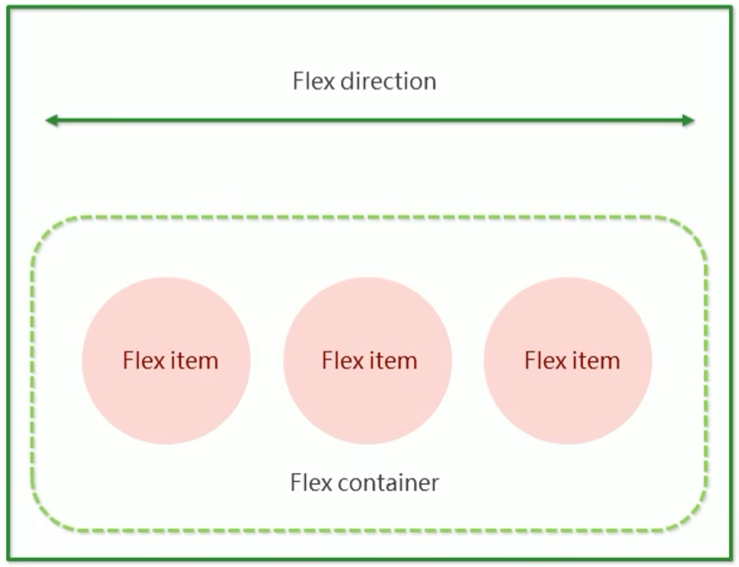

## 常见的父项属性

- `flex-direction`：设置主轴的方向
- `justify-content`：设置主轴的子元素排列方式
- `flex-wrap`：设置子元素是否换行(设置为换行后，可能会和`align-items`和`algin-self`**发生冲突**)
- `align-items`：设置恻轴上的子元素排列方式(单行)
- `align-content`：设置侧轴上的子元素的排列方式(多行)
- `flex-flow`：复合属性，相当于同时设置了`flex-direction`和`flex-wrap`，使用方式`flex-flow: row wrap`

### flex-direction

子元素是跟着主轴来排列的，`flex-direction`决定主轴的方向(即项目的排列方向)，主轴和侧轴是会发生变化的，设置其中一个为主轴，剩下的就是侧轴

|     属性值     |      说明      |
| :------------: | :------------: |
|      row       | 默认值从左到右 |
|  row-reverse   |    从右到左    |
|     column     |    从上到下    |
| column-reverse |    从下到上    |

设置值为`flex-direction: column-reverse;`

> 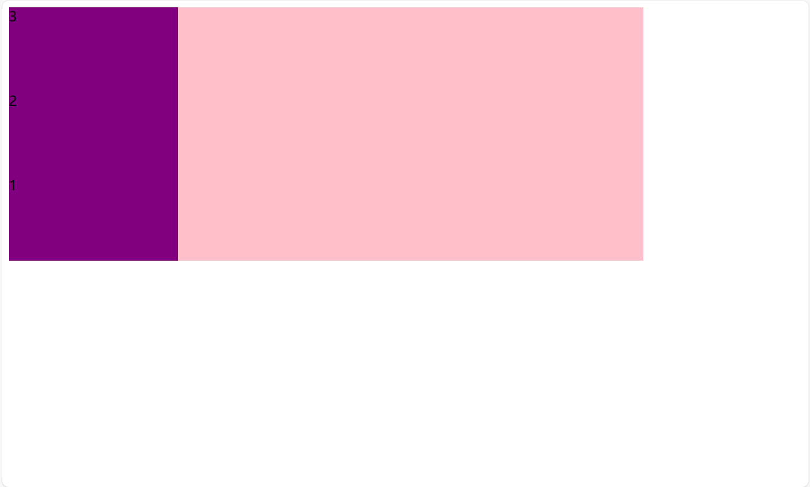

### justify-content

`justify-content`属性定义了项目在主轴上的对齐方式

|    属性值     |                    说明                     |
| :-----------: | :-----------------------------------------: |
|  flex-start   | 默认值从头部开始，如果主轴是x轴，则从左到右 |
|   flex-end    |               从尾部开始排列                |
|    center     |   在主轴居中对齐(如果主轴是x轴则水平居中)   |
| space-around  |                平分剩余空间                 |
| space-between |         先两边贴边，再平分剩余空间          |

不设置子元素的flex的值，设置子元素`width: 20%;height: 80px;`，再设置父元素`justify-content: center;`

> 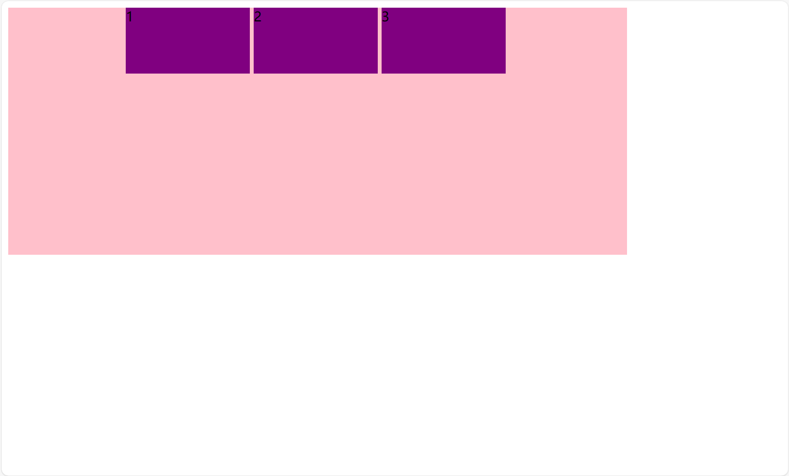

### flex-wrap

flex布局中，默认的子元素是不换行的，如果装不下，会自动缩小子元素的宽度，排布在一条线(轴线)上。`flex-wrap`属性定义是否换行，默认不换行。设置为换行后，可能会和`align-items`和`algin-self`**发生冲突**

| 属性值 |      说明      |
| :----: | :------------: |
| nowrap | 默认值，不换行 |
|  wrap  |      换行      |

添加一个子元素，再设置子元素`width: 30%;`，设置父元素`justify-content: space-between;flex-wrap: wrap;`

> 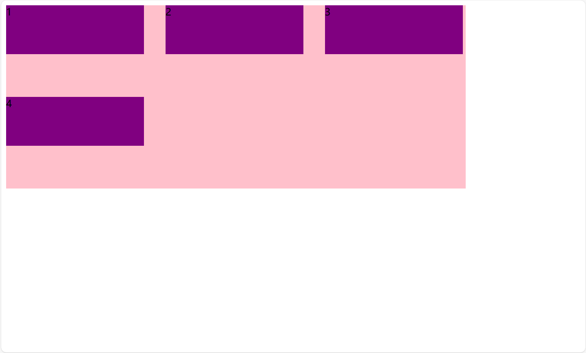

### align-items(单行)

控制子项在侧轴(默认是y轴)上的排列方式，在子项为单项的时候使用

|   属性值   |          说明          |
| :--------: | :--------------------: |
| flex-start |    默认值，从上到下    |
|  flex-end  |        从下到上        |
|   center   | 挤在一起居中(垂直居中) |
|  stretch   |          拉伸          |

去除换行，设置父元素`align-items: center;`，在y轴上居中

> 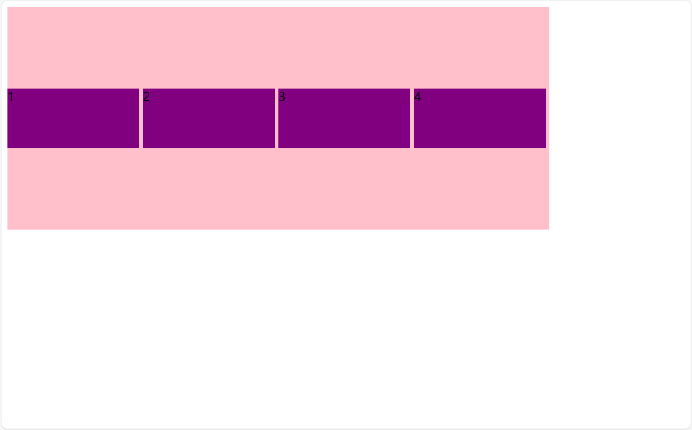

不去除换行，设置父元素`align-items: center;`，会出现一些不可控问题

> 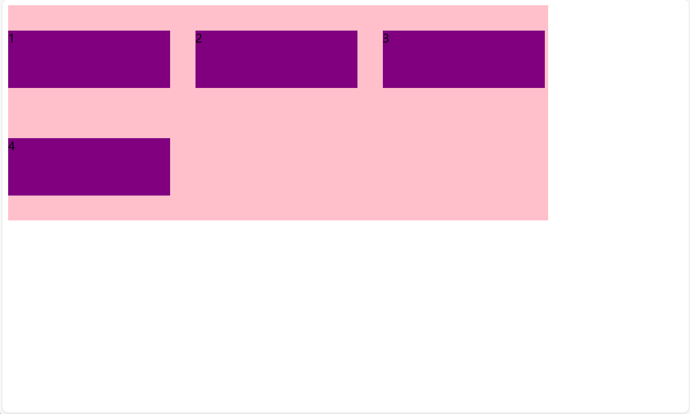

不去除换行，取消子元素的高度，设置父元素`align-items: stretch;`

> 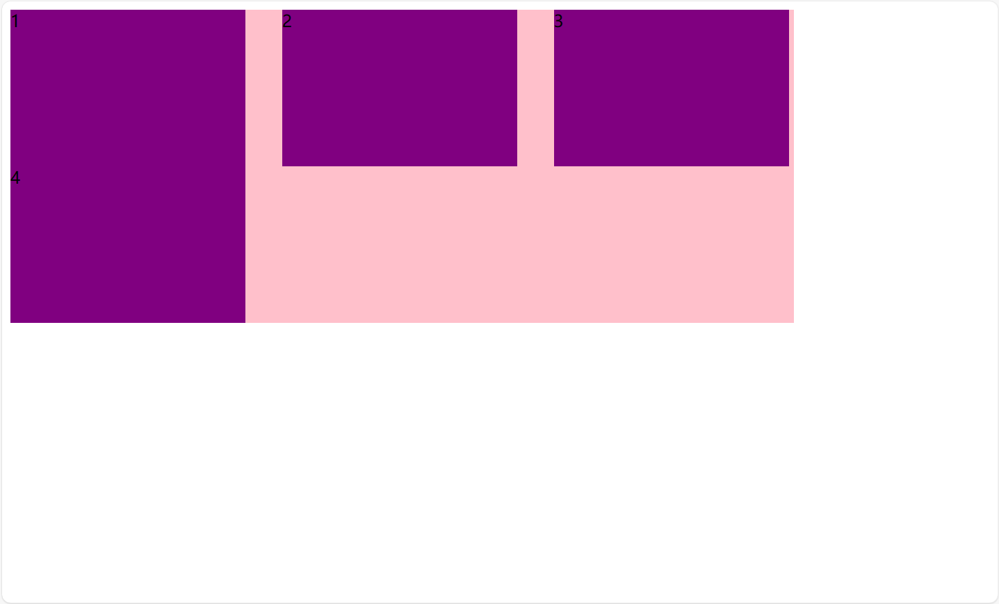

### align-content(多行)

`align-content`设置子项在侧轴上的排列方式，适用于子项出现换行的情况(多行)，单行是没有效果的

|    属性值     |                  说明                  |
| :-----------: | :------------------------------------: |
|  flex-start   |      默认值，在侧轴的头部开始排列      |
|   flex-end    |          在侧轴的尾部开始排列          |
|    center     |            在侧轴的中间显示            |
| space-around  |         子项在侧轴平分剩余空间         |
| space-between | 子项在侧轴先分布在两头，再平分剩余空间 |
|    stretch    |     设置子项元素高度平分父元素高度     |

设置父元素`align-content: space-between;`

> 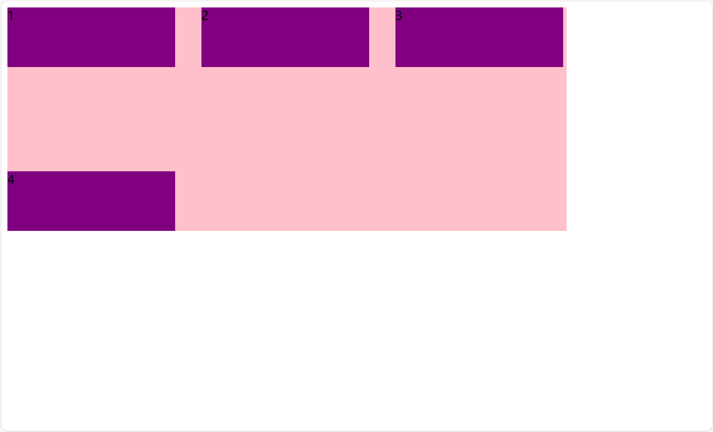

## 常见的子项属性

- `flex`：子元素分配**剩余空间**所占的份数
- `align-self`：控制子元素在侧轴的排列方式
- `order`：定义子项的排列顺序(前后顺序)

### flex

```html
<html>
    <head>
        <title>flex布局</title>
        <style>
            section {
                display: flex;
                width: 60%;
                height: 150px;
                background-color: pink;
                margin: 0 auto;
            }

            section div:nth-child(1) {
                width: 100px;
                height: 150px;
                background-color: red;
            }

            section div:nth-child(2) {
                flex: 1;
                background-color: green;
            }

            section div:nth-child(3) {
                width: 100px;
                height: 150px;
                background-color: blue;
            }
        </style>
    </head>

    <body>
        <section>
            <div>1</div>
            <div>2</div>
            <div>3</div>
        </section>
    </body>
</html>
```

> 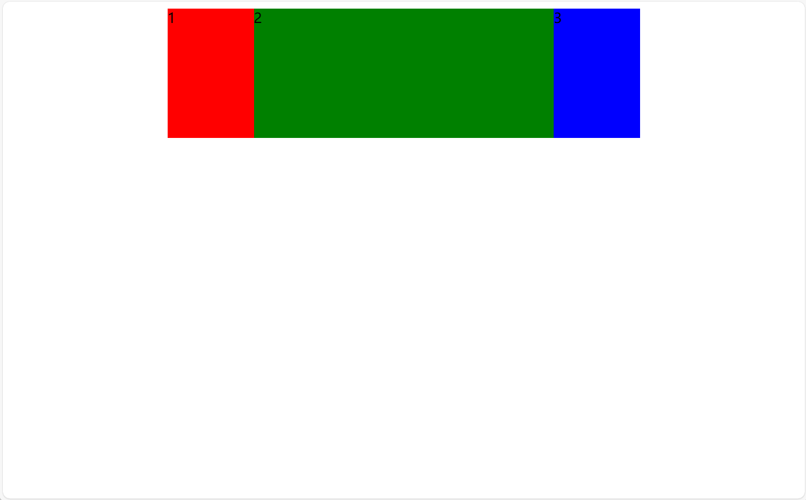

### align-self

`align-self`允许单个项目与其它项目不一样的对齐方式，可覆盖父元素指定的`align-items`属性，默认值为auto，表示集成父元素的`align-items`属性，如果没有父元素，则等同于stretch

```html
<html>
    <head>
        <title>flex布局</title>
        <style>
            div {
                display: flex;
                background-color: pink;
                width: 80%;
                height: 300px;
                /* 设置主轴子元素先两边贴边，再平分剩余空间 */
                justify-content: space-between;
                /* 此属性会让父元素align-items和子元素lign-self失效 */
                /* flex-wrap: wrap; */
                align-items: flex-start;
                align-content: space-between;
            }
            div span {
                width: 30%;
                height: 80px;
                background-color: purple;
                margin-right: 5px;
            }
            div span:nth-child(3) {
                align-self: center;
            }
        </style>
    </head>

    <body>
        <div>
            <span>1</span>
            <span>2</span>
            <span>3</span>
        </div>
    </body>
</html>
```

> 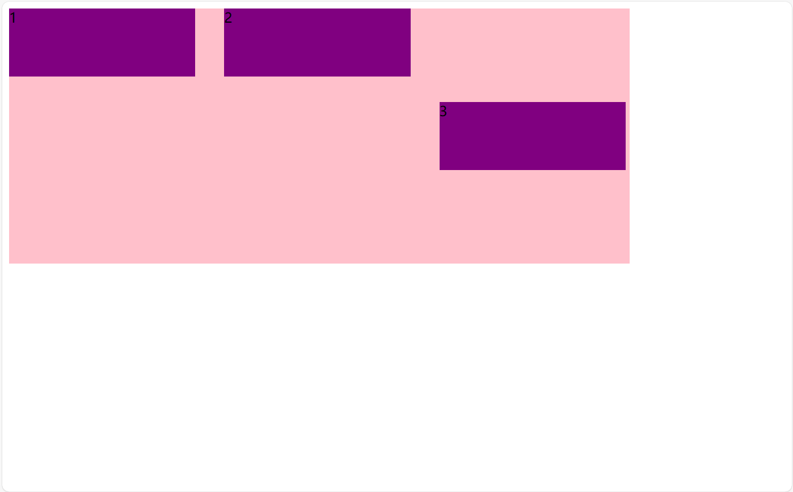

### order

`order`定义项目的排列顺序，数值越小，越靠前，默认值为0

子元素中增加`order: -1;`

> 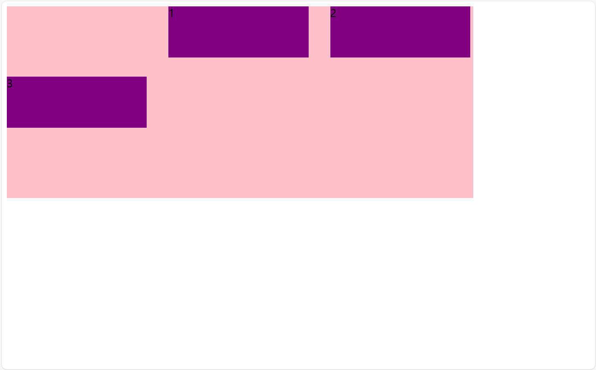