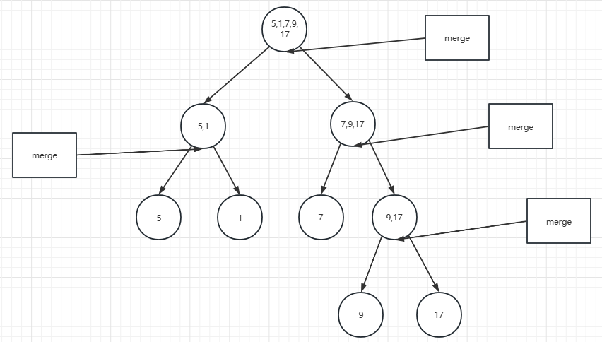
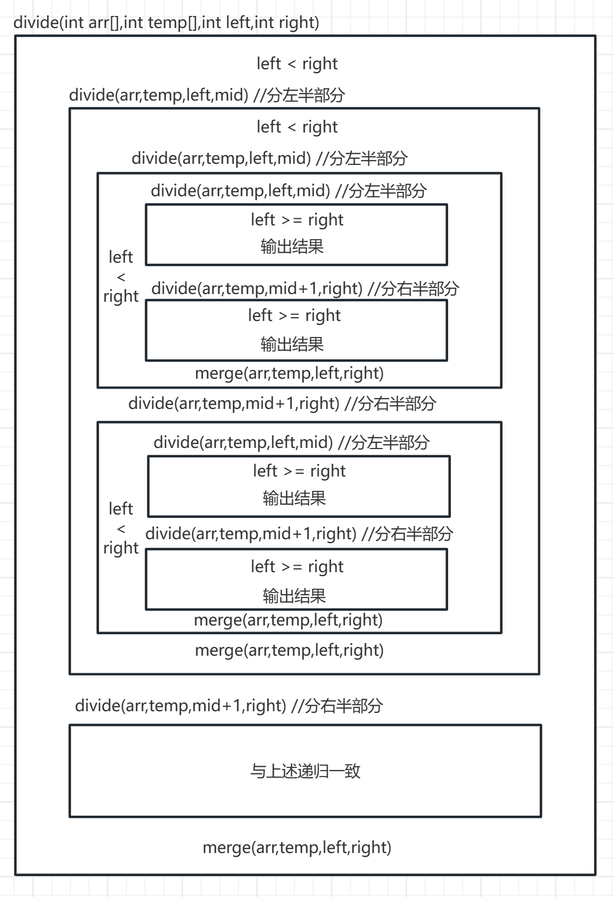

# 快速排序和归并排序

## 快速排序

> - 通过一个循环——比目标数小的放左边，比目标数大的放右边，当两个指针指向同一位置时，即为目标数的正确位置
>
> - 通过递归调用不断调用自身，缩小左指针和右指针，直至范围缩小为0时结束(递归出口：`left > right `（可以加等于号）)，通过递归将目标数的左边和右边分别还原

```c
#include<stdio.h>

void quickSort(int *arr,int left,int right);

int main(){
	int a[] = {8,2,67,3,68,43,10,5};
	quickSort(a,0,(sizeof(a)/sizeof(int)-1));
	for(int i = 0;i < sizeof(a)/sizeof(int);i++){
		printf("%d ",a[i]);
	}
}

void quickSort(int arr[],int left,int right){
	//如果指针越界，则终止 
	if(left >= right){
		return ;
	}
	//存储目标数 
	int key = arr[left];
	int begin = left;
	int end = right;
	while(end > begin){
		//当大于或者等于目标数时继续前进，同时不能越过另外一个指针 
		while(arr[end] >= key & end > begin){
			end--; 
		}
		//当小于或者等于目标数时继续前进 ，同时不能越过另外一个指针
		while(arr[begin] <= key & end > begin){
			begin++;
		}
		//找到了需要交换值的两个位置 
		if(end > begin){
			int temp = arr[end];
			arr[end] = arr[begin];
			arr[begin] = temp;
		}
		//两个指针到了同一位置了(单次大循环的尽头)
		if(end == begin){
			arr[left] = arr[begin]; //将这个位置的数与目标数换位置 
			arr[begin] = key; //目标数放入正确的位置 
		}
	}
	//将目标数左边的数字排序 
	quickSort(arr,left,begin-1);
	//将目标数右边的数字排序 
	quickSort(arr,begin+1,right);
}
```

## 归并排序

先"分"，再"治"



算法简略结构



```c
#include<stdio.h>
#include<stdlib.h>

void mergeSort(int arr[],int number);
void divide(int arr[],int temp[],int left,int right);
void merge(int arr[],int temp[],int left,int right);

int main(){
	int a[] = {8,2,67,3,68,43,10,5};
	mergeSort(a,(sizeof(a)/sizeof(int)-1));
	printf("\n最终排序结果为"); 
	for(int i = 0;i < sizeof(a)/sizeof(int);i++){
		printf("%d ",a[i]);
	}
}

//将数组分开 
void divide(int arr[],int temp[],int left,int right){
	//如果分的组大于一，则通过递归调用继续分 
	if(left < right){
		int mid = (left + right)/2;
		//每个小块在尽头执行完分左半部分之后还会继续执行分右半部分(类似于二叉树) 
		//分左半部分 
		divide(arr,temp,left,mid); 
		//分右半部分
		divide(arr,temp,mid+1,right);
		//开始合并
		merge(arr,temp,left,right); 
	}else{
		//输出划分的结果
		printf(" %d",arr[left]);
		return ;
	}
}

//将数组合并
void merge(int arr[],int temp[],int left,int right){
	int mid = (left+right)/2;
	//标记左半区第一个未排序的元素
	int l_pos = left; 
	//标记右半区第一个未排序的元素
	int r_pos = mid+1;
	//临时数组元素的下标
	int pos = left;
	//当左半区没有到合并到大数列的中间时，右半区没到合并到大数列的尽头时 
	while(l_pos <= mid && r_pos <= right){
		if(arr[l_pos] < arr[r_pos]){
			temp[pos++] = arr[l_pos++];
		}else{
			temp[pos++] = arr[r_pos++];
		}
	} 
	
	//当右半区全部放完时，合并左半区剩余元素
	while(l_pos <= mid){
		temp[pos++] = arr[l_pos++];
	} 
	
	//当左半区全部放完时，合并右半区剩余元素
	while(r_pos <= right){
		temp[pos++] = arr[r_pos++];
	} 
	
	//把临时数组合并后的元素复制回原来的数组
	while(left <= right){
		arr[left] = temp[left];
		left++;
	} 
} 

void mergeSort(int arr[],int number){
	int *temp = (int *)malloc((number+1) * sizeof(int));
	printf("划分结果为");
	divide(arr,temp,0,number);
}
```