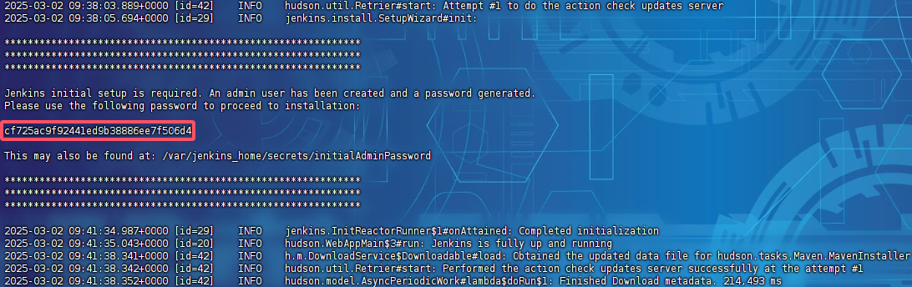

# Jenkins

> 官网：[Jenkins](https://www.jenkins.io/zh/)

## CI/CD

> - 持续集成（`Continuous Integration, CI`） ：持续集成是一种开发实践，要求开发者频繁地将代码提交到共享存储库中，并通过自动化的构建和测试过程验证这些提交是否符合预期
> - 持续交付/部署（`Continuous Delivery/Deployment, CD`）：持续交付是在持续集成的基础上，进一步确保代码可以随时被部署到生产环境。它的目标是让软件始终处于可发布状态

## 安装运行

拉取最新版稳定版：

```
docker pull jenkins/jenkins:lts-jdk17
```

> 拉取长期支持的jdk8版本：
>
> ```
> docker pull jenkins/jenkins:lts-jdk8
> ```
>
> 通过`inspact`命令获取到真实版本，修改版本号：
>
> ```
> docker tag jenkins/jenkins:lts-jdk8 jenkins/jenkins:2.319.1-lts-jdk8
> ```

运行容器：

```
docker run \
  -u root \
  --name jenkins \
  -v jenkins-data:/var/jenkins_home \
  -v /var/run/docker.sock:/var/run/docker.sock \
  -v /usr/bin/docker:/usr/bin/docker \
  -v /usr/local/jenkins/code:/usr/local/jenkins/code \
  -e TZ="Asia/Shanghai" \
  -p 8899:8080 \
  -p 50000:5000 \
  -d jenkins/jenkins:2.492.1-lts-jdk17
```

> - `-v /var/run/docker.sock:/var/run/docker.sock`：将主机的`Docker Socket`挂载到容器中，以便Jenkins可以直接调用Docker
> - `-v /usr/bin/docker:/usr/bin/docker`：将主机的`Docker CLI`挂载到容器中
> - `-v /usr/local/jenkins/code:/usr/local/jenkins/code`：主机的代码仓库目录映射到对应容器目录

访问地址：


通过查看日志获取初始密码：



不选择安装任何插件：


可以在容器内使用宿主机的docker：


## 自动构建

### 私人令牌

私人令牌创建：

```
https://gitee.com/profile/personal_access_tokens
```


安装插件：


- nvm插件

添加凭证：


### 创建项目


配置仓库：


配置构建环境：


配置构建脚本：


```dockerfile
FROM nginx:1.20.2

RUN echo 'alias ll="ls -l"' >> ~/.bashrc

RUN apt-get update

# 安装vim
RUN apt-get install -y bash vim

# 安装ping
RUN apt-get install -y iputils-ping

# 安装并配置语言工具包，防止中文乱码
RUN apt-get install -y locales
RUN locale-gen en_US.UTF-8
ENV LANG en_US.UTF-8
ENV LC_ALL en_US.UTF-8

# 安装net-tools包
RUN apt-get install -y net-tools

# 将打包后的dist目录复制到Nginx的静态资源目录
COPY ./dist /usr/local/nginx/ui/dist

# 移除Nginx配置文件中的默认配置
RUN rm /etc/nginx/conf.d/default.conf

# 复制自定义的Nginx配置文件到容器中
COPY ./nginx_dev.conf /etc/nginx/conf.d

# 暴露Nginx的80端口
EXPOSE 80

# 运行nginx命令，使得nginx在前台运行，docker容器才不会退出
CMD ["nginx", "-g", "daemon off;"]
```

