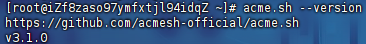
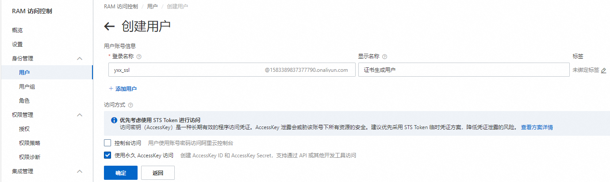
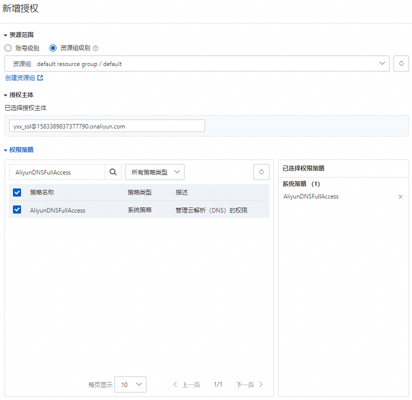
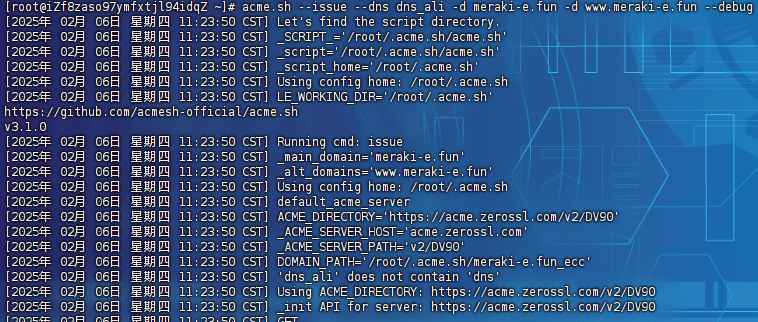
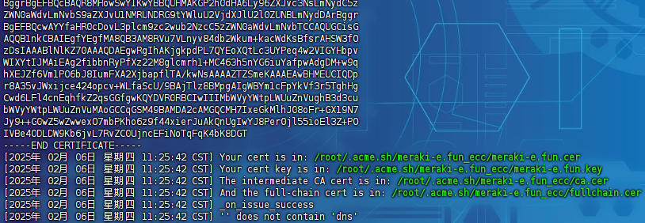
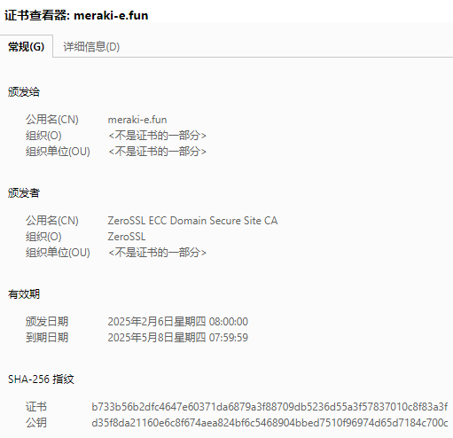
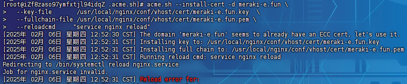
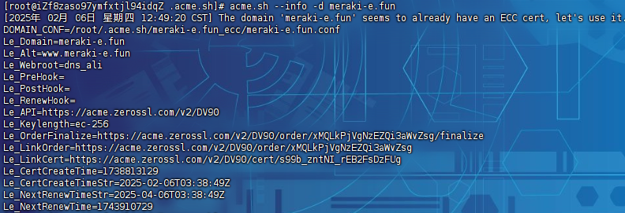
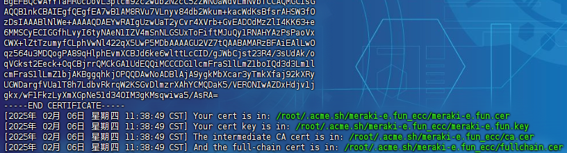

# acme.sh

> acme.sh实现了`acme`协议，可以从`ZeroSSL`，`Let's Encrypt`等CA生成免费的证书
>
> 官方仓库：[acmesh-official/acme.sh: A pure Unix shell script implementing ACME client protocol (github.com)](https://github.com/acmesh-official/acme.sh)
>
> 中文说明：[说明 · acmesh-official/acme.sh Wiki (github.com)](https://github.com/acmesh-official/acme.sh/wiki/说明)

## 安装

命令：

```
curl https://get.acme.sh | sh -s email=my@example.com
```

或者：

```
wget -O -  https://get.acme.sh | sh -s email=my@example.com
```

> 安装过程进行了以下几步：
>
> - 把`acme.sh`安装到home目录下：
>
>   - ```
>     ~/.acme.sh/
>     ```
>
> - 创建一个shell的alias，方便使用：`alias acme.sh=~/.acme.sh/acme.sh`，自动在例如`~/.bashrc`追加：
>
>   - ```
>     . "/root/.acme.sh/acme.sh.env"
>     ```
>
> - 自动创建cronjob， 每天自动检测所有的证书，如果快过期了，需要更新，则会自动更新证书
>
>   - ```
>     11 14 * * * "/root/.acme.sh"/acme.sh --cron --home "/root/.acme.sh" > /dev/null
>     ```
>
> 注意：安装过程不会污染已有的系统任何功能和文件，所有的修改都限制在安装目录`~/.acme.sh/`中，如果安装完成后提示`-bash: acme.sh: command not found`，需要手动执行`source ~/.bashrc`

测试是否安装成功：

```
acme.sh --version
```

> 

## 获取密钥

> 阿里云使用的是dns方式，阿里云客户端提供了操作dns的账号以及密钥

创建用户：



授予权限：



## 自动续签

### 获取证书

设置环境变量：

```
export Ali_Key="aaaaaaaaaaaaaaaaaaaaaaa"
export Ali_Secret="aaaaaaaaaaaaaaaaaaaaaaa"
```

签发证书：

```
acme.sh --issue --dns dns_ali -d example.com -d www.example.com --debug
```

- `dns_ali`代表是请求阿里的DNS
- 启用`--debug`参数，可以看到详细的执行过程，否则会很容易误以为命令假死
- 期间acme会请求`80`端口，如果需要指定端口可使用`--httpport`
- 如果需要`pfx`证书可以使用`--to-pkcs12 --password 密码`
- 如果申请通配符证书则在在域名前面加上`*`，如`*.example.com`

执行日志：



等待完成：



查看证书有效期：

```
[root@iZf8zaso97ymfxtjl94idqZ .acme.sh]# openssl x509 -in /root/.acme.sh/meraki-e.fun_ecc/fullchain.cer -noout -dates
notBefore=Feb  6 00:00:00 2025 GMT
notAfter=May  7 23:59:59 2025 GMT
```



### 复制证书

```
acme.sh --install-cert -d example.com \
  --key-file       /path/to/keyfile/in/nginx/key.pem  \
  --fullchain-file /path/to/fullchain/nginx/cert.pem \
  --reloadcmd     "service nginx reload"
```

> Nginx的配置项`ssl_certificate`需要使用`/etc/nginx/ssl/fullchain.cer`，而非`/etc/nginx/ssl/<domain>.cer`，否则`SSL Labs`的测试会报证书链问题（Chain issues Incomplete）
>
> ```
> acme.sh --install-cert -d meraki-e.fun \
>   --key-file       /usr/local/nginx/conf/vhost/cert/meraki-e.fun.key  \
>   --fullchain-file /usr/local/nginx/conf/vhost/cert/meraki-e.fun.pem \
>   --reloadcmd     "service nginx reload"
> ```
>
> 

## 查看已安装证书

```
acme.sh --info -d example.com
```



## 手动更新

默认证书每60天自动更新，也可以强制续签证书：

```
acme.sh --renew -d example.com --force
```



## 自动化脚本

RenewSh.sh

```sh
#!/bin/bash
# @description: 使用acme.sh自动申请、部署并续期（提前一周）免费的ssl证书，并通知到钉钉群告知运维工程师！

# 使用调试模式
set -x

DOMAIN_LIST="
admin.example.com
api.example.com
h5.example.com
opapi.example.com
www.example.com
"
SSL_DIR="/etc/nginx/ssl"
WEBROOT="/var/nginx/html"
ACMESH="/root/.acme.sh/acme.sh"
NOTICE_DINGDING_TOBOT="https://oapi.dingtalk.com/robot/send?access_token=xxxxxxxxxxxxxxxxxxxxxxxxxxxxxxxxxxxxxxxxxx"

noticeDingding(){
  msg="{\"msgtype\": \"text\",\"text\": {\"content\": "\'"${1}"\'"},\"at\": {\"isAtAll\": true}}"
  curl "$NOTICE_DINGDING_TOBOT" -H 'Content-Type: application/json' -d "$msg"
}

applyFreeSSLCertificate(){
    status=0
    # 1、强制申请免费ssl证书
    $ACMESH --issue -d $domain -w $WEBROOT --force
    [ $? -eq 0 ] && status=`expr $status + 1`
    # 2、安装ssl证书到nginx
    $ACMESH --install-cert -d ${domain} --key-file "${SSL_DIR}/${domain}.key" --fullchain-file "${SSL_DIR}/${domain}.cer" --reloadcmd "nginx -s reload"  # 自动部署到nginx
    [ $? -eq 0 ] && status=`expr $status + 1`

    if [ $status -eq 2 ];then
      noticeDingding "申请并部署、续期（提前一周）免费ssl证书"${domain}"成功！"
    else
      noticeDingding "申请并部署、续期（提前一周）免费ssl证书"${domain}"失败！请手动执行本脚本程序再次申请、续期以观测失败原因！"
    fi
}

for domain in $DOMAIN_LIST;do
  echo "自动申请部署并续期ssl证书，域名=$domain"

  # 申请部署免费SSL证书
  # 如果证书文件不存在则自动申请并部署免费的SSL证书
  if [ ! -e ${SSL_DIR}/${domain}.cer ];then
    applyFreeSSLCertificate
  fi

  # 自动续期
  # 检查ssl证书到期时间，提前一周自动续期并部署新的ssl证书
  expirationTimeGMT=`openssl x509 -in ${SSL_DIR}/${domain}.cer -noout -dates|grep notAfter|awk -F '=' '{print $2}'`  # 证书到期GMT时间
  expirationTime=`date -d "$expirationTimeGMT" +%s`  # 证书到期时间，转换为以秒为单位的时间戳
  currTime=`date +%s`  # 当前时间戳

  echo "当前证书到期时间还有$(expr $(expr $expirationTime - $currTime) / 60 / 60 / 24)天"
  if [ $(expr $(expr $expirationTime - $currTime) / 60 / 60 / 24) -lt 7 ];then
    applyFreeSSLCertificate
  fi
done
```

