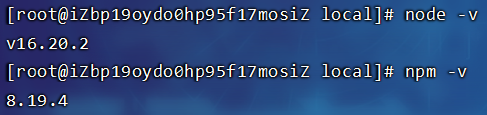
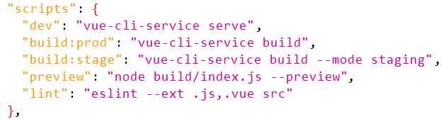

# 前端部署

## node.js

解压node.js：


```
cd /usr/local

tar -zxvf node-v16.20.2-linux-x64.tar.gz
mv node-v16.20.2-linux-x64 node
```

配置环境变量：

```
export NODE_HOME=/usr/local/node
export PATH=$NODE_HOME/bin:$PATH
```

> 重新加载文件：
>
> ```
> source /etc/profile
> ```
>
> 检测版本：
>
> 

配置镜像：

```
# 设置镜像
npm config set registry https://registry.npm.taobao.org

# 查看镜像
npm config get registry
```

> 

## npm命令

安装第三方包：

```
npm install
```

执行项目：

```
npm run dev
```

打包项目：

```
npm run build
```

> 命令具体取决于`pageage.json`文件，像是若依的生产环境打包命令为`npm run build:prod`，开发环境打包命令为`npm run build:stage`
>
> 

## 配置Nginx

复制打包后的目录到Nginx的html下：

```
cp -r dist /usr/local/nginx/html/front # 没有此目录则会将dist重命名为front，否则移动到此目录下
```

配置nginx.conf：

```nginx
    server {
        listen       80;
        server_name  localhost;
        # 设置虚拟主机的根目录
        root   html/front/dist;


        # 为特定的URL匹配请求设置根目录
        location / {
            index  index.html index.htm;
            # 用于指定文件的查找规则
            # $uri表示当前请求的URL路径
            # $uri/表示在当前请求的URL路径后面添加/后的路径
            try_files $uri $uri/ /index.html;
        }


        # 设置这些类型的文件在客户端缓存的过期时间为30天
        location ~ .*\.(gif|jpg|jpeg|png|bmp|swf)$
        {
            expires      30d;
        }
        location ~ .*\.(js|css)?$
        {
            expires      12h;
        }


        # 将这些请求转发到对应地址上，并设置一些HTTP请求头信息
        # $http_host表示客户端请求的主机名
        # $remote_addr表示客户端的IP地址
        # $proxy_add_x_forwarded_for表示通过代理服器转发的客户端IP地址
		# location ^~/api/的优先级比location /api/高
        location ^~/prod-api/  {
          proxy_set_header Host $http_host;
		        proxy_set_header X-Real-IP $remote_addr;
		        proxy_set_header REMOTE-HOST $remote_addr;
		        proxy_set_header X-Forwarded-For $proxy_add_x_forwarded_for;
            proxy_pass http://localhost:9000/;
        }
        location ^~/dev-api/ {
		        proxy_set_header Host $http_host;
		        proxy_set_header X-Real-IP $remote_addr;
		        proxy_set_header REMOTE-HOST $remote_addr;
		        proxy_set_header X-Forwarded-For $proxy_add_x_forwarded_for;
		        proxy_pass http://localhost:9000/;
	      }
        location ^~/stage-api/ {
		        proxy_set_header Host $http_host;
		        proxy_set_header X-Real-IP $remote_addr;
		        proxy_set_header REMOTE-HOST $remote_addr;
		        proxy_set_header X-Forwarded-For $proxy_add_x_forwarded_for;
		        proxy_pass http://localhost:9000/;
	      }

        # 错误处理配置
        error_page   500 502 503 504  /50x.html;
        location = /50x.html {
            root   html;
        }
    }
```

> 重启Nginx：
>
> ```
> nginx -s reload
> ```