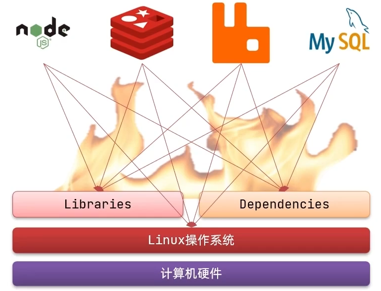
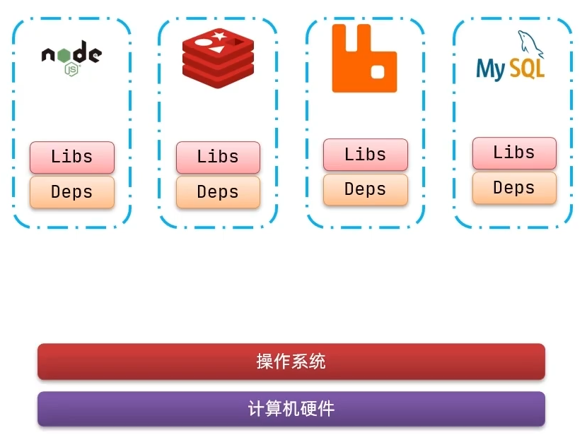
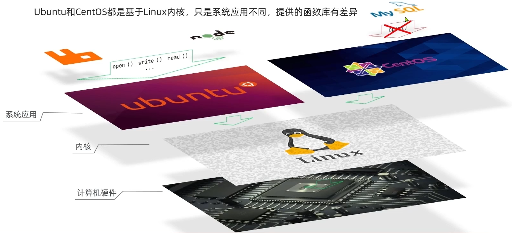
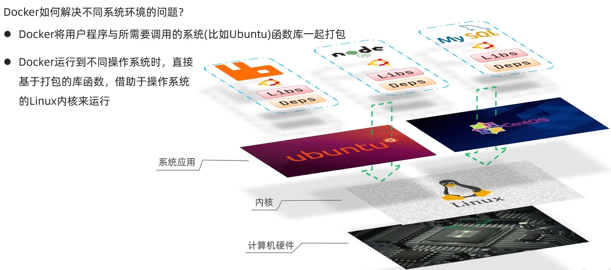
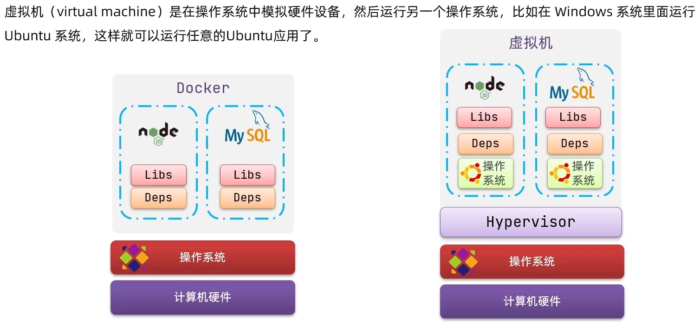
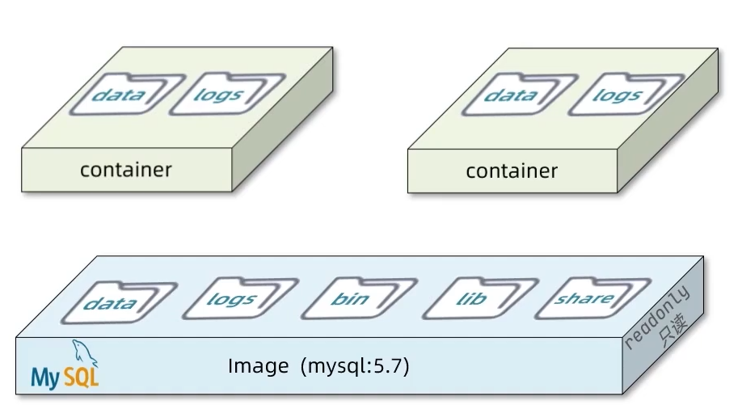
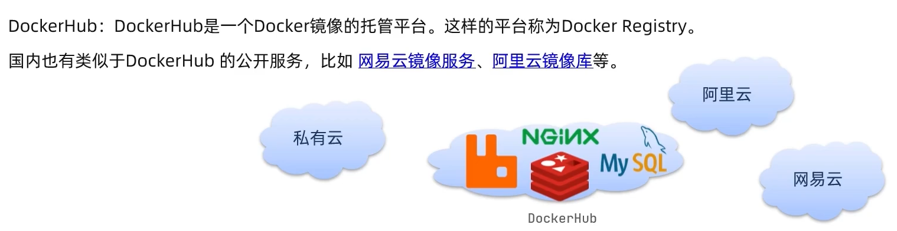
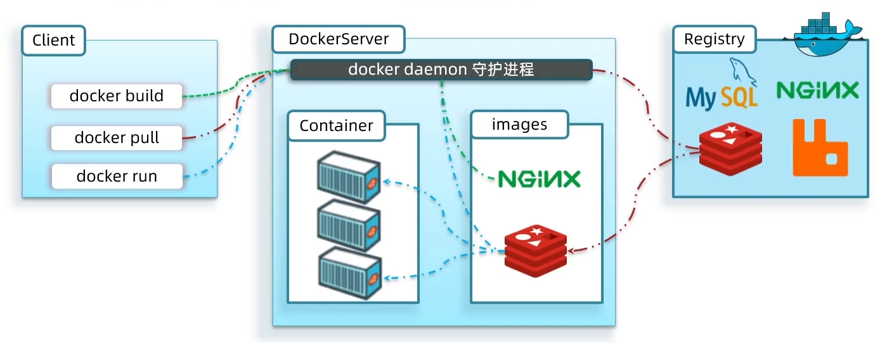
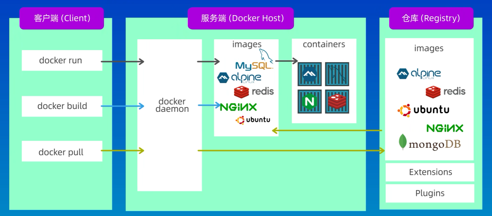

# 初识Docker

大型项目组件较多，运行环境也较为复杂，部署时会碰到一些问题：

- 依赖关系复杂，容易出现兼容性问题
- 开发、测试、生产环境有差异

Docker解决依赖的兼容问题

- 将应用的Libs（函数库）、Deps（依赖）、**配置与应用一起打包**，形成可移植镜像
- 将每个应用运行在隔离的容器中，使用**沙箱机制**，避免互相干扰

## 解决依赖兼容的方式

> Docker镜像中包含完整的运行环境，包含系统函数库，仅依赖系统的Linux内核，因此可以在任意Linux操作系统上运行，启动、移除都可以通过一行命令完成，方便快捷

## Docker与虚拟机

Docker和虚拟机的差异：

|   特征   |  Docker  |  虚拟机  |
| :------: | :------: | :------: |
|   性能   | 接近原生 | 性能较差 |
| 硬盘占用 | 一般为MB | 一般为GB |
|   启动   |   秒级   |  分钟级  |

> Docker是一个系统进程，虚拟机是在操作系统中的操作系统

## 镜像和容器

- 镜像(Image)：Docker将应用程序及其所需的**依赖、函数库、环境**等文件打包在一起，称为镜像
- 容器(Container)：镜像中的应用程序运行后**形成的进程就是容器**，只是Docker会给容器做隔离，对外不可见

## DockerHub

## Docker架构

Docker是一个CS架构的程序，由两部分组成：

- 服务端(server)：Docker守护进程，负责处理Docker指令，管理镜像、容器等
- 客户端(client)：通过命令或RestAPI向Docker服务端发送指令，可以在本地或远程向服务器发送指令

