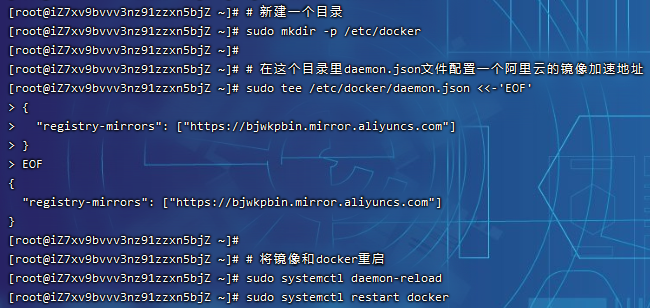
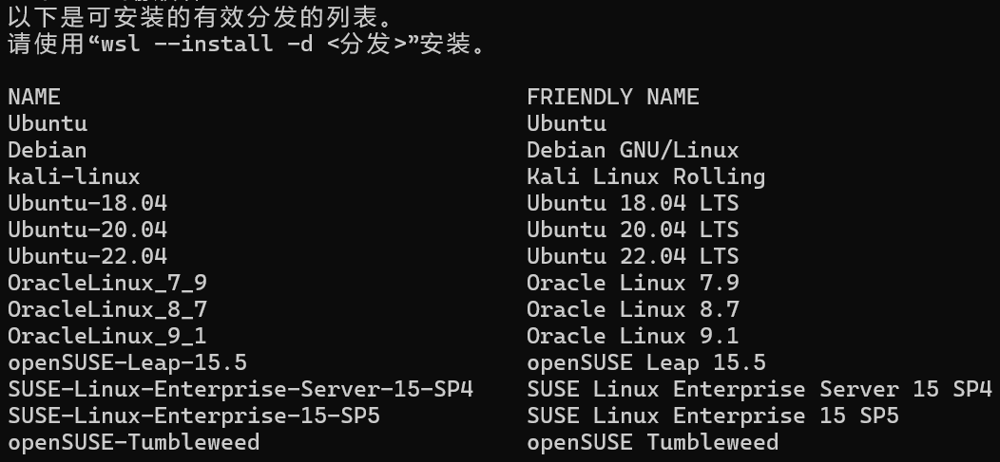

# 安装Docker

> Docker 分为CE和EE两大版本。CE即社区版（免费，支持周期 7 个月），EE即企业版，强调安全，付费使用，支持周期 24 个月
>
> Docker CE分为`stable`、`test`和`nightly`三个更新频道

官方网站上有各种环境下的[安装指南](https://docs.docker.com/install/)，安装演示为Docker CE在CentOS上的安装

官方镜像仓库：[Docker Hub Container Image Library | App Containerization](https://hub.docker.com/)

## CentOS安装Docker

Docker CE支持64位版本CentOS 7，并且要求内核版本不低于3.10， CentOS 7满足最低内核的要求

### 卸载

如果之前安装过旧版本的Docker，可以使用下面命令卸载：

```
yum remove docker \
                  docker-client \
                  docker-client-latest \
                  docker-common \
                  docker-latest \
                  docker-latest-logrotate \
                  docker-logrotate \
                  docker-selinux \
                  docker-engine-selinux \
                  docker-engine \
                  docker-ce
```

### 安装docker

### 联网安装

#### Centos系统

联网安装yum工具：

```
yum install -y yum-utils \
           device-mapper-persistent-data \
           lvm2 --skip-broken

```

> 

更新本地镜像源：

```
# 设置docker镜像源
yum-config-manager \
    --add-repo \
    https://mirrors.aliyun.com/docker-ce/linux/centos/docker-ce.repo

sed -i 's/download.docker.com/mirrors.aliyun.com\/docker-ce/g' /etc/yum.repos.d/docker-ce.repo

yum makecache fast

```

> 
>
> 回车确认：
>
> 

输入命令安装社区免费版本(docker-ce)：

```
yum install -y docker-ce
```

> 

查看docker版本：

```
docker -v
```

> 

#### Ubuntu系统

为了使用`https`的 APT 源，需要安装一些必要的依赖包：

```
sudo apt install apt-transport-https ca-certificates curl software-properties-common
```

添加Docker的官方GPG密钥以确保下载验证：

```
curl -fsSL https://mirrors.aliyun.com/docker-ce/linux/ubuntu/gpg | sudo gpg --dearmor -o /usr/share/keyrings/docker-archive-keyring.gpg
```

添加Docker APT仓库，这里使用阿里云的镜像源加速下载速度：

```
echo \
  "deb [arch=$(dpkg --print-architecture) signed-by=/usr/share/keyrings/docker-archive-keyring.gpg] https://mirrors.aliyun.com/docker-ce/linux/ubuntu \
  $(lsb_release -cs) stable" | sudo tee /etc/apt/sources.list.d/docker.list > /dev/null
```

更新包索引并安装 Docker 社区版：

```
sudo apt update
sudo apt install docker-ce docker-ce-cli containerd.io
```

> 

### 手动安装

> 限制镜像的版本，否则容易出问题

**下载包**

- 更新本地镜像源：

```
# 设置docker镜像源
yum-config-manager \
    --add-repo \
    https://mirrors.aliyun.com/docker-ce/linux/centos/docker-ce.repo

sed -i 's/download.docker.com/mirrors.aliyun.com\/docker-ce/g' /etc/yum.repos.d/docker-ce.repo

yum makecache fast
```

- 插件包下载：

```
yumdownloader --resolve --destdir=/usr/local/docker-ce yum-utils device-mapper-persistent-data lvm2
```

- Docker下载：

```
yumdownloader --resolve --destdir=/usr/local/docker-ce docker-ce
```

> 需要更新本地镜像源，否则下载不到

打包压缩：

```
tar -zcvf docker-ce.tar.gz ./docker-ce
```

**安装包**

- 解压缩：

```
tar -zxvf docker-ce.tar.gz

mv docker-ce/* ./
```

- 本地安装：

```
yum localinstall *.rpm
```

> 

### 启动Docker

Docker应用需要用到各种端口，如果逐一去修改防火墙设置，会非常麻烦，因此这里直接关闭防火墙！

```
# 关闭
systemctl stop firewalld
# 禁止开机启动防火墙
systemctl disable firewalld
# 查看防火墙状态
systemctl status firewalld
```

> 

通过命令启动Docker：

```
systemctl start docker  # 启动docker服务

systemctl enable docker # 设置docker开机自启动

systemctl stop docker  # 停止docker服务

systemctl restart docker  # 重启docker服务
```

### 配置镜像

docker官方镜像仓库网速较差，需要设置国内镜像服务

参考使用阿里云的镜像加速文档：https://cr.console.aliyun.com/cn-hangzhou/instances/mirrors（每个人镜像地址都不一样）


```
# 新建一个目录
sudo mkdir -p /etc/docker

# 在这个目录里daemon.json文件配置一个阿里云的镜像加速地址
sudo tee /etc/docker/daemon.json <<-'EOF'
{
  "registry-mirrors": ["https://bjwkpbin.mirror.aliyuncs.com"]
}
EOF

# 将镜像和docker重启
sudo systemctl daemon-reload
sudo systemctl restart docker
```

> 
>
> 配置更多的镜像地址：
>
> ```json
> {
>     "registry-mirrors": [
>        "https://bjwkpbin.mirror.aliyuncs.com",
>        "https://mirrors.tuna.tsinghua.edu.cn",
>        "http://hub-mirror.c.163.com",
>        "https://docker.mirrors.ustc.edu.cn"
>     ]
> }
> ```

## Windows安装Docker

### Windows虚拟化

`Win + I`搜索`启用或关闭 Windows 功能`，开启`Hyper-V`和`容器`(专业版Windows支持)，家庭版开启`Windows 虚拟机监控程序平台`、`虚拟机平台`和`适用于 Linux 的 Windows 子系统`

> 
>
> Hyper-V是一个功能更全面、更强大的虚拟化平台，适用于需要高级虚拟化功能的企业和开发者。而虚拟机平台则是一个相对简单的虚拟化功能，适用于一般的虚拟机需求。如果你需要在Windows上运行虚拟机，并且需要高级功能和更好的性能，建议使用Hyper-V。如果只需要基本的虚拟机功能，虚拟机平台也可以满足需求
>
> 适用于 Linux 的 Windows 子系统(WSL)主要是一种面向开发人员的工具，尤其是 Web 开发人员，从事开源项目，或者部署到 Linux 服务器环境。 WSL 适用于喜欢使用 Bash、常用 Linux 工具 (`sed``awk`、 等) 和 Linux 优先框架 (Ruby、Python 等) 但也喜欢使用 Windows 生产力工具的任何人
>

### WSL

下载镜像更新wsl：https://wslstorestorage.blob.core.windows.net/wslblob/wsl_update_x64.msi

查看可使用系统：

```
wsl --list --online
```

> 
>
> 注：centos需要自行打包安装
>
> 官方说明文档地址：[WSL 的基本命令 | Microsoft Learn](https://learn.microsoft.com/zh-cn/windows/wsl/basic-commands)

安装系统`Ubuntu-22.04`：

```
wsl --install -d Ubuntu-22.04
```

通过命令窗口启动：


> 列出已安装的Linux发行版：
>
> ```
> wsl --list --verbose
> ```
>
> 关闭wsl，释放内存：
>
> ```
> wsl --shutdown
> ```

修改wsl文件位置：

> wsl默认保存在`C:\Users\<主机名>\AppData\Local\Packages`下，以`CanonicalGroupLimited...`开头

执行步骤：

```
#1.查看wsl安装哪些分支
wsl -l -v
#2.关闭所有的分支及wsl2
wsl --shutdown
#3.导出相关分支
wsl --export Ubuntu-22.04 D:\WSL\Ubuntu-22.04.tar
#4.注销分发并删除根文件系统
wsl --unregister Ubuntu-22.04
#5.将指定的 tar 文件作为新分发导入
wsl --import Ubuntu-22.04 D:\WSL\Ubuntu-22.04 D:\WSL\Ubuntu-22.04.tar
#6.查看。执行1的操作即可
```

> 
>
> 设置为默认发行版：
>
> ```
> wsl --set-default Ubuntu-22.04
> ```

### 安装docker

官网下载地址：[Get Started | Docker](https://www.docker.com/get-started/)

安装成功后需要重启：


选择是否手动更新WSL 2：


> 如果还是需要更新，选择自动更新即可：
>
> 

更改docker目录下的镜像文件保存位置：


> 应用后重启docker即可，docker会自动迁移目录，无需手动移动文件

### 配置镜像

修改`C:\Users\<主机名>\.docker`路径下的`daemon.json`文件：

```json
{
  "builder": {
    "gc": {
      "defaultKeepStorage": "20GB",
      "enabled": true
    }
  },
  "experimental": false
}
```

修改为：

```json
{
  "builder": {
    "gc": {
      "defaultKeepStorage": "20GB",
      "enabled": true
    }
  },
  "experimental": false,
  "registry-mirrors": [
    "https://bjwkpbin.mirror.aliyuncs.com",
    "https://mirrors.tuna.tsinghua.edu.cn",
    "http://hub-mirror.c.163.com",
    "https://docker.mirrors.ustc.edu.cn"
  ]
}
```

或者直接修改可视化界面中的配置文件(会有提示信息，如果文件读取出错会无法启动)，再重启docker即可：


### 停止docker

因为docker服务依赖于WSL，所以在Windows上会占用大量的内存空间，选择`Quit Docker Desktop`关闭docker服务：


再关闭wsl：

```
wsl --shutdown
```


### 低版本Windows安装Docker

由于Docker Engine守护程序使用特定于Linux的内核功能，因此您无法在Windows上本地运行Docker Engine。相反，您必须使用Docker Machine命令`docker-machine`来创建并附加到计算机上的小型Linux VM。该VM在Windows系统上托管Docker Engine

> 较新的[Docker Desktop for Windows](https://docs.docker.com/docker-for-windows/)解决方案的优点之一 是，它使用本机虚拟化，不需要使用VirtualBox运行Docker

所以对于不满足docker系统要求，有如下两种解决方式：

- 一种就是把你的系统或硬件升级到官方要求的尽可能新的版本，这个比较麻烦
- 另外一种解决方案就是安装`Docker Toolbox`。在[官方文档](https://docs.docker.com/toolbox/toolbox_install_windows/)上有介绍到：Docker Toolbox提供了一种在不满足[Docker Desktop for Windows](https://docs.docker.com/docker-for-windows/) 应用最低系统要求的Windows系统上使用Docker的方法

Docker Toolbox包含以下Docker工具：

- Docker CLI Client 用于运行Docker Engine以创建映像和容器
- Docker Machine 可以从Windows终端运行Docker Engine命令
- Docker Compose 用于运行`docker-compose`命令
- Kitematic，Docker GUI
- 为Docker命令行环境预先配置的Docker QuickStart shell
- Oracle VM VirtualBox

Docker Toolbox 官方下载地址：[下载地址](https://github.com/docker/toolbox/releases)


对于安装组件，Git可不选：


全部勾选上：


继续安装：


安装成功：


修改Docker Quickstart Terminal属性，修改git指定地址，否则会报"Windows正在查找bash.exe"，然后结束：


Docker启动时如果检测到没有Boot2Docker，就会去下载，在下载过程中出现了网络连接上的错误(国内网络一般都会出现这个问题)，导致启动失败：


可以手动下载放到此目录，默认目录在用户目录下的`.docker/machine/cache`，手动用其他工具下载对应的boot2docker.iso文件，下载地址：[https://github.com/boot2docker/boot2docker/releases](https://github.com/boot2docker/boot2docker/releases/download/v18.06.1-ce/boot2docker.iso)，文件不用解压缩：


重新启动，如果出现报错：


大概意思就是virtual box 无法创建host-only 网卡，可以通过控制面板找到virtual box并卸载，然后打开docker toolbox安装位置的`virtual box （\Docker Toolbox\installers\virtualbox）`安装程序，重新安装一次就好了：


重新启动，显示如下界面，表示已经安装完毕，可以正常的使用Docker了：


