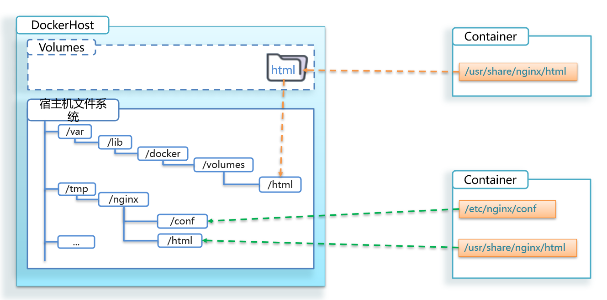

# Docker基本操作

## 常用命令


官方文档：[Reference documentation | Docker Docs](https://docs.docker.com/reference/)

## 镜像操作

镜像名称一般分为两部分组成：`[repository]:[tag]`，在没有指定tag时，默认时latest，代表最新版本的镜像


### 镜像操作命令


### 从DockerHub拉取镜像

官网：http://hub.docker.com/，可以在官网搜索镜像


拉取镜像：

```
docker pull nginx
```

> 

查看镜像：

```
docker images
```

> 

### 导出和导入镜像


查看语法：

 ```
 docker save --help
 ```

> 

导出镜像：

```
# 查看当前目录
pwd


# 将nginx:latest导出为镜像nginx.tar
docker save -o nginx.tar nginx:latest
```

删除镜像：

```
docker rmi nginx:latest
```

> 

导入镜像：

```
# 通过当前目录下的nginx.tar来导入镜像
docker load -i nginx.tar
```

> 

## 容器操作

### 容器操作命令


### 运行容器


从镜像中构建运行容器：

```
docker run --name mn -p 80:80 -d nginx
```

> 构建成功后会输出容器的唯一id
>
> 
>
> 运行已有容器：
>
> ```
> docker start mn
> ```

查看容器状态：

```
docker ps # 查看容器运行状态
docker ps -a # 查看所有容器
```

> 

浏览器访问：


### 查看对应容器的日志

```
docker logs mn
```

> 

持续日志输出(有更新就会持续输出，需要手动退出)：

```
docker logs -f mn
```

> 
>
> (这里换行是为了方便观察，并非在日志中写入了换行)

### 修改容器内数据


进入容器：

```
docker exec -it mn bash
```

> 

进入需要修改的目录(里面的文件目录实际是阉割版的Linux文件目录，保证了容器之间的隔离)：

```
cd /usr/share/nginx/html
```

> 

修改index.html的内容：

```
sed -i 's#Welcome to nginx#传智教育欢迎您#g' index.html # 在 index.html 文件中查找所有的 "Welcome to nginx" 并将其替换为 "传智教育欢迎您"
sed -i 's#<head>#<head><meta charset="utf-8">#g' index.html
```

退出容器：

```
exit
```

重新访问：


### 删除容器

停止容器：

```
docker stop mn
```

查看所有容器，把包括未运行的：

```
docker ps -a
```

启动容器：

```
docker start mn
```

删除容器：

```
docker rm mn
```

> 无法删除一个正在运行中的容器
>
> 
>
> 强制删除：
>
> ```
> docker rm -f mn
> ```

## 数据卷

容器与数据耦合问题

- 不便于修改：修改容器的内容时，需要进入容器内部修改，很不方便
- 数据不可复用：在容器内的修改对外是不可见的，所有修改对新创建的容器是不可复用的
- 升级维护困难：数据在容器内，要升级容器必然删除旧容器，所有数据一起被删除了

**数据卷(volume)是一个虚拟目录，指向宿主机文件系统中的某个目录**


### 数据卷操作命令


### 创建数据卷


创建数据卷html：

```
docker volume create html
```

查看所有数据卷：

```
docker volume ls
```

> 

查看数据卷详细信息：

```
docker volume inspect html
```

> 

删除未使用的数据卷：

```
docker volume prune
```

> 

删除指定的数据卷：

```
docker volume rm html
```

### 挂载数据卷

在创建容器时，可以通过 -v 参数来挂载一个数据卷到某个容器目录：

```
docker run \
  --name mn \
  -v html:/root/html \
  -p 8080:80
  nginx \
```

> 

```
docker run --name mn -p 80:80 -v html:/usr/share/nginx/html -d nginx
```

> 如果有重名的数据卷，删除之前的即可
>
> 

查看数据卷详细信息：

```
docker inspect html
```

> 

通过修改"Mountpoint"对应位置下的文件就可以修改容器内的文件：

```
cd /var/lib/docker/volumes/html/_data
```

> 
>
> 此时就可以直接通过windows的编译器打开，然后进行编辑后保存，修改立即生效，无需重启
>
> 

### 目录挂载

相比于数据卷挂载，目录挂载不使用生成的数据卷，需要手动指定目录，自己进行管理


导入mysql.tar：

```
cd /tmp/
```

加载为一个镜像：

```
docker load -i mysql.tar
```

创建目录：

```
mkdir -p mysql/data
mkdir -p mysql/conf
```

将配置文件hym.cnf上传到conf目录：


运行mysql容器：

```
docker run \
	--name mysql \
	-e MYSQL_ROOT_PASSWORD=123 \
	-p 3306:3306 \
	-v /tmp/mysql/conf/hmy.cnf:/etc/mysql/conf.d/hmy.cnf \
	-v /tmp/mysql/data:/var/lib/mysql \
	-d \
	mysql:5.7.25
```

挂载成功，data目录下有数据：


> 在运行mysql容器前，如果本机已经有mysql服务了，则需要先关闭：
>
> ```
> sudo systemctl stop mysqld
> ```

两者方式对比：



- 数据卷挂载耦合度低，由docker来管理目录，但是目录较深，不好找
- 目录挂载耦合度高，需要自己管理目录，不过目录容易寻找查看
