# Dockerfile自定义镜像

## 镜像结构

> 镜像是将应用程序及其需要的系统函数库、环境、配置、依赖打包而成

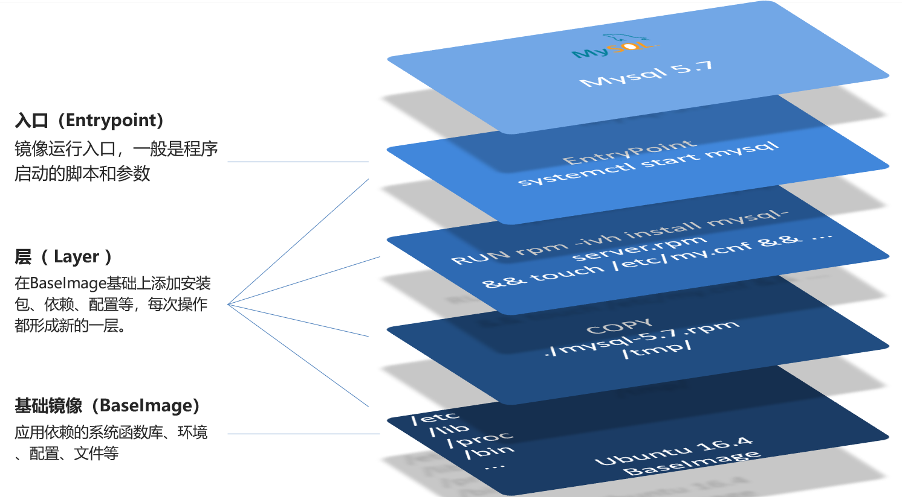

## 自定义镜像

> Dockerfile就是一个文本文件，其中包含一个个的指令(Instruction)，用指令来说明要执行什么操作来构建镜像。每一个指令都会形成一层**Layer**

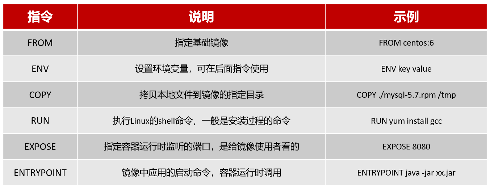

官网文档：[Dockerfile reference | Docker Docs](https://docs.docker.com/engine/reference/builder/)

## 基于Ubuntu镜像构建Java项目

创建目录：

```
cd /usr/local

mkdir docker-demo

cd docker-demo
```

上传文件：

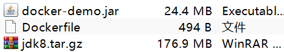

Dockerfile

```dockerfile
# 指定基础镜像
FROM ubuntu:16.04
# 配置环境变量，JDK的安装目录
ENV JAVA_DIR=/usr/local

# 拷贝jdk和java项目的包
COPY ./jdk8.tar.gz $JAVA_DIR/
COPY ./docker-demo.jar /tmp/app.jar

# 安装JDK
RUN cd $JAVA_DIR \
 && tar -xf ./jdk8.tar.gz \
 && mv ./jdk1.8.0_144 ./java8

# 配置环境变量
ENV JAVA_HOME=$JAVA_DIR/java8
ENV PATH=$PATH:$JAVA_HOME/bin

# 暴露端口
EXPOSE 8090
# 入口，java项目的启动命令
ENTRYPOINT java -jar /tmp/app.jar
```

基于当前目录下的Dockerfile构建镜像：

```
docker build -t javaweb:1.0 . # "-t"后指定[repository]:[tag]，"."代表在当前目录构建
```

> 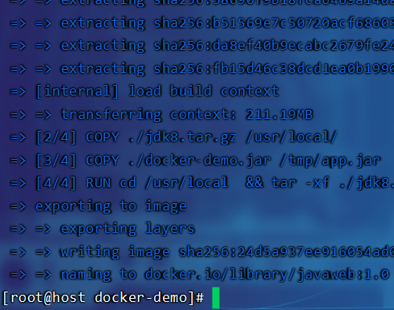
>
> 指定文件：
>
> ```
> docker build -t nvm-node:22 -f nvm.dockerfile .
> ```
>
> - `-f`：指定Dockerfile的绝对路径或相对路径
> - `.`：表示当前目录作为**构建上下文**（Build Context）。Docker会将当前目录及其子目录中的文件打包并上传到Docker守护进程进行构建

查看构建的镜像并运行：

```
docker images

docker run --name web -p 8090:8090 -d javaweb:1.0
```

> 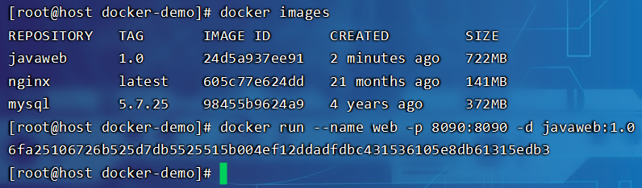

访问：

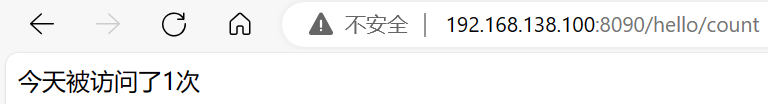

## 基于java:8-alpine镜像构建Java项目

> Alpine Linux是一个轻量级的Linux发行版，其基于`musl`库而不是传统的`glibc`，因此镜像的体积更小，与此同时还具有，启动速度快、安全性高、可移植性强的特点

拷贝DockerFile：

```dockerfile
cp Dockerfile Dockerfile-alpine
```

修改Dockerfile-alpine：

```dockerfile
# 指定基础镜像
FROM java:8-alpine

# 拷贝java项目的包
COPY ./docker-demo.jar /tmp/app.jar

# 暴露端口
EXPOSE 8090
# 入口，java项目的启动命令
ENTRYPOINT java -jar /tmp/app.jar
```

构建镜像：

```
docker build -f Dockerfile-alpine -t javaweb:2.0 .
```

> - `-f`：参数指定了Dockerfile的文件名，默认情况下，Docker会在当前目录下寻找名为`Dockerfile`的文件
> - `-t`：参数用于为构建的镜像指定标签（tag）
> - `.`：表示当前目录作为构建上下文，Docker会将当前目录下的所有文件和子目录打包（除非被`.dockerignore`文件排除），并将其发送到Docker守护进程以供构建使用
>
> 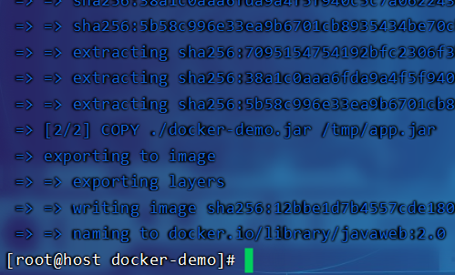
>
> 查看所有镜像：
>
> ```
> docker images -a
> ```
>
> 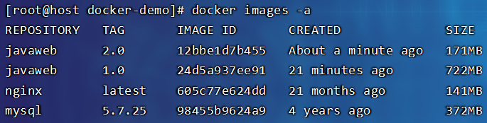

## 部署前端项目

上传文件：

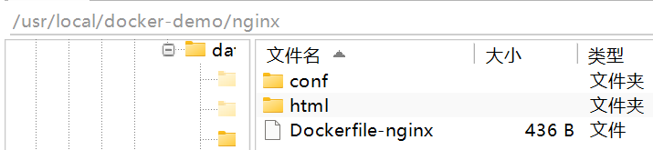

Dockerfile-nginx

```dockerfile
# 使用官方的nginx镜像作为基础镜像
FROM nginx:latest

# 将当前目录下html目录复制到nginx的默认html目录
COPY ./html /usr/share/nginx/html

# 将当前目录下的nginx.conf文件复制到nginx的配置目录
COPY ./conf/nginx.conf /etc/nginx/nginx.conf

# 更改工作目录
WORKDIR /usr/share/nginx/

# 暴露80端口供外部访问
EXPOSE 80

# 运行nginx命令，使得nginx在前台运行，docker容器才不会退出
CMD ["nginx", "-g", "daemon off;"]
```

> 对于Linux下的nginx，提供相对路径（如`html/dist`），nginx会在其当前工作目录下查找这个路径，所以会在其安装目录下查找`html/dist`，但是在Docker容器中就需要全部指定才行
>
> ```
>         location / {
>             root  /usr/share/nginx/html/dist;
>             index index.html;
>         }
> ```

构建镜像：

```
docker build -f Dockerfile-nginx -t frontend:1.0 .
```

> 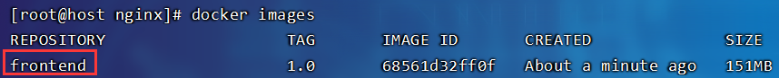

创建并运行容器，挂载当前目录到数据卷中，实现绑定：

```
docker run -d \
  -p 80:80 \
  -v ./html:/usr/share/nginx/html \
  -v ./conf/nginx.conf:/etc/nginx/nginx.conf \
  --name frontend \
  frontend:1.0
```

> 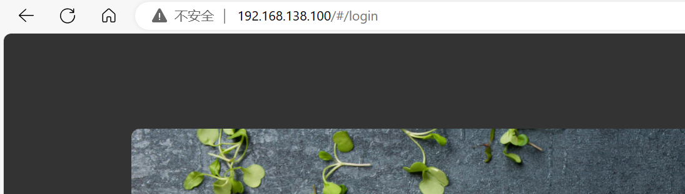
