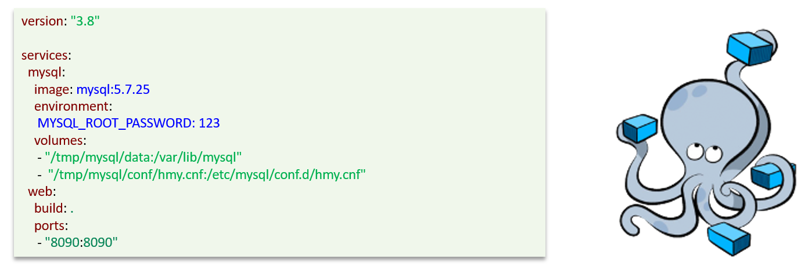
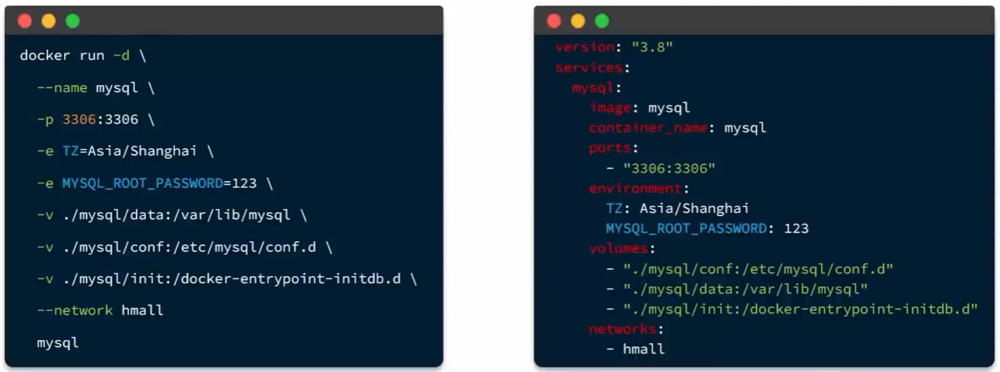
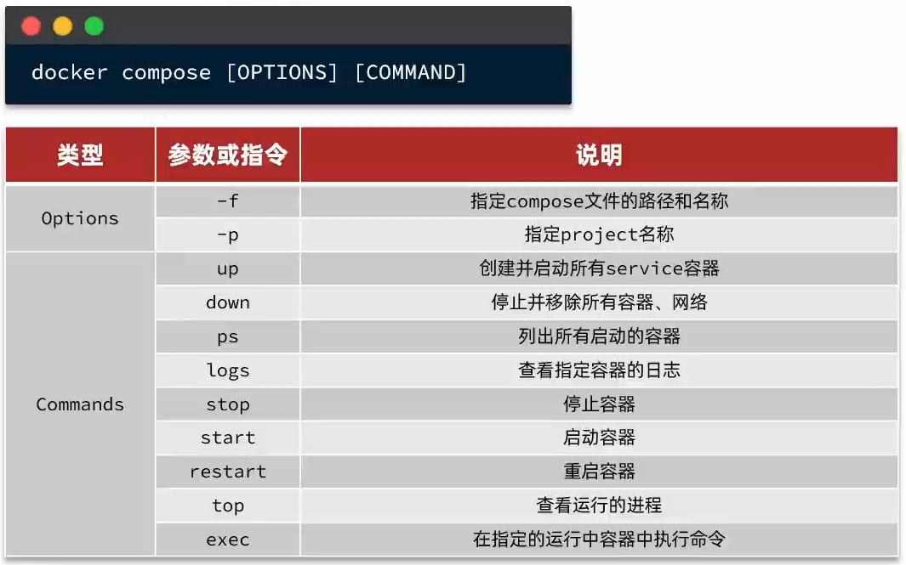
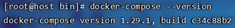
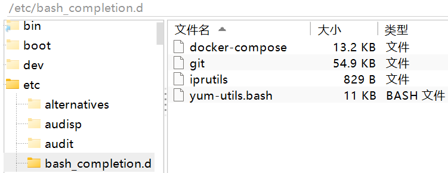
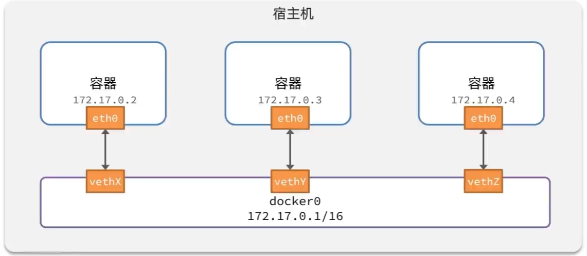
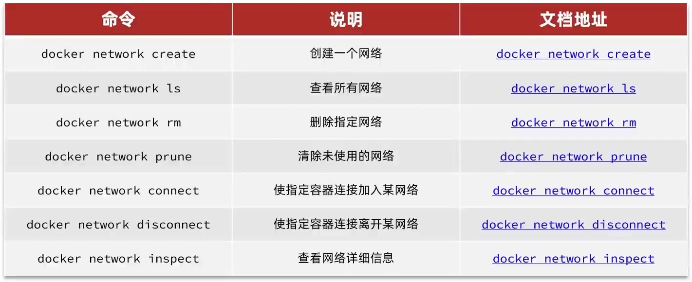
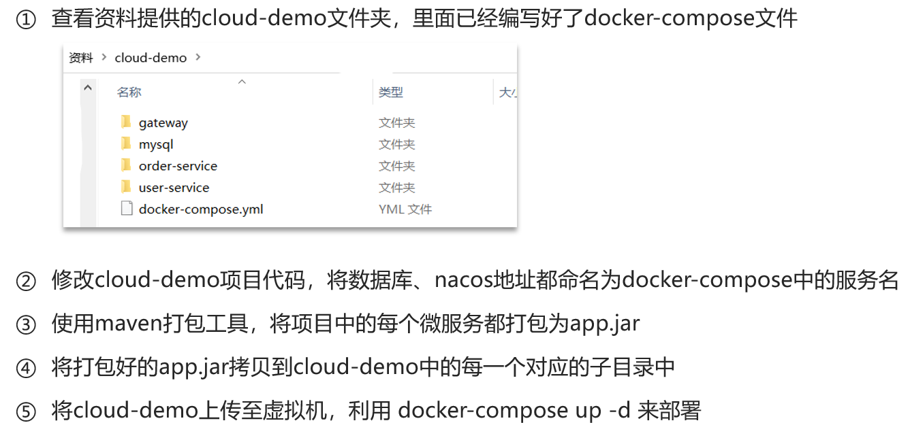
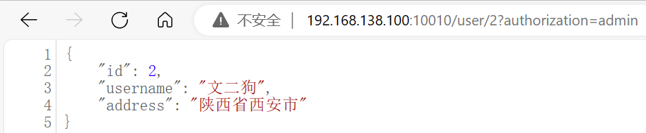
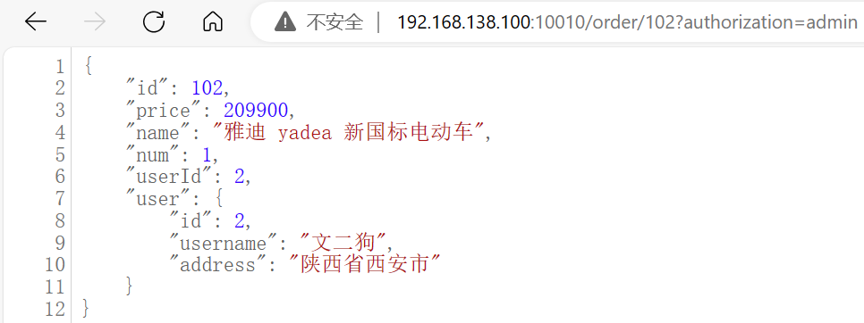

# DockerCompose部署微服务

## DockerCompose

> - 是一个文本文件，通过指令定义集群中的**每个容器如何运行（Dockfile是定义镜像的构建）**
> - 可以基于Compose文件快速的部署分布式应用，而无需手动一个个创建和运行容器



官方文档：[Overview | Docker Docs](https://docs.docker.com/compose/compose-file/)

## 与Docker命令行对比



## docker compose命令



## 安装docker-compose

> `docker-compose`和`docker compose`在功能上是一致，但`docker-compose`需要单独安装

### 命令安装

```
curl -L https://github.com/docker/compose/releases/download/1.23.1/docker-compose-`uname -s`-`uname -m` > /usr/local/bin/docker-compose
```

> 由于是国外网站，安装比较慢，可以选择手动安装

### 手动安装

上传文件到：

```
cd /usr/local/bin/
```

> 

修改权限：

```
chmod +x /usr/local/bin/docker-compose
```

查看版本：

```
docker-compose --version
```

> 

### Base自动补全命令

补全命令：

```
curl -L https://raw.githubusercontent.com/docker/compose/1.29.1/contrib/completion/bash/docker-compose > /etc/bash_completion.d/docker-compose
```

> 如果拒绝连接，则修改hosts文件再执行：
>
> ```
> echo "199.232.68.133 raw.githubusercontent.com" >> /etc/hosts
> ```
>
> 如果连接超时错误，可以通过浏览器访问（使用代理），复制网页所有信息后手动复制粘贴到`/etc/bash_completion.d`目录下的docker-compose文件即可：
>
> 

## 部署微服务集群

### 容器网络

默认情况下，所有容器都是以bridge方式连接到Docker的一个虚拟网桥上：



网络命令：



### 项目部署



> cloud-demo.zip已经打包好，只需要部署即可

docker-compose.yml

```yaml
version: "3.2"

services:
  nacos:
    image: nacos/nacos-server
    environment:
      MODE: standalone
    ports:
      - "8848:8848"
  mysql:
    image: mysql:5.7.25
    environment:
      MYSQL_ROOT_PASSWORD: 123
    volumes:
      - "$PWD/mysql/data:/var/lib/mysql"
      - "$PWD/mysql/conf:/etc/mysql/conf.d/"
  userservice:
    build: ./user-service
  orderservice:
    build: ./order-service
  gateway:
    build: ./gateway
    ports:
      - "10010:10010"
```

切换目录：

```
cd /usr/local/docker-demo # 存入文件


yum install unzip # 安装解压软件
unzip cloud-demo.zip # 解压压缩包


cd cloud-demo
```

创建并执行容器：

```
docker-compose up -d
```

> 
>
> 查看日志：
>
> ```
> docker-compose logs -f
> ```
>
> 由于执行先后顺序的问题，服务注册与配置中心nacos还未启动成功，导致API网关gateway注册失败，导致SpringBoot连接失败，重新启动服务即可
>
> ```
> # 如果比较卡则一个个重启即可
> docker-compose restart gateway
> docker-compose restart userservice
> docker-compose restart orderservice
> ```

开放端口：

```
firewall-cmd --add-port=10010/tcp --permanent

firewall-cmd --reload
```

运行效果：





> 杀死所有容器进程命令：
>
> ```
> docker kill $(docker ps -q)
> ```