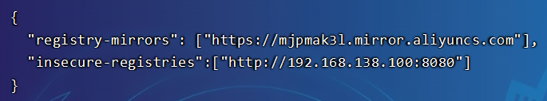
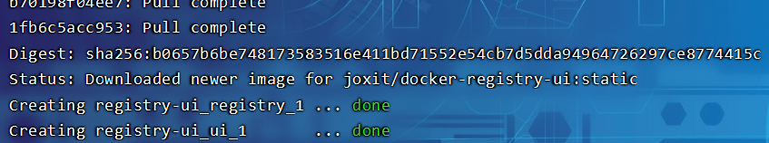
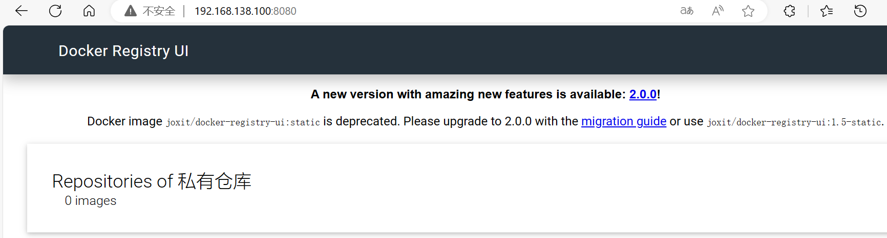
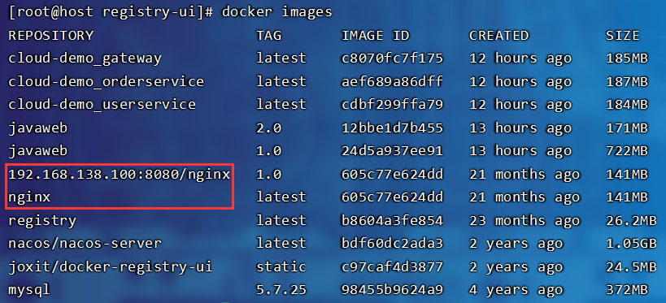
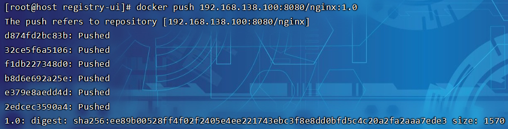
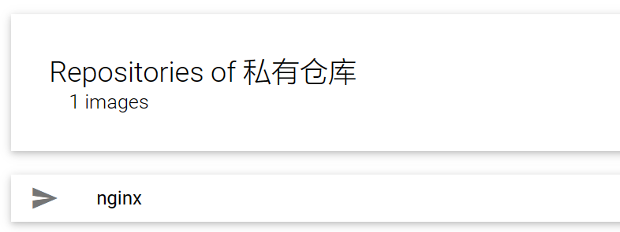
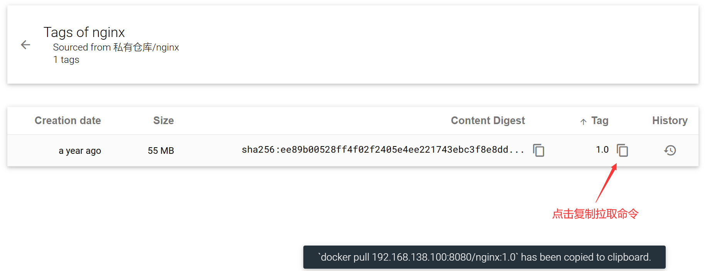
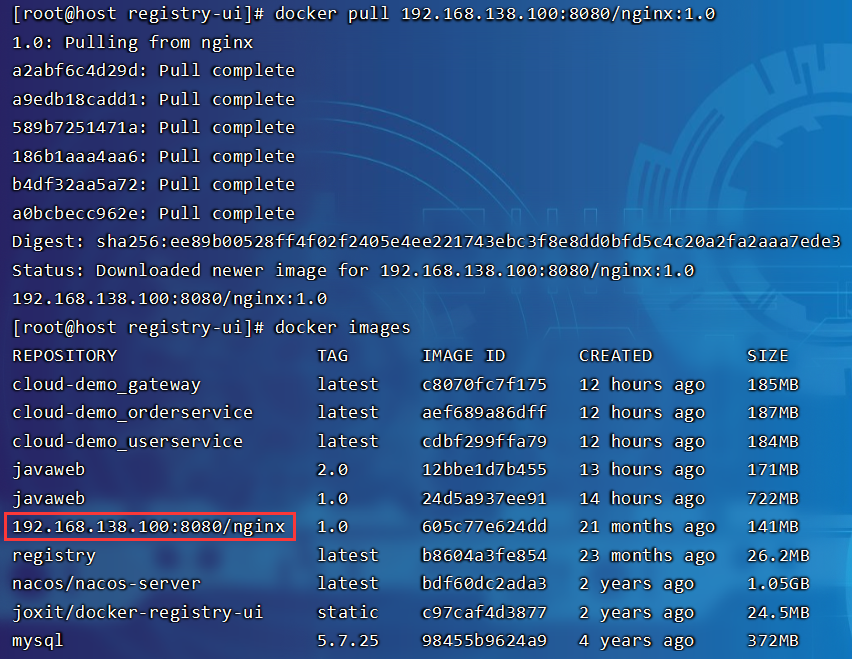

# Docker镜像仓库

镜像仓库（ Docker Registry ）有公共的和私有的两种形式：

- 公共仓库：例如Docker官方的 [Docker Hub](https://hub.docker.com/)，国内也有一些云服务商提供类似于 Docker Hub 的公开服务，比如 [网易云镜像服务](https://c.163.com/hub)、[DaoCloud](https://hub.daocloud.io/)[ ](https://hub.daocloud.io/)[镜像服务](https://hub.daocloud.io/)、[阿里云镜像服务](https://cr.console.aliyun.com/)等。

- 除了使用公开仓库外，用户还可以在本地搭建私有 Docker Registry。企业自己的镜像最好是采用私有Docker Registry来实现

## 配置Docker信任地址

私服采用的是http协议，默认不被Docker信任，所以需要做一个配置：

```
# 打开要修改的文件
vi /etc/docker/daemon.json

# 添加内容：
"insecure-registries":["http://192.168.138.100:8080"]

# 重加载
systemctl daemon-reload

# 重启docker
systemctl restart docker
```

> 

## 简化版镜像仓库

Docker官方的Docker Registry是一个基础版本的Docker镜像仓库，具备仓库管理的完整功能，但是没有图形化界面，搭建命令如下：

```
docker run -d \
    --restart=always \
    --name registry	\
    -p 5000:5000 \
    -v registry-data:/var/lib/registry \
    registry
```

> 命令中挂载了一个数据卷registry-data到容器内的`/var/lib/registry`目录，这是私有镜像库存放数据的目录

访问http://192.168.138.100:5000/v2/_catalog，可以查看当前私有镜像服务中包含的镜像

## 图形化界面仓库

> 使用DockerCompose部署带有图形化界面的DockerRegistry

```
cd /usr/local/docker-demo

mkdir registry-ui

cd registry-ui

touch docker-compose.yml
```

docker-compose.yml

```yaml
version: '3.0'
services:
  registry:
    image: registry
    volumes:
      - ./registry-data:/var/lib/registry
  ui:
    image: joxit/docker-registry-ui:static
    ports:
      - 8080:80
    environment:
      - REGISTRY_TITLE=私有仓库
      - REGISTRY_URL=http://registry:5000
    depends_on:
      - registry
```

执行文件：

```
docker-compose up -d
```

> 

访问8080端口：



## 镜像仓库推送和拉取

> 推送镜像到私有镜像服务必须先tag，名称前缀为私有仓库的地址：`192.168.138.100:8080/`
>
> ```
> docker tag nginx:latest 192.168.138.100:8080/nginx:1.0
> ```
>
> 

推送镜像：

```
docker push 192.168.138.100:8080/nginx:1.0
```

> 
>
> 重新访问：
>
> 
>
> 

拉取镜像：

> 先删除原有的镜像：
>
> ```
> docker rmi 192.168.138.100:8080/nginx:1.0
> docker rmi nginx:latest
> ```
>
> 如果镜像正在被容器使用，则需要先删除容器，再删除镜像：
>
> ```
> docker ps -a | grep 'nginx:latest'
> 
> docker stop 1f14be5c7659
> docker rm 1f14be5c7659
> ```

拉取命令：

```
docker pull 192.168.138.100:8080/nginx:1.0
```

> 