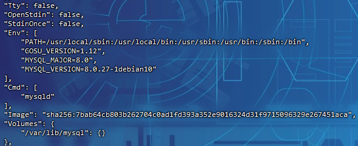
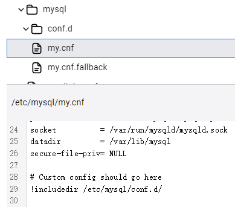
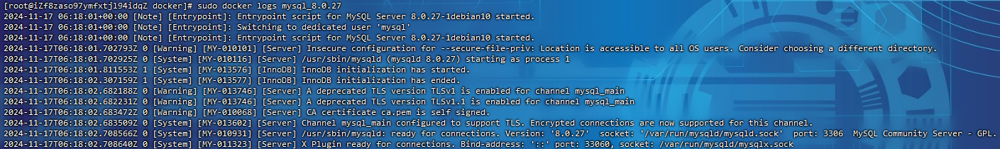
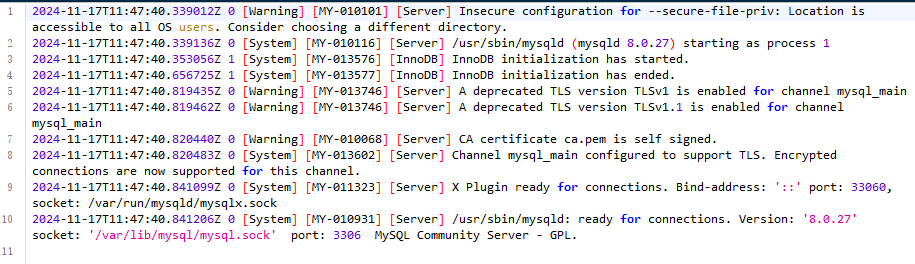
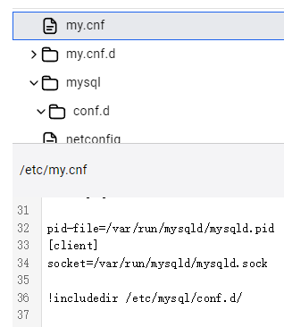

# Docker安装mysql

## 拉取镜像

```
sudo docker pull mysql:latest
```

> ```
> sudo docker pull mysql:8.0.27
> ```

查看版本信息：

```
sudo docker inspect mysql:latest
```

> 

## 启动容器

```
sudo mkdir -p /usr/local/docker/mysql_8.0.27/{log,data,conf,mysql-files}


sudo docker run -p 3308:3306 --name mysql_8.0.27 \
  -v /usr/local/docker/mysql_8.0.27/log:/var/log \
  -v /usr/local/docker/mysql_8.0.27/data:/var/lib/mysql \
  -v /usr/local/docker/mysql_8.0.27/conf.d:/etc/mysql/conf.d \
  -v /usr/local/docker/mysql_8.0.27/mysql-files:/var/lib/mysql-files \
  -e MYSQL_ROOT_PASSWORD=root \
  -d mysql:latest

```

> - `-p 3308:3306`：将宿主机的3308端口映射到容器内部的 3306 端口。这意味着从宿主机上访问3308端口时，会连接到容器内的MySQL服务
> - `--name mysql_8.0.27`：为容器指定了一个名称`mysql_8.0.27`，这样就可以通过这个名字来管理和操作这个容器
> - `-v /usr/local/docker/mysql_8.0.27/log:/var/log/mysql`：宿主机的`/usr/local/docker/mysql_8.0.27/log`目录挂载到容器内的 `/var/log/mysql` 目录。这样做是为了将 MySQL 的日志文件写入宿主机的指定目录，而不是在容器内部创建日志文件
> - `-v /usr/local/docker/mysql_8.0.27/data:/var/lib/mysql`：将宿主机的`/usr/local/docker/mysql_8.0.27/data`目录挂载到容器内的`/var/lib/mysql`目录。这样做是为了将 MySQL 的数据文件（如数据库文件和表文件）存储在宿主机的指定目录，而不是在容器内部创建数据文件
> - `-v /usr/local/docker/mysql_8.0.27/conf.d:/etc/mysql/conf.d`：将宿主机的`/usr/local/docker/mysql_8.0.27/conf.d`目录挂载到容器内的`/etc/mysql/conf.d`目录。这样做是为了将MySQL的配置文件（如`my.cnf`或`my.ini`）放在宿主机的指定目录，而不是在容器内部创建配置文件
> - `-v /usr/local/docker/mysql_8.0.27/mysql-files:/var/lib/mysql-files`：将宿主机的`/usr/local/docker/mysql_8.0.27/mysql-files`目录挂载到容器内的`/var/lib/mysql-files`目录。这样做是为了将 MySQL 的`--secure-file-priv`选项指定的目录放在宿主机的指定目录，而不是在容器内部创建该目录(当指定了外部配置文件与外部存储路径时（没有指定的话，不需要挂载`mysql-files`），也需要指定`/var/lib/mysql-files`的外部目录)
> - `-e MYSQL_ROOT_PASSWORD=root`：这个参数设置了 MySQL 的 root 用户的密码为`root`。这是为了在容器启动时自动设置 root 用户的密码
> - `-d mysql:latest`：这个参数以守护进程模式（detached）运行 MySQL 容器，并且使用`mysql:latest`镜像
>
> 容器创建之后，配置文件目录会自动置空：
>
> 
>
> 注意：如果容器被删除了，但已经使用Docker卷（volume）或绑定挂载（bind mount）将数据从容器挂载到宿主机上，那么挂载在宿主机上的文件通常会保留
>
> 重置密码：
>
> ```
> sudo docker exec -it mysql_8.0.27 mysqladmin -u root password 'newpassword'
> ```

查看日志：

```
sodo docker logs mysql_8.0.27
```

> 

## 进入容器

```
sudo docker exec -it mysql_8.0.27 bash
```

> 退出：
>
> ```
> exit
> ```

### 密码配置

> 默认是允许远程连接的，且密码为启动容器时设置的密码

更改权限和密码：

```
-- 设置一个复杂密码，防止密码强度不够
alter user 'root'@'localhost' identified by '13&Uasdf!ahjsf' password expire never;

flush privileges;

-- 降低密码强度
SET GLOBAL validate_password.policy=LOW;
SET GLOBAL validate_password.length=1;

-- 更改root用户的密码，并将其设置为永不过期
alter user 'root'@'localhost' identified by 'password' password expire never;

-- 更改root密码为'password'并明确指定使用mysql_native_password认证插件
alter user 'root'@'localhost' identified with mysql_native_password by 'password';

flush privileges;

use mysql

-- 将用户名为root且主机名为localhost的记录的host字段改为%,允许root用户从任何主机连接到MySQL服务器
update user set host='%' where user='root' and host='localhost';

flush privileges;

exit

```

## 配置文件

创建文件`my.cnf`在`/usr/local/docker/mysql_8.0.27/conf`目录:

```
# For advice on how to change settings please see
# http://dev.mysql.com/doc/refman/8.0/en/server-configuration-defaults.html

[mysqld]
#
# Remove leading # and set to the amount of RAM for the most important data
# cache in MySQL. Start at 70% of total RAM for dedicated server, else 10%.
# innodb_buffer_pool_size = 128M
#
# Remove the leading "# " to disable binary logging
# Binary logging captures changes between backups and is enabled by
# default. It's default setting is log_bin=binlog
# disable_log_bin
#
# Remove leading # to set options mainly useful for reporting servers.
# The server defaults are faster for transactions and fast SELECTs.
# Adjust sizes as needed, experiment to find the optimal values.
# join_buffer_size = 128M
# sort_buffer_size = 2M
# read_rnd_buffer_size = 2M
#
# Remove leading # to revert to previous value for default_authentication_plugin,
# this will increase compatibility with older clients. For background, see:
# https://dev.mysql.com/doc/refman/8.0/en/server-system-variables.html#sysvar_default_authentication_plugin
# default-authentication-plugin=mysql_native_password

datadir=/var/lib/mysql
socket=/var/lib/mysql/mysql.sock

log-error=/var/log/mysqld.log
#pid-file=/var/run/mysqld/mysqld.pid

```

配置日志文件权限：

```
touch /var/log/mysqld.log
chown mysql:mysql /var/log/mysqld.log
chmod 660 /var/log/mysqld.log
```

> 重启数据库：
>
> ```
> docker restart mysql_8.0.27
> ```
>
> 

## 更高版本

```
sudo docker run -p 3308:3306 --name mysql_8.0.40 \
  -v /usr/local/docker/mysql_8.0.40/data:/var/lib/mysql \
  -v /usr/local/docker/mysql_8.0.40/conf.d:/etc/mysql/conf.d \
  -e MYSQL_ROOT_PASSWORD=root \
  -d mysql:8.0.40

```

> 配置文件位置有所不同，但还是对应挂载目录还是不变：
>
> 

## 资源调控

```
sudo docker run -p 3308:3306 --name mysql_8.0.27 \
  -v /usr/local/docker/mysql_8.0.27/log:/var/log/mysql \
  -v /usr/local/docker/mysql_8.0.27/data:/var/lib/mysql \
  -v /usr/local/docker/mysql_8.0.27/conf.d:/etc/mysql/conf.d \
  -v /usr/local/docker/mysql_8.0.27/mysql-files:/var/lib/mysql-files \
  -e MYSQL_ROOT_PASSWORD=root \
  --memory="1g" \
  --cpus="2.0" \
  --device-read-bps=/dev/sda:10GB \
  --device-write-bps=/dev/sda:10GB \
  -d mysql:latest

```

> - `--memory="1g"`：限制容器最大内存占用为1G
> - `--cpus="2.0"`：限制容器可以使用最多2个CPU核心
> - `--device-read-bps=/dev/sda:10GB`：限制容器对`/dev/sda`设备的最大读速率为10GB/s
> - `--device-write-bps=/dev/sda:10GB`：限制容器对`/dev/sda`设备的最大写速率为10GB/s

## 镜像管理

导出镜像：

```
docker save -o mysql_8.0.27.tar mysql:latest
```

导入镜像：

```
docker load -i mysql_8.0.27.tar
```

## 环境变量

**可定制的环境变量**

| 名称                            | 描述                                                         | 默认值  |
| ------------------------------- | ------------------------------------------------------------ | ------- |
| `ALLOW_EMPTY_PASSWORD`          | 允许 MySQL 访问而无需任何密码                                | `no`    |
| `MYSQL_AUTHENTICATION_PLUGIN`   | 在第一次初始化期间配置的 MySQL 身份验证插件。                | `nil`   |
| `MYSQL_ROOT_USER`               | MySQL 数据库 root 用户。                                     | `root`  |
| `MYSQL_ROOT_PASSWORD`           | MySQL数据库root用户密码。                                    | `nil`   |
| `MYSQL_USER`                    | MySQL 数据库用户在第一次初始化期间创建。                     | `nil`   |
| `MYSQL_PASSWORD`                | 首次初始化期间创建的 MySQL 数据库用户的密码。                | `nil`   |
| `MYSQL_DATABASE`                | 在第一次初始化期间创建的 MySQL 数据库。                      | `nil`   |
| `MYSQL_MASTER_HOST`             | MySQL 主节点的地址。                                         | `nil`   |
| `MYSQL_MASTER_PORT_NUMBER`      | MySQL 主节点的端口号。                                       | `3306`  |
| `MYSQL_MASTER_ROOT_USER`        | master主机的MySQL数据库root用户。                            | `root`  |
| `MYSQL_MASTER_ROOT_PASSWORD`    | master主机的MySQL数据库root用户的密码。                      | `nil`   |
| `MYSQL_MASTER_DELAY`            | MySQL 数据库复制延迟。                                       | `0`     |
| `MYSQL_REPLICATION_USER`        | MySQL 复制数据库用户。                                       | `nil`   |
| `MYSQL_REPLICATION_PASSWORD`    | MySQL 复制数据库用户的密码。                                 | `nil`   |
| `MYSQL_PORT_NUMBER`             | 用于 MySQL 服务器服务的端口号。                              | `nil`   |
| `MYSQL_REPLICATION_MODE`        | MySQL复制模式。                                              | `nil`   |
| `MYSQL_REPLICATION_SLAVE_DUMP`  | 在主 MySQL 数据库上进行转储并更新从属 MySQL 数据库           | `false` |
| `MYSQL_EXTRA_FLAGS`             | 启动 MySQL 服务器时需要传递的额外标志。                      | `nil`   |
| `MYSQL_INIT_SLEEP_TIME`         | 等待 MySQL 初始化配置操作完成时的睡眠时间。                  | `nil`   |
| `MYSQL_CHARACTER_SET`           | 要使用的 MySQL 排序规则。                                    | `nil`   |
| `MYSQL_COLLATE`                 | 要使用的 MySQL 排序规则。                                    | `nil`   |
| `MYSQL_BIND_ADDRESS`            | MySQL绑定地址。                                              | `nil`   |
| `MYSQL_SQL_MODE`                | 要启用的 MySQL 服务器 SQL 模式。                             | `nil`   |
| `MYSQL_IS_DEDICATED_SERVER`     | MySQL 服务器是否将在专用节点上运行。                         | `nil`   |
| `MYSQL_CLIENT_ENABLE_SSL`       | 是否强制使用 SSL 来连接 MySQL 数据库。                       | `no`    |
| `MYSQL_CLIENT_SSL_CA_FILE`      | 用于与 MySQL 数据库服务器进行 SSL 连接的 CA 证书的路径。     | `nil`   |
| `MYSQL_CLIENT_SSL_CERT_FILE`    | 用于与 MySQL 数据库服务器进行 SSL 连接的客户端公钥证书的路径。 | `nil`   |
| `MYSQL_CLIENT_SSL_KEY_FILE`     | 用于与 MySQL 数据库服务器进行 SSL 连接的客户端私钥的路径。   | `nil`   |
| `MYSQL_CLIENT_EXTRA_FLAGS`      | 是否使用“mysql”CLI 工具强制进行 SSL 连接。对于依赖 CLI 而不是 API 的应用程序很有用。 | `no`    |
| `MYSQL_STARTUP_WAIT_RETRIES`    | 等待数据库运行的重试次数。                                   | `300`   |
| `MYSQL_STARTUP_WAIT_SLEEP_TIME` | 等待数据库运行的重试之间的睡眠时间。                         | `2`     |
| `MYSQL_ENABLE_SLOW_QUERY`       | 是否启用慢查询日志。                                         | `0`     |
| `MYSQL_LONG_QUERY_TIME`         | 多少时间（以秒为单位）定义了慢速查询。                       | `10.0`  |

**只读环境变量**

| 名称                          | 描述                                     | 默认值                        |
| ----------------------------- | ---------------------------------------- | ----------------------------- |
| `DB_FLAVOR`                   | SQL 数据库风格。有效值：mariadb或mysql。 | `mysql`                       |
| `DB_BASE_DIR`                 | MySQL 文件的基本路径。                   | `${BITNAMI_ROOT_DIR}/mysql`   |
| `DB_VOLUME_DIR`               | 持久文件的 MySQL 目录。                  | `${BITNAMI_VOLUME_DIR}/mysql` |
| `DB_DATA_DIR`                 | MySQL 数据文件目录。                     | `${DB_VOLUME_DIR}/data`       |
| `DB_BIN_DIR`                  | 可执行二进制文件所在的 MySQL 目录。      | `${DB_BASE_DIR}/bin`          |
| `DB_SBIN_DIR`                 | 服务二进制文件所在的MySQL目录。          | `${DB_BASE_DIR}/bin`          |
| `DB_CONF_DIR`                 | MySQL 配置目录。                         | `${DB_BASE_DIR}/conf`         |
| `DB_DEFAULT_CONF_DIR`         | MySQL默认配置目录。                      | `${DB_BASE_DIR}/conf.default` |
| `DB_LOGS_DIR`                 | MySQL 日志目录。                         | `${DB_BASE_DIR}/logs`         |
| `DB_TMP_DIR`                  | MySQL 临时文件目录。                     | `${DB_BASE_DIR}/tmp`          |
| `DB_CONF_FILE`                | 主要 MySQL 配置文件。                    | `${DB_CONF_DIR}/my.cnf`       |
| `DB_PID_FILE`                 | MySQL PID 文件。                         | `${DB_TMP_DIR}/mysqld.pid`    |
| `DB_SOCKET_FILE`              | MySQL 服务器套接字文件。                 | `${DB_TMP_DIR}/mysql.sock`    |
| `DB_DAEMON_USER`              | 将执行 MySQL Server 进程的用户。         | `mysql`                       |
| `DB_DAEMON_GROUP`             | 将执行 MySQL Server 进程的组。           | `mysql`                       |
| `MYSQL_DEFAULT_PORT_NUMBER`   | 用于 MySQL 服务器服务的默认端口号。      | `3306`                        |
| `MYSQL_DEFAULT_CHARACTER_SET` | 默认 MySQL 字符集。                      | `utf8mb4`                     |
| `MYSQL_DEFAULT_BIND_ADDRESS`  | 默认 MySQL 绑定地址。                    | `0.0.0.0`                     |

### 首次运行时设置root密码

> 可以使用以下环境变量通过设置root用户和密码
>
> - `MYSQL_ROOT_USER`：数据库管理员用户。默认为root
> - `MYSQL_ROOT_PASSWORD`：数据库管理员用户密码。没有默认值

在首次运行时会设置以上用户名及密码：

```
docker run --name mysql -e MYSQL_ROOT_PASSWORD=qingcloud123 registry.cn-hangzhou.aliyuncs.com/qingcloudtech/mysql:latest
```

修改`docker-compose.yml`文件：

```yaml
services:
  mysql:
  ...
    environment:
      - MYSQL_ROOT_PASSWORD=qingcloud123
  ...
```

> MYSQL_ROOT_USER始终是通过远程访问创建的。建议始终指定 env 变量来为用户MYSQL_ROOT_USER设置密码MYSQL_ROOT_PASSWORD。如果您希望允许MYSQL_ROOT_USER用户无需密码即可访问数据库，请设置环境变量ALLOW_EMPTY_PASSWORD=yes。建议仅用于开发

### 设置字符集和排序规则

> 可以使用以下环境变量配置数据库默认使用的字符集和排序规则：
>
> - `MYSQL_CHARACTER_SET`：使用的默认字符集。默认：`utf8mb4`
> - `MYSQL_COLLATE`：要使用的默认排序规则。默认：`utf8_general_ci`

### 首次运行时创建数据库

`MYSQL_DATABASE`通过在第一次运行镜像时传递环境变量，将创建一个数据库。如果应用程序要求数据库已存在，不必使用MySQL客户端手动创建数据库：

```
docker run --name mysql \
    -e ALLOW_EMPTY_PASSWORD=yes \
    -e MYSQL_DATABASE=my_database \
    registry.cn-hangzhou.aliyuncs.com/qingcloudtech/mysql:latest
```

或者通过修改`docker-compose.yml`文件：

```yaml
services:
  mysql:
  ...
    environment:
      - ALLOW_EMPTY_PASSWORD=yes
      - MYSQL_DATABASE=my_database
  ...
```

### 首次运行时创建数据库用户

可以创建一个受限数据库用户，该用户仅具有**使用环境变量创建的数据库的权限**`MYSQL_DATABASE`。为此，请提供`MYSQL_USER`环境变量并为提供该变量的数据库用户设置密码`MYSQL_PASSWORD`。MySQL支持不同的身份验证机制，例如`caching_sha2_password`或`mysql_native_password`。可以`MYSQL_AUTHENTICATION_PLUGIN`变量：

```
docker run --name mysql \
  -e ALLOW_EMPTY_PASSWORD=yes \
  -e MYSQL_USER=my_user \
  -e MYSQL_PASSWORD=my_password \
  -e MYSQL_DATABASE=my_database \
  -e MYSQL_AUTHENTICATION_PLUGIN=mysql_native_password \
  registry.cn-hangzhou.aliyuncs.com/qingcloudtech/mysql:latest
```

或者通过修改`docker-compose.yml`文件：

```yaml
services:
  mysql:
  ...
    environment:
      - ALLOW_EMPTY_PASSWORD=yes
      - MYSQL_USER=my_user
      - MYSQL_PASSWORD=my_password
      - MYSQL_DATABASE=my_database
  ...
```

> 注意：这里如果要禁用空密码, 可以配置`MYSQL_ROOT_PASSWORD`环境变量替代`ALLOW_EMPTY_PASSWORD=yes`
