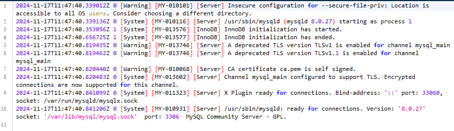

# 安装mysql

## 拉取镜像

```
sudo docker pull mysql:latest
```

> ```
> sudo docker pull mysql:8.0.27
> ```

查看版本信息：

```
sudo docker inspect mysql:latest
```

> 

## 启动容器

```
sudo mkdir -p /usr/local/docker/mysql_8.0.27/{log,data,conf,mysql-files}


sudo docker run -p 3308:3306 --name mysql_8.0.27 \
  -v /usr/local/docker/mysql_8.0.27/log:/var/log \
  -v /usr/local/docker/mysql_8.0.27/data:/var/lib/mysql \
  -v /usr/local/docker/mysql_8.0.27/conf:/etc/mysql \
  -v /usr/local/docker/mysql_8.0.27/mysql-files:/var/lib/mysql-files \
  -e MYSQL_ROOT_PASSWORD=root \
  -d mysql:latest

```

> - `-p 3308:3306`：这个参数将宿主机的 3308 端口映射到容器内部的 3306 端口。这意味着从宿主机上访问 3308 端口时，会连接到容器内的 MySQL 服务
> - `--name mysql_8.0.27`：这个参数为容器指定了一个名称 `mysql_8.0.27`，这样就可以通过这个名字来管理和操作这个容器
> - `-v /usr/local/docker/mysql_8.0.27/log:/var/log/mysql`：这个参数将宿主机的 `/usr/local/docker/mysql_8.0.27/log` 目录挂载到容器内的 `/var/log/mysql` 目录。这样做是为了将 MySQL 的日志文件写入宿主机的指定目录，而不是在容器内部创建日志文件
> - `-v /usr/local/docker/mysql_8.0.27/data:/var/lib/mysql`：这个参数将宿主机的 `/usr/local/docker/mysql_8.0.27/data` 目录挂载到容器内的 `/var/lib/mysql` 目录。这样做是为了将 MySQL 的数据文件（如数据库文件和表文件）存储在宿主机的指定目录，而不是在容器内部创建数据文件
> - `-v /usr/local/docker/mysql_8.0.27/conf:/etc/mysql`：这个参数将宿主机的 `/usr/local/docker/mysql_8.0.27/conf` 目录挂载到容器内的 `/etc/mysql` 目录。这样做是为了将 MySQL 的配置文件（如 `my.cnf` 或 `my.ini`）放在宿主机的指定目录，而不是在容器内部创建配置文件
> - `-v /usr/local/docker/mysql_8.0.27/mysql-files:/var/lib/mysql-files`：这个参数将宿主机的 `/usr/local/docker/mysql_8.0.27/mysql-files` 目录挂载到容器内的 `/var/lib/mysql-files` 目录。这样做是为了将 MySQL 的 `--secure-file-priv` 选项指定的目录放在宿主机的指定目录，而不是在容器内部创建该目录(当指定了外部配置文件与外部存储路径时（没有指定的话，不需要挂载`mysql-files`），也需要指定`/var/lib/mysql-files`的外部目录)
> - `-e MYSQL_ROOT_PASSWORD=root`：这个参数设置了 MySQL 的 root 用户的密码为 `root`。这是为了在容器启动时自动设置 root 用户的密码
> - `-d mysql:latest`：这个参数以守护进程模式（detached）运行 MySQL 容器，并且使用 `mysql:latest` 镜像
>
> 如果容器被删除了，但已经使用Docker卷（volume）或绑定挂载（bind mount）将数据从容器挂载到宿主机上，那么挂载在宿主机上的文件通常会保留
>
> 重置密码：
>
> ```
> sudo docker exec -it mysql_8.0.27 mysqladmin -u root password 'newpassword'
> ```

查看日志：

```
sodo docker logs mysql_8.0.27
```

> 

## 进入容器

```
sudo docker exec -it mysql_8.0.27 bash
```

> 退出：
>
> ```
> exit
> ```

### 密码配置

> 默认是允许远程连接的，且密码为启动容器时设置的密码

更改权限和密码：

```
-- 设置一个复杂密码，防止密码强度不够
alter user 'root'@'localhost' identified by '13&Uasdf!ahjsf' password expire never;

flush privileges;

-- 降低密码强度
SET GLOBAL validate_password.policy=LOW;
SET GLOBAL validate_password.length=1;

-- 更改root用户的密码，并将其设置为永不过期
alter user 'root'@'localhost' identified by 'password' password expire never;

-- 更改root密码为'password'并明确指定使用mysql_native_password认证插件
alter user 'root'@'localhost' identified with mysql_native_password by 'password';

flush privileges;

use mysql

-- 将用户名为root且主机名为localhost的记录的host字段改为%,允许root用户从任何主机连接到MySQL服务器
update user set host='%' where user='root' and host='localhost';

flush privileges;

exit

```

## 配置文件

创建文件`my.cnf`在`/usr/local/docker/mysql_8.0.27/conf`目录:

```
# For advice on how to change settings please see
# http://dev.mysql.com/doc/refman/8.0/en/server-configuration-defaults.html

[mysqld]
#
# Remove leading # and set to the amount of RAM for the most important data
# cache in MySQL. Start at 70% of total RAM for dedicated server, else 10%.
# innodb_buffer_pool_size = 128M
#
# Remove the leading "# " to disable binary logging
# Binary logging captures changes between backups and is enabled by
# default. It's default setting is log_bin=binlog
# disable_log_bin
#
# Remove leading # to set options mainly useful for reporting servers.
# The server defaults are faster for transactions and fast SELECTs.
# Adjust sizes as needed, experiment to find the optimal values.
# join_buffer_size = 128M
# sort_buffer_size = 2M
# read_rnd_buffer_size = 2M
#
# Remove leading # to revert to previous value for default_authentication_plugin,
# this will increase compatibility with older clients. For background, see:
# https://dev.mysql.com/doc/refman/8.0/en/server-system-variables.html#sysvar_default_authentication_plugin
# default-authentication-plugin=mysql_native_password

datadir=/var/lib/mysql
socket=/var/lib/mysql/mysql.sock

log-error=/var/log/mysqld.log
#pid-file=/var/run/mysqld/mysqld.pid

```

配置日志文件权限：

```
touch /var/log/mysqld.log
chown mysql:mysql /var/log/mysqld.log
chmod 660 /var/log/mysqld.log
```

> 重启数据库：
>
> ```
> docker restart mysql_8.0.27
> ```
>
> 

## 资源调控

```
sudo docker run -p 3308:3306 --name mysql_8.0.27 \
  -v /usr/local/docker/mysql_8.0.27/log:/var/log/mysql \
  -v /usr/local/docker/mysql_8.0.27/data:/var/lib/mysql \
  -v /usr/local/docker/mysql_8.0.27/conf:/etc/mysql \
  -v /usr/local/docker/mysql_8.0.27/mysql-files:/var/lib/mysql-files \
  -e MYSQL_ROOT_PASSWORD=root \
  --memory="1g" \
  --cpus="2.0" \
  --device-read-bps=/dev/sda:10GB \
  --device-write-bps=/dev/sda:10GB \
  -d mysql:latest

```

> - `--memory="1g"`：限制容器最大内存占用为1G
> - `--cpus="2.0"`：限制容器可以使用最多2个CPU核心
> - `--device-read-bps=/dev/sda:10GB`：限制容器对`/dev/sda`设备的最大读速率为10GB/s
> - `--device-write-bps=/dev/sda:10GB`：限制容器对`/dev/sda`设备的最大写速率为10GB/s

## 镜像管理

导出镜像：

```
docker save -o mysql_8.0.27.tar mysql:latest
```

导入镜像：

```
docker load -i mysql_8.0.27.tar
```

