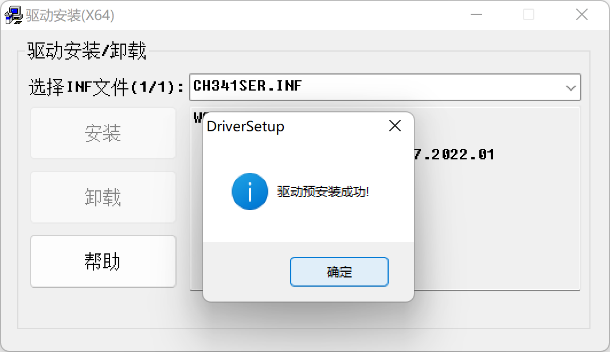
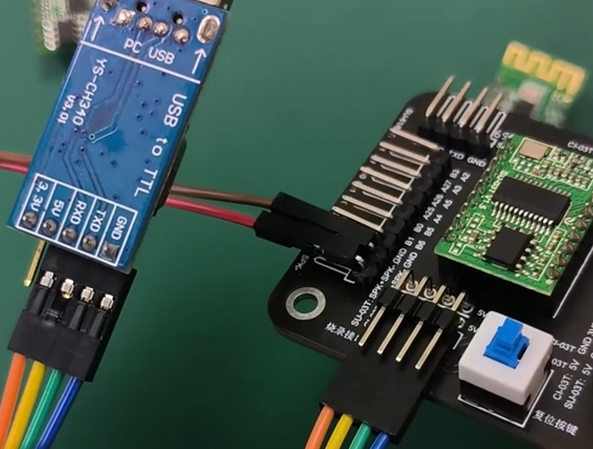

# 烧录

## 下载固件

### 烧录工具

[01、SU-03T、SU-61/63T、CI-03T模块转接板 - Powered by MinDoc (aimachip.com)](http://help.aimachip.com/docs/kyck/kyck_mkzjb_01)

### 配置固件信息

## 下载驱动

CH340驱动：[CH341SER.EXE - 南京沁恒微电子股份有限公司 (wch.cn)](https://www.wch.cn/download/CH341SER_EXE.html)

安装成功

（**安装此驱动可能会挤占Thonny的固定识别，可以重新选择，或者改为自动识别(似乎有BUG)都可以**）

## 烧录连接

### 模块转发版连接

（左下角为喇叭，**喇叭和咪头正反随意**）

### 直接连接

## 开始烧录

打开之前下载的烧录工具-->打开SU-03T开发包

打开工具

选择镜像文件-->bin文件不能带中文路径

点击"烧录"-->等待设备

> - 如果是模块转发版则按下烧录按钮，等待烧录成功即可
> - 如果是直接连接的，则需要插拔VCC口，等待连接成功后烧录成功即可

## 外置供电

外置供电需要区分正反，其中**电源接口的黑色线的GMD口接模块的GND口**，**另外一个红色线接模块的VCC(5V)口**

