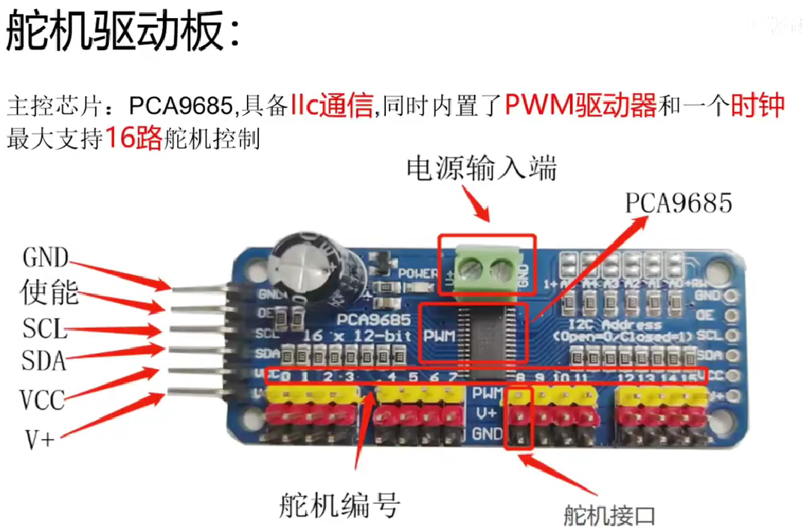
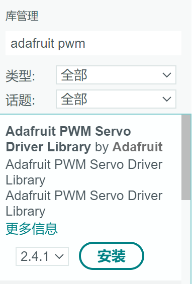

# PCA9685

## 基本信息



## 安装库



## 连接针脚

| PCA9685 | ESP8266 GPIO |    说明    |
| :-----: | :----------: | :--------: |
|   GND   |     GND      |   电源地   |
|   OE    |      /       |    使能    |
|   SCL   |   GPIO5/D1   |  I2C协议   |
|   SDA   |   GPIO4/D2   |  I2C协议   |
|   VCC   |     3V3      | 寄存器电源 |
|   V+    |     3V3      |  舵机电源  |

> **VCC、GND、V+这三个口是必须接的**，因为电流需要形成回路，所以这三个口必须在同一个电源系统中，**不能是V+由电池供电，而VCC和GDN由充电头供电**
>
> - 外置供电可以选择性的接

## 选择gpiotest示例

修改示例代码如下

```c
/*************************************************** 
  This is an example for our Adafruit 16-channel PWM & Servo driver
  GPIO test - this will set a pin high/low

  Pick one up today in the adafruit shop!
  ------> http://www.adafruit.com/products/815

  These drivers use I2C to communicate, 2 pins are required to  
  interface.For Arduino UNOs, thats SCL -> Analog 5, SDA -> Analog 4 对应esp8266就是

  Adafruit invests time and resources providing this open source code, 
  please support Adafruit and open-source hardware by purchasing 
  products from Adafruit!

  Written by Limor Fried/Ladyada for Adafruit Industries.  
  BSD license, all text above must be included in any redistribution
 ****************************************************/

#include <Wire.h>
#include <Adafruit_PWMServoDriver.h>

#define SERVO_0 102 //寄存器的值 102 = 0.5ms = 0°
#define SERVO_45 187 
#define SERVO_90 280 
#define SERVO_135 375 
#define SERVO_180 510 
// called this way, it uses the default address 0x40
Adafruit_PWMServoDriver pwm = Adafruit_PWMServoDriver();
// you can also call it with a different address you want
//Adafruit_PWMServoDriver pwm = Adafruit_PWMServoDriver(0x41);
// you can also call it with a different address and I2C interface
//Adafruit_PWMServoDriver pwm = Adafruit_PWMServoDriver(0x40, Wire);

void setup() {
  // Serial.begin(9600);
  // Serial.println("GPIO test!");
  pwm.begin();
  pwm.setPWMFreq(50);  //设置频率为50HZ，相当于20ms的周期
}

void loop() {
  // Drive each pin in a 'wave'
  // for (uint8_t pin=0; pin<16; pin++) {
  //   pwm.setPWM(pin, 4096, 0);       // turns pin fully on
  //   delay(100);
  //   pwm.setPWM(pin, 0, 4096);       // turns pin fully off
  // }
  pwm.setPWM(0 , 0 , SERVO_45); //舵机编号、脉冲启示时间，脉冲结束时间
  delay(1000);
  pwm.setPWM(0 , 0 , SERVO_90);
  delay(1000);
}
```