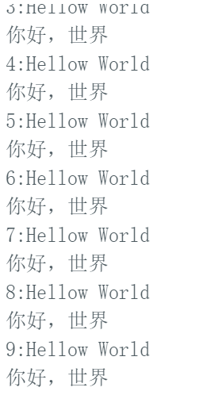

# 串口通信

Arduino与计算机通信最常用的方式就是串口通信，USB线连接esp与计算机时，可以通过串口与计算机通信，通过连接，esp便可与计算机互传数据

**波特率**是一个衡量通信速度的参数。它表示每秒钟传送的bit的个数。例如9600波特表示每秒发送9600bit的数据。通信双方需要使用一致的的波特率才能正常通信。串口通信通常会使用以下波特率：

300、600、1200、2400、4800、9600、14400、19200、28800、38400、57600、115200

## 串口输出

> 串口初始化完成后，便可以使用Serial.print() 或Serial.println() 向计算机发送信息了

```c++
int counter=0; // 计数器

void setup() {
  // 初始化串口
  Serial.begin(9600);
}

void loop() {
  // 每loop循环一次，计数器变量加1
  counter = counter+1;
  // 输出变量
  Serial.print(counter);
  // 输出字符
  Serial.print( ':' );
  // 输出字符串;
  Serial.println("Hellow World");
  Serial.println("你好，世界");
  delay(1000);
}
```



## 串口输出

```c++
void setup() {
  // 初始化串口
  Serial.begin(9600);
}

void loop() {
  // 如果缓冲区中有数据，则读取并输出
  if(Serial.available()>0)
    {
      char ch=Serial.read();
      Serial.print(ch);
      if(ch=='c'){
        Serial.print("你好");
      }
    }
}
```

> 可以将接收的中文打印出来，但是无法用于比较和逻辑运算，只能用英文字符进行比较
>
> 

此外，在涉及串口通信的Arduino Uno例程程序中，还会经常看到如下特殊用法：

```c
while (!Serial) { }
```

这是在**等待串口监视器开启**，开启串口监视器后，!Serial将为假，即会运行该while循环后的语句

## 软串口通信

Arduino还提供了SoftwareSerial类库，**它可以将你的其他数字引脚通过程序模拟成串口通信引脚**。通常将Arduino UNO上自带的串口称为硬件串口，而使用SoftwareSerial类库模拟成的串口，称为软件模拟串口（简称软串口）

SoftwareSerial类库是Arduino IDE默认提供的一个第三方类库，**和硬件串口不同**，其声明并没有包含在Arduino核心库中，因此要建立软串口通信，首先需要声明包含SoftwareSerial.h头文件，然后即可使用该类库中的构造函数，初始化一个软串口实例

