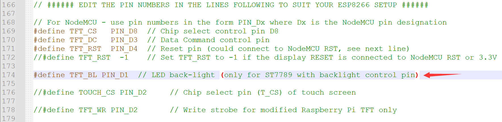

# 屏幕显示

## 屏幕点亮

### 连接针脚

| TFT  | ESP8266 GPIO |   说明   |
| :--: | :----------: | :------: |
| GND  |     GND      |  电源地  |
| VCC  |     3.3V     |   供电   |
| SCL  |   IO14/D5    |  时钟线  |
| SDA  |   IO13/D7    |  数据线  |
| RES  |    IO2/D4    |   复位   |
|  DC  |    IO0/D3    | 命令选择 |
| BLK  |    IO5/D1    | 背光开关 |

### 下载库


### 配置库

找到下载的库，打开`User_Setup.h`文件


设置屏幕驱动(**只能选择一个驱动程序，这里默认选择通用的，需要注释选择需要的ST7789驱动**)


设置屏幕尺寸


设置针脚



> 针脚定义文件在`User_Setup_Select.h`
>
> 

设置字体(无需修改)


设置频率(无需修改)


> 修复边缘杂色像素等显示异常问题，在确保前面只开启一个驱动的前提下，一此取消一个注释，进行尝试
>
> 

### 显示代码

```c
#include <Arduino.h>
#include <TFT_eSPI.h>

#define TFT_GREY 0x5AEB // New colour
TFT_eSPI tft = TFT_eSPI();

void displayes()
{
	Serial.begin(115200);
	/* 清屏函数，将背景颜色设置为灰色 */
    tft.fillScreen(TFT_GREY);
  
	/* 将“光标”设置在显示器的左上角（0,0），并选择字体2 */
	tft.setCursor(0, 0, 2);
	/* 将字体颜色设置为白色，背景为黑色，将文本大小倍增设置为1 */
	tft.setTextColor(TFT_WHITE,TFT_BLACK);  
	tft.setTextSize(1);
	// We can now plot text on screen using the "print" class
	tft.println("Hello World!");
	
	// Set the font colour to be yellow with no background, set to font 7
	tft.setTextColor(TFT_YELLOW,TFT_BLACK); tft.setTextFont(7);
	tft.println(1234.56);
	
	// Set the font colour to be green with black background, set to font 4
	tft.setTextColor(TFT_GREEN,TFT_BLACK);
	tft.setTextFont(4);
	tft.println("Groop");
	tft.println("I implore thee,");
 
	// Change to font 2
	tft.setTextFont(2);
	tft.println("my foonting turlingdromes.");
	tft.println("And hooptiously drangle me");
	tft.println("with crinkly bindlewurdles,");
	// This next line is deliberately made too long for the display width to test
	// automatic text wrapping onto the next line
	tft.println("Or I will rend thee in the gobberwarts with my blurglecruncheon, see if I don't!");
	
	// Test some print formatting functions
	float fnumber = 123.45;
	// Set the font colour to be blue with no background, set to font 4
	tft.setTextColor(TFT_BLUE);    tft.setTextFont(4);
	tft.print("Float = "); tft.println(fnumber);           // Print floating point number
	tft.print("Binary = "); tft.println((int)fnumber, BIN); // Print as integer value in binary
	tft.print("Hexadecimal = "); tft.println((int)fnumber, HEX); // Print as integer number in Hexadecimal
}
 
void setup() { 
	tft.init();
  tft.setRotation(0);
  tft.invertDisplay(0);

	displayes();
}
 
void loop() {
  // put your main code here, to run repeatedly:
}
```

### 参考文档

[ESP8266使用TFT-eSPI驱动ST7789 240*240 1.3寸 TFT_哈皮玩的博客-CSDN博客](https://blog.csdn.net/yulusilian1/article/details/120064858)（未写实际代码）

[TFT-eSPI入门使用教程 - 浇筑菜鸟 - 博客园 (cnblogs.com)](https://www.cnblogs.com/jzcn/p/16687980.html)（未提示注释通用驱动，代码需求有所不同）

[NodeMCU-ESP8266使用TFT_eSPI库驱动IC为ST7735的1.44寸TFT屏幕（TFT_eSPI详解）_esp8266 st7735_李shine的博客-CSDN博客](https://blog.csdn.net/qq_43168623/article/details/117983877)（相对较全，足够详细）

## 库的显示方法和函数