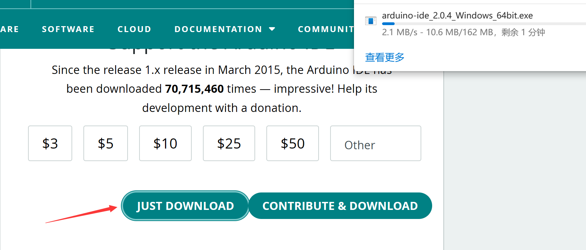
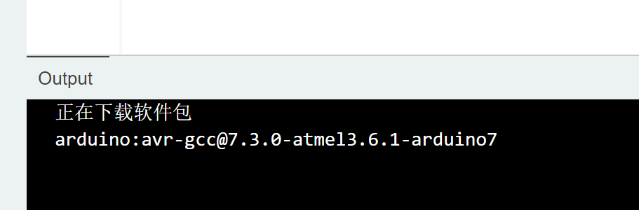
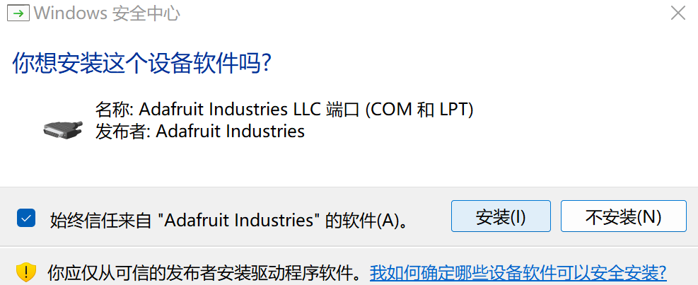
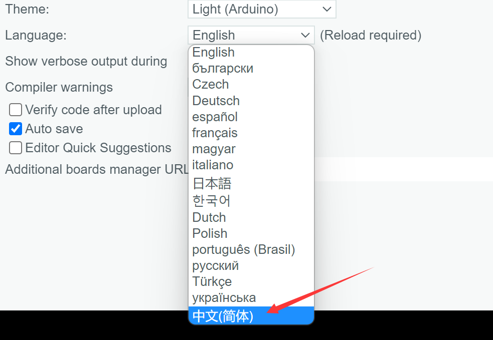
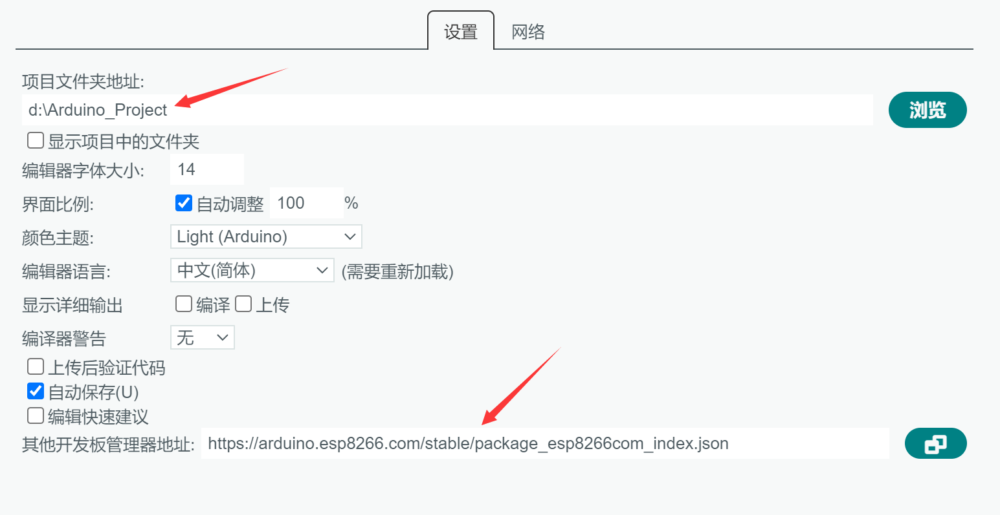
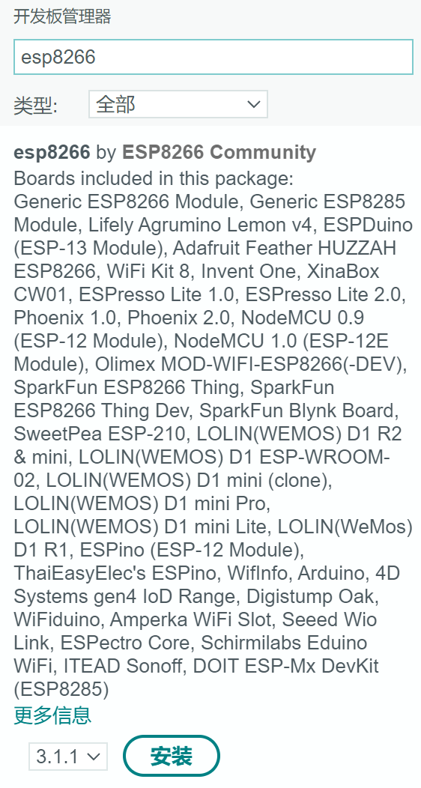
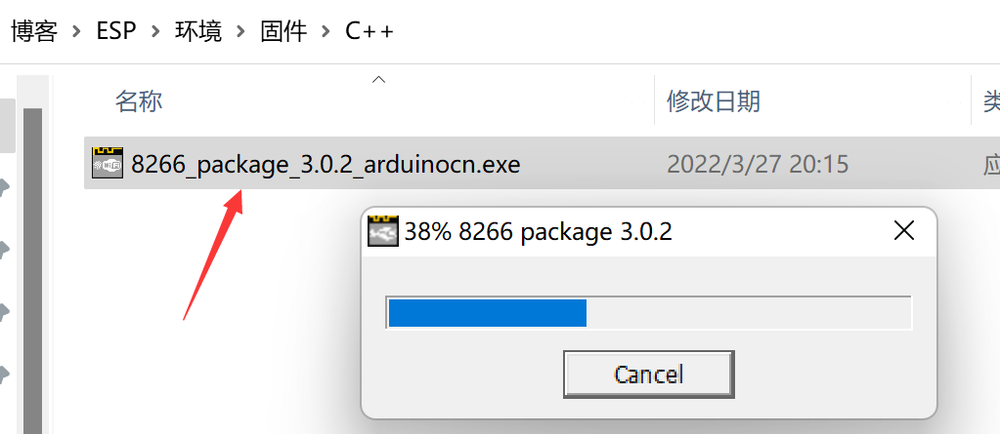
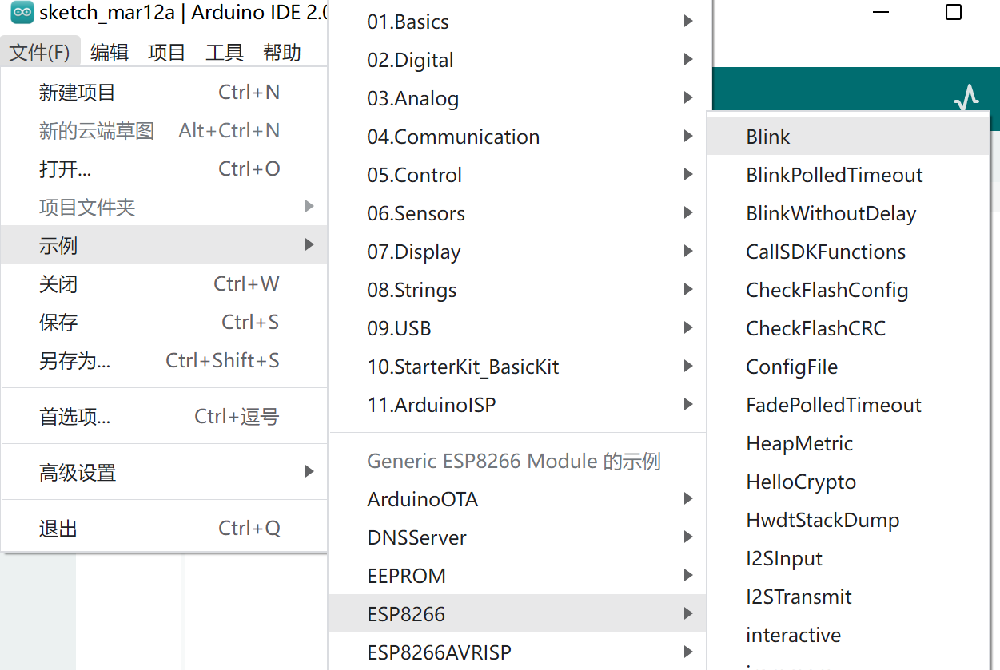
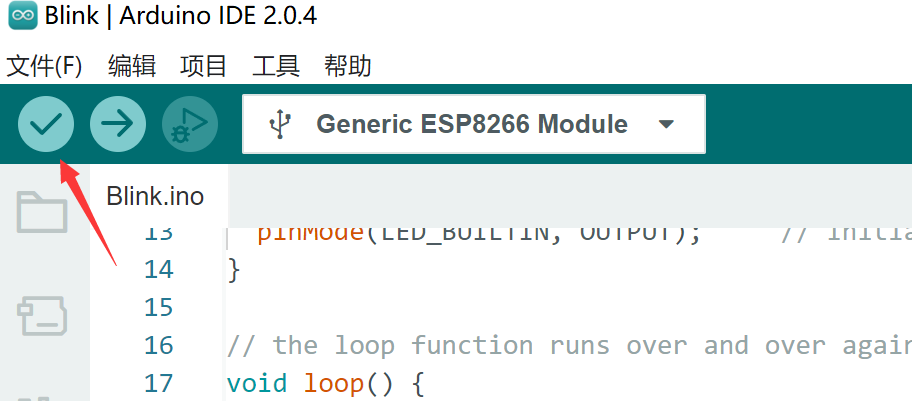
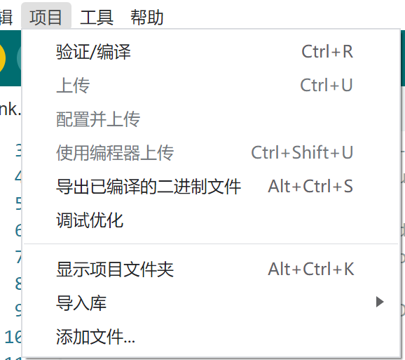

# Arduino环境配置

官网下载：[Support the Arduino IDE | Arduino](https://www.arduino.cc/en/donate/)

下载后直接安装即可(**英文路径**)-->打开等待软件包下载完毕

同意安装驱动

修改为中文(**Ctrl+逗号**)

修改项目地址，添加esp8266开发板管理器地址

在开发板管理中再搜索esp8266，不使用安装，因为国外网站会非常慢，会导致安装失败

关闭Arduino，使用安装软件安装

此时在工具-->开发板-->就可以看到esp8266了，选择里面的第一个，继续点开工具-->端口-->选择对应的端口

### 测试

点开文件，选择好对应的示例

新的串口有示例代码，点击进行编译

**按下FLASH（或叫BOOT)不丢，然后按一下复位键（RST）松开复位键（RST），开发板上的灯会闪一下，此时FLASH(或叫BOOT)不要松，然后点上传**

此时esp8266会一秒闪烁一次，代表烧录成功

### 参考开发文档

[Arduino入门教程,ArduinoIDE下载-DFRobot产品资料库](https://wiki.dfrobot.com.cn/Arduino入门教程)