# 环境搭建

## 下载IDE

官网：[Thonny, Python IDE for beginners](https://thonny.org/)

（下载速度很慢，可能会失败好几次，多尝试几次就能成功）

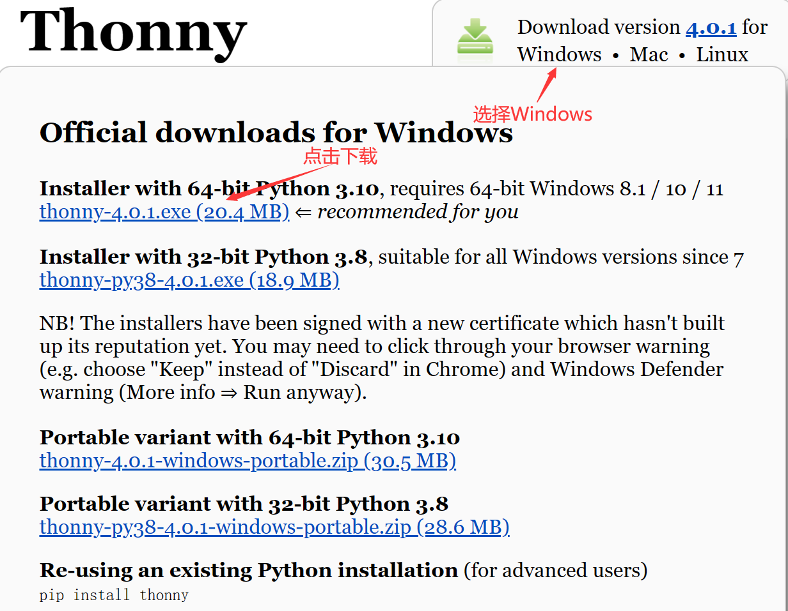

按照安装指引-->选择创建桌面图标-->完成安装

## 下载固件

官网：[MicroPython - Python for microcontrollers](https://micropython.org/)

点击download--->找到ESP32

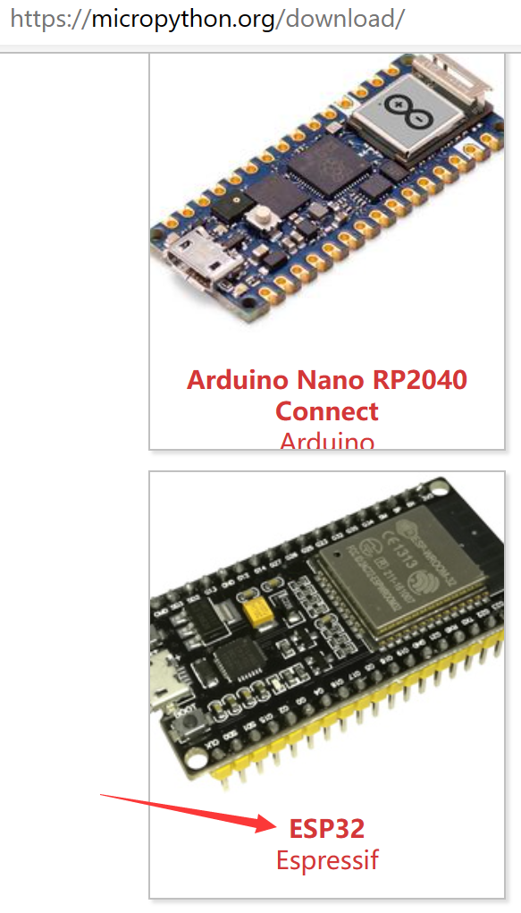

下载固件

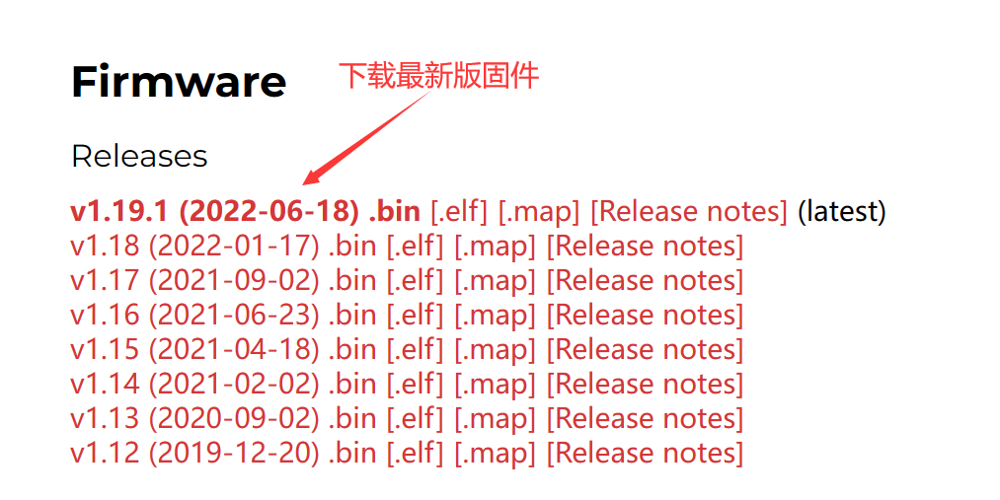

## 下载驱动

官网：[CP210x USB to UART Bridge VCP Drivers - Silicon Labs (silabs.com)](https://www.silabs.com/developers/usb-to-uart-bridge-vcp-drivers?tab=downloads)

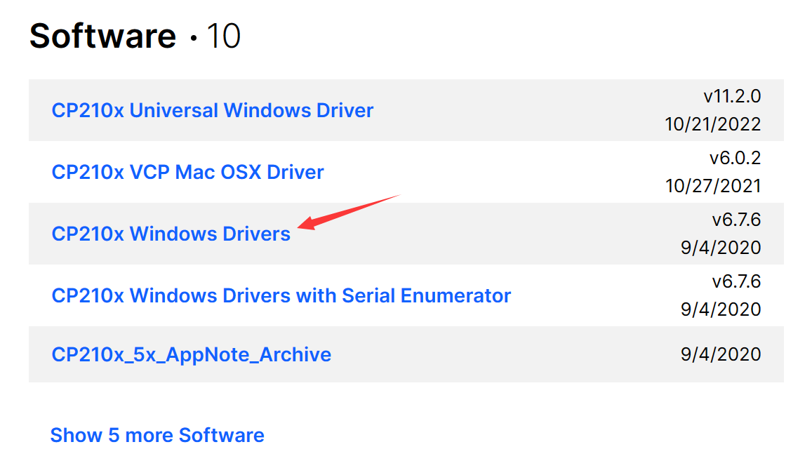

安装驱动

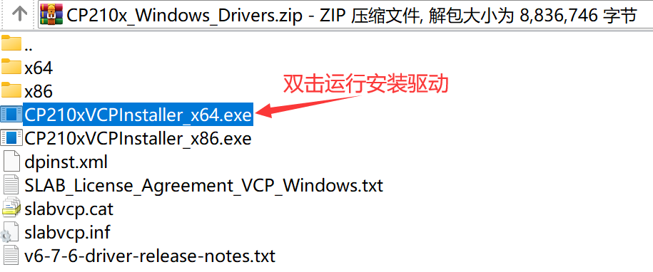

## IDE配置环境

打开IDE

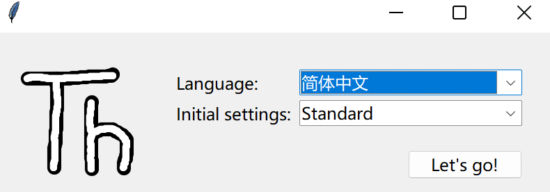

配置解释器

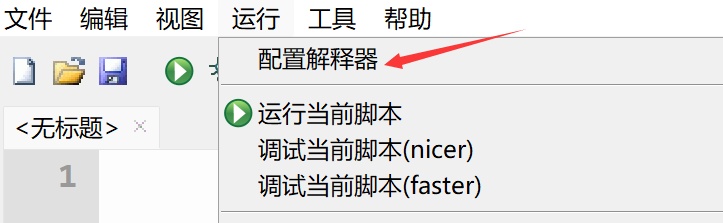

### 配置端口

按如图所示选择（**没有安装ESP32驱动则没有COM5端口**）

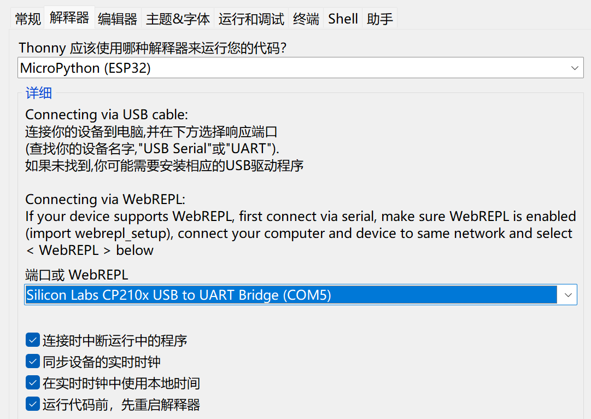

### 烧录MicroPython解释器

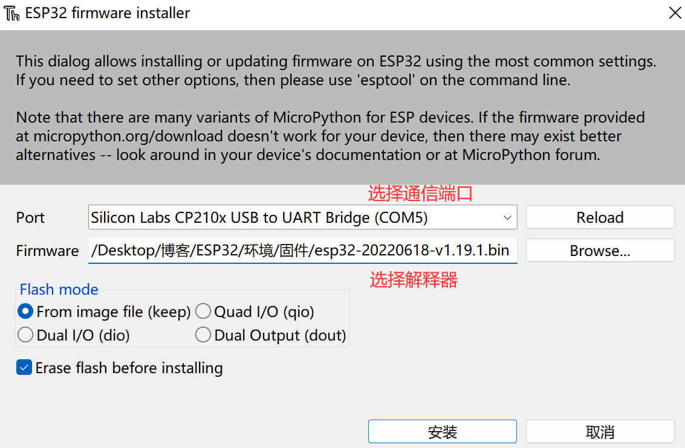

在安装前得先**按住ESP32上面的BOOT键**-->出现安装进度松开即可

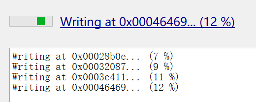

安装成功

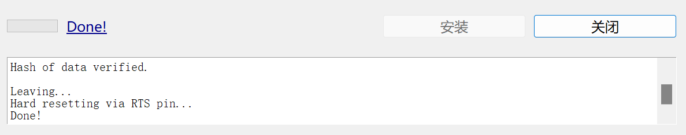

配置视图

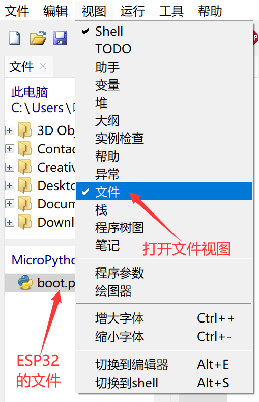

## Hello

在控制台输入`print("Hello,ESP32!")`-->回车将命令发送给ESP32，ESP32将运行结果返回到显示到控制台

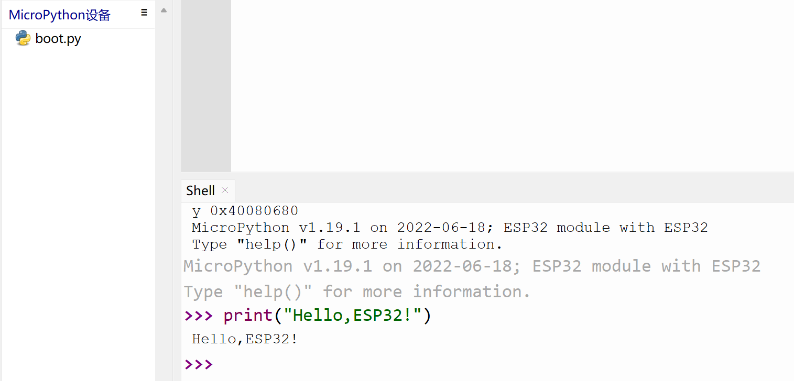