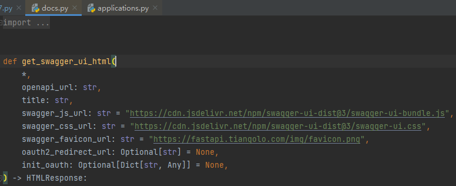
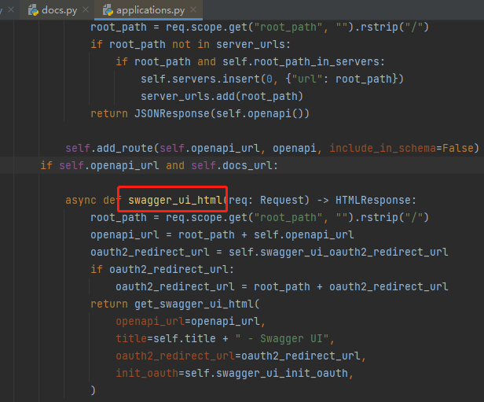
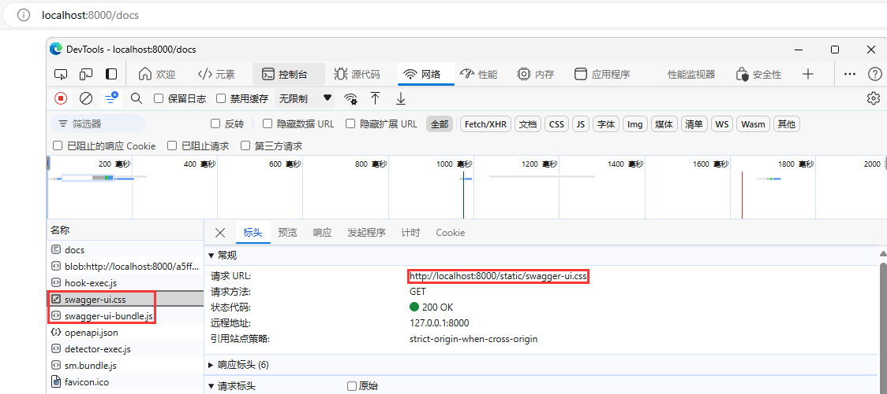

# swagger配置

> 因为`swagger ui`的静态资源引用默认在外网，可能会造成加载速度慢或者无法加载的问题

查看源代码：



方法调用位置：



替换原本的方法：

```python
from fastapi.openapi.docs import get_swagger_ui_html
from fastapi import applications


def swagger_monkey_patch(*args, **kwargs):
    return get_swagger_ui_html(
        *args, **kwargs,
        swagger_js_url='/static/swagger-ui-bundle.js',
        swagger_css_url='/static/swagger-ui.css',
        swagger_favicon_url='/static/favicon.ico',
    )


applications.get_swagger_ui_html = swagger_monkey_patch
```

挂载静态路由：

```python
from fastapi.staticfiles import StaticFiles

# 静态文件放在名为 'static' 的目录下
app.mount("/static", StaticFiles(directory="static"), name="static")
```

效果：

