# MaxKB基本使用

> 官网链接：[MaxKB - 基于大模型和 RAG 的知识库问答系统 - 官网](https://maxkb.cn/)


## 安装使用

**Linux操作系统**：

```
# 启动 maxkb 容器（Linux）
docker run \
  -d \                        # 以分离模式运行容器
  --name=maxkb \              # 指定容器名称为 maxkb
  --restart=always \          # 设置容器自动重启策略
  -p 8080:8080 \              # 将主机的 8080 端口映射到容器的 8080 端口
  -v ~/.maxkb:/var/lib/postgresql/data \  # 挂载主机的 PostgreSQL 数据目录
  -v ~/.python-packages:/opt/maxkb/app/sandbox/python-packages \  # 挂载 Python 包目录
  cr2.fit2cloud.com/1panel/maxkb  # 使用指定的镜像

```

**Windows操作系统**：

```
docker run ^
  -d ^
  --name=maxkb ^
  --restart=always ^
  -p 8080:8080 ^
  -v C:/maxkb:/var/lib/postgresql/data ^
  -v C:/python-packages:/opt/maxkb/app/sandbox/python-packages ^
  cr2.fit2cloud.com/1panel/maxkb

```

> - `--restart=always`：设置容器的自动重启策略为`always`，确保即使Docker服务重启或容器异常退出后，容器也会自动重新启动

## 基本使用

访问：`http://localhost:8080/`

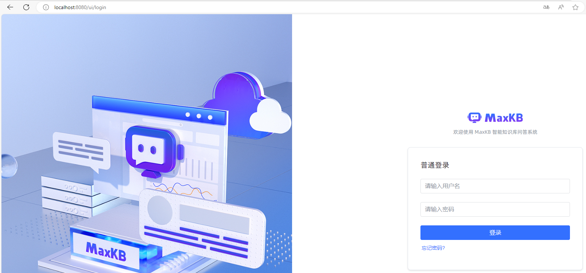

> - 用户名：`admin`
> - 默认密码：`MaxKB@123..`

### 模型添加

添加私有模型：

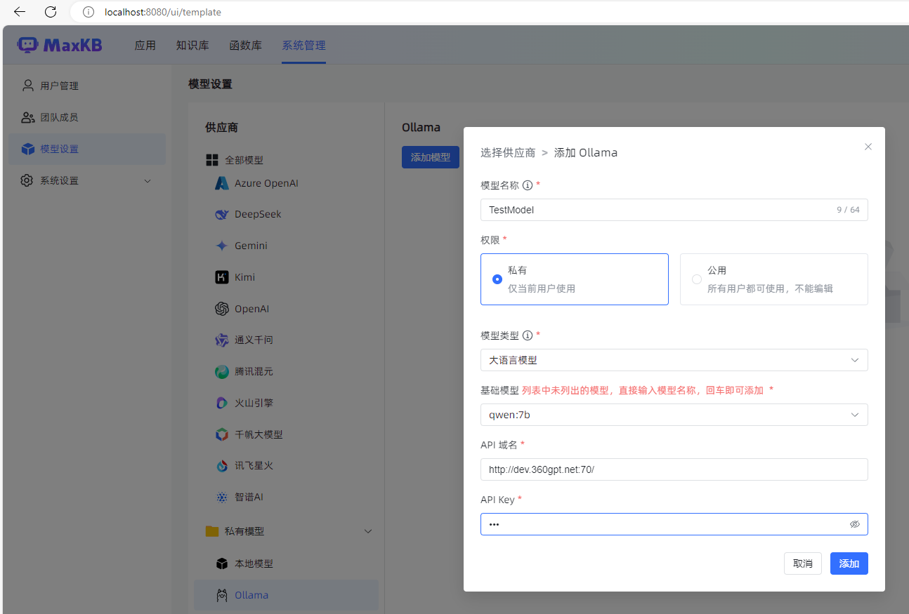

> 注意：
>
> - Api域名需要可以访问的公网ip，ollama需要配置环境变量允许任意ip连接
>
> - 因为本地模型，所以Api Key随便填

等待下载完成：

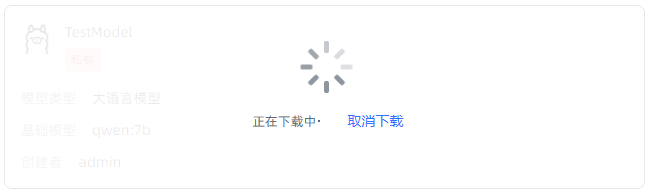

> 如果下载失败，可以在ollama中手动下载(这里是maxkb的qwen:2.5-instruct的暂时还没有支持到，暂时只能1.5)：
>
> 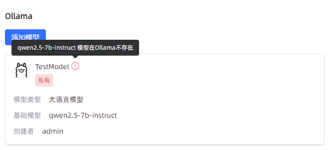
>
> 官网指示：[qwen2.5 (ollama.com)](https://ollama.com/library/qwen2.5)
>
> ```
> ollama run qwen2.5:7b
> ```

### 应用创建

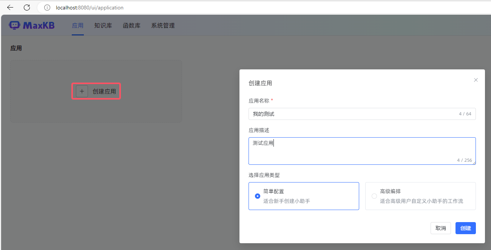

基本创建：

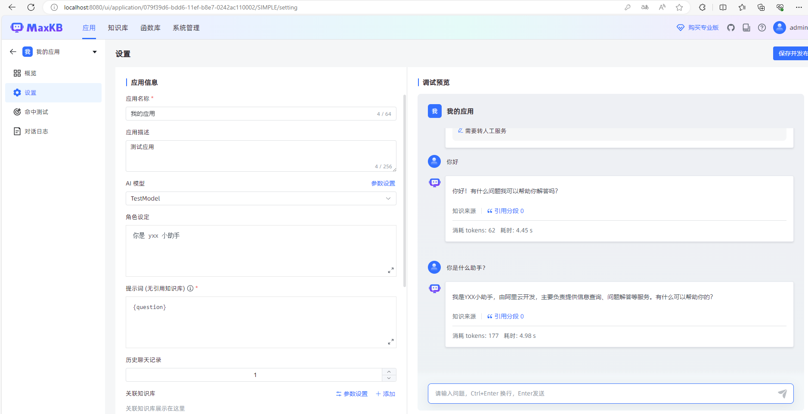

## 外链引用

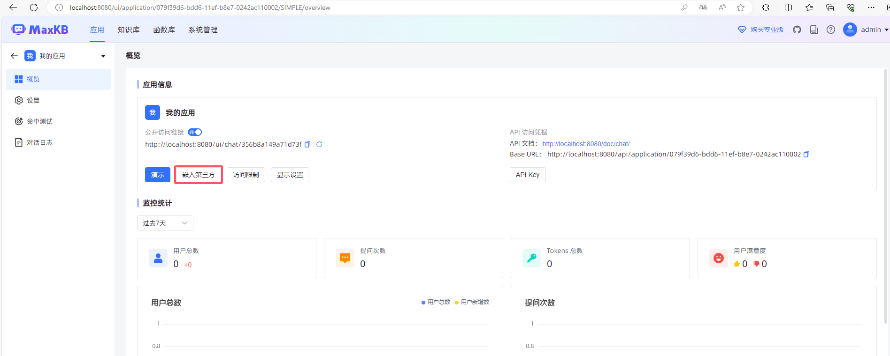

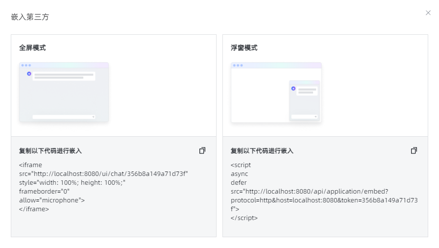

> 页面`<iframe>`：
>
> ```js
> <iframe
> src="http://localhost:8080/ui/chat/356b8a149a71d73f"
> style="width: 100%; height: 100%;"
> frameborder="0"
> allow="microphone">
> </iframe>
> ```
>
> 脚本`<script>`：
>
> ```js
> <script
> async
> defer
> src="http://localhost:8080/api/application/embed?protocol=http&host=localhost:8080&token=356b8a149a71d73f">
> </script>
> ```
>
> vue项目可以使用`<iframe>`标签，但无法直接使用`<script>`标签，需要使用js：
>
> ```vue
> <script setup>
> import { onMounted } from 'vue';
> 
> onMounted(() => {
>   const script = document.createElement('script');
>   script.src = "http://localhost:8080/api/application/embed?protocol=http&host=localhost:8080&token=356b8a149a71d73f";
>   script.async = true;
>   script.defer = true;
>   document.head.appendChild(script);
> });
> </script>
> 
> <template>
>   <!-- 模板代码 -->
> </template>
> ```
>
> 指定IP：
>
> ```vue
> <script setup>
> import { onMounted } from 'vue';
> 
> onMounted(() => {
>   const script = document.createElement('script');
>   script.src = "http://172.16.10.108:8080/api/application/embed?protocol=http&host=172.16.10.108:8080&token=356b8a149a71d73f";
>   script.async = true;
>   script.defer = true;
>   document.head.appendChild(script);
> });
> </script>
> 
> <template>
>   <!-- 模板代码 -->
> </template>
> ```

## 使用效果

页面`<iframe>`：

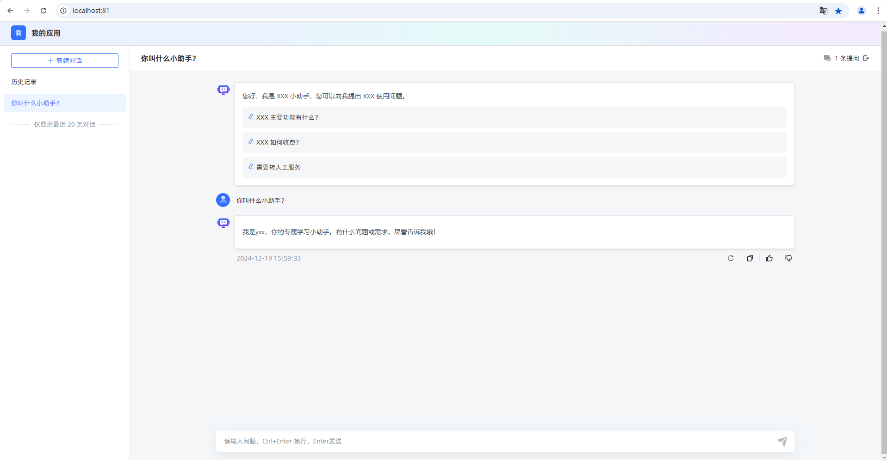

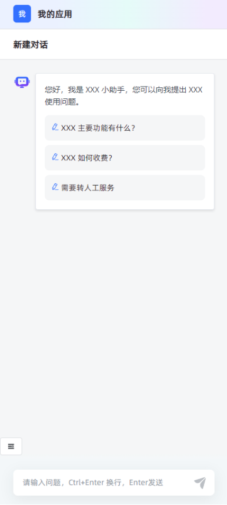

脚本`<script>`：

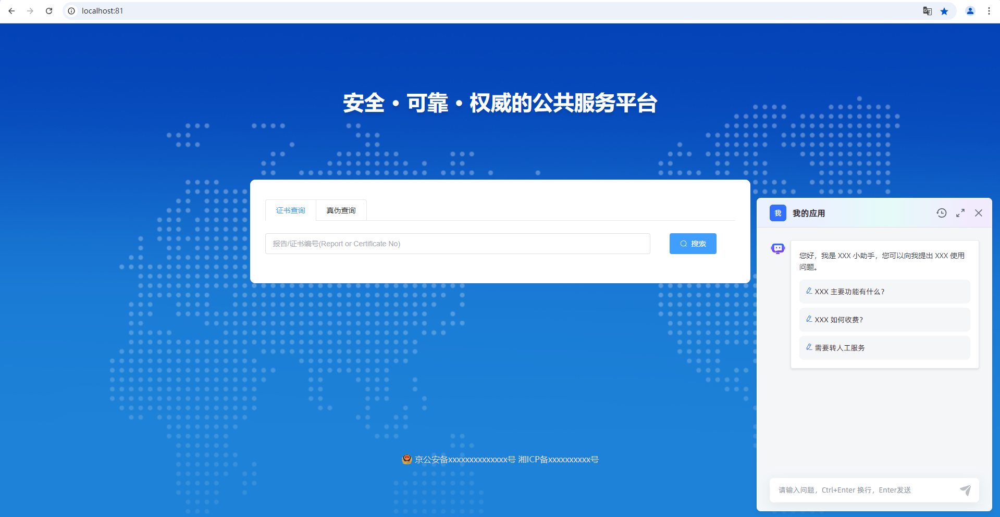

