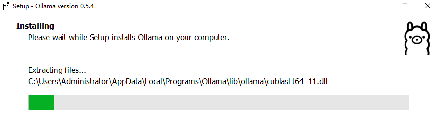
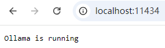
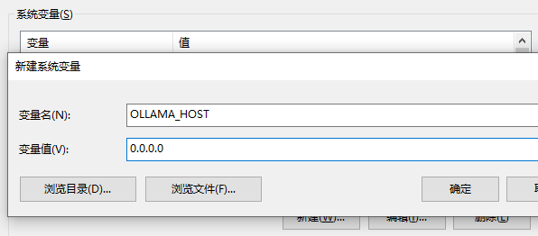
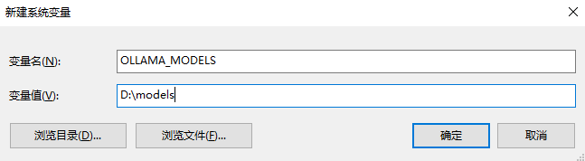
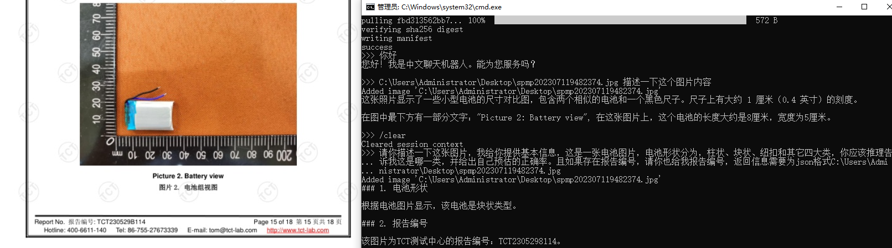

# Ollama基本使用

> 官网链接：[Ollama](https://ollama.com/)
>
> 中文链接：[Ollama - Ollama 框架](https://ollama.org.cn/)

## 安装使用

直接安装：



安装后自动运行：



允许任何IP连接：



> 通过系统变量`OLLAMA_HOST`指定ip，默认只允许本地

修改模型下载位置：



> 默认目录：`C:\Users\Administrator\.ollama\models`，设置变量之后，退出应用，迁移文件后重启即可

## 基本命令

```
C:\Users\Administrator>ollama
Usage:
  ollama [flags]
  ollama [command]

Available Commands:
  serve       Start ollama
  create      Create a model from a Modelfile
  show        Show information for a model
  run         Run a model
  stop        Stop a running model
  pull        Pull a model from a registry
  push        Push a model to a registry
  list        List models
  ps          List running models
  cp          Copy a model
  rm          Remove a model
  help        Help about any command

Flags:
  -h, --help      help for ollama
  -v, --version   Show version information

Use "ollama [command] --help" for more information about a command.
```

**模型列表**：

```
ollama list
```

> ```
> C:\Users\Administrator>ollama list
> NAME    ID    SIZE    MODIFIED
> ```
>
> 模型下载：[library (ollama.com)](https://ollama.com/library)
>
> 中文地址：[模型库 - Ollama 框架](https://ollama.org.cn/library)

**运行模型**：

```
ollama run llama3.2
```

> ```
> C:\Users\Administrator>ollama run llama3.2
> pulling manifest
> pulling dde5aa3fc5ff... 100% ▕████████████████████████████████████████████████████████▏ 2.0 GB
> pulling 966de95ca8a6... 100% ▕████████████████████████████████████████████████████████▏ 1.4 KB
> pulling fcc5a6bec9da... 100% ▕████████████████████████████████████████████████████████▏ 7.7 KB
> pulling a70ff7e570d9... 100% ▕████████████████████████████████████████████████████████▏ 6.0 KB
> pulling 56bb8bd477a5... 100% ▕████████████████████████████████████████████████████████▏   96 B
> pulling 34bb5ab01051... 100% ▕████████████████████████████████████████████████████████▏  561 B
> verifying sha256 digest
> writing manifest
> success
> ```

**直接对话**：

````
>>> hello
Hello! How can I assist you today?

>>> please write a little code that can print a HelloWorld by Python
Here is a simple Python program that prints "Hello, World!" to the console:

```python
print("Hello, World!")
```

You can save this in a file (e.g., `hello.py`) and run it with Python (e.g., `python hello.py`).

Alternatively, here's a more traditional Python program:

```python
def main():
    print("Hello, World!")

if __name__ == "__main__":
    main()
```

This code defines a function `main()` that prints "Hello, World!", and uses the `if __name__ == "__main__":` idiom
to ensure it's only run when the script is executed directly (not when it's imported as a module).

>>> 请编写一段可以用Python打印HelloWorld的代码，请用中文回答
当然了！以下是使用 Python 打印“Hello World”的简单例子：

```python
# 直接使用 print 函数
print("Hello, World!")

# 定义一个函数
def main():
    print("Hello, World!")

if __name__ == "__main__":
    main()
```

您可以将这个代码保存为一个文件（例如，hello.py），然后在命令行中使用 Python 执行它：

```bash
python hello.py
```

或者，您也可以在 IDLE 或其他 IDE 中创建一个新文件，然后将该代码粘贴到其中。

如果您想使用 Python 的环境或 IDE，例如 PyCharm、Visual Studio Code 等，可以按照以下步骤进行：

1.  导入 Python 环境或 IDE
2.  新建一个新项目或工作空间
3.  在控制台或终端中创建一个新的 Python 脚本（.py文件）
4.  将上述代码粘贴到脚本中
5.  运行脚本，例如使用命令行中的 `python` 命令，或在 IDE 中使用“运行”/“执行”按钮。

所有这些方法都可以让您轻松地用 Python 执行“Hello World”的程序。

>>> /bye
````

> - `/clear`：清楚会话记录
> - `/bye`：退出会话

**关闭模型**：

```
ollama stop llama3.2
```

## 量化模型

```
C:\Users\Administrator>ollama list
NAME               ID              SIZE      MODIFIED
qwen2.5:7b         845dbda0ea48    4.7 GB    25 hours ago
llama3.2:latest    a80c4f17acd5    2.0 GB    2 days ago
```

`qwen2.5:7b`是支持量化的：

```
ollama run qwen2.5:7b-instruct
```

运行结果：

```
C:\Users\Administrator>ollama list
NAME                   ID              SIZE      MODIFIED
qwen2.5:7b-instruct    845dbda0ea48    4.7 GB    48 seconds ago
qwen2.5:7b             845dbda0ea48    4.7 GB    25 hours ago
llama3.2:latest        a80c4f17acd5    2.0 GB    2 days ago
```

## 图像模型

安装模型：

```
ollama run llama3.2-vision
```

添加图片时直接拖拽即可：

```
>>> 请你描述一下这张图片，我给你提供基本信息，这是一张电池图片，电池形状分为，柱状、块状、纽扣和其它四大类，你应该推理告
... 诉我这是哪一类，并给出自己预估的正确率。且如果存在报告编号，请你也给我报告编号，返回信息需要为json格式C:\Users\Admi
... nistrator\Desktop\spmp202307119482374.jpg
Added image 'C:\Users\Administrator\Desktop\spmp202307119482374.jpg'
### 1. 电池形状

根据电池图片显示，该电池是块状类型。

### 2. 报告编号

该图片为TCT测试中心的报告编号：TCT2305298114。
```

> 

参考博客：

- [Ollama完整教程：本地LLM管理、WebUI对话、Python/Java客户端API应用 - 老牛啊 - 博客园 (cnblogs.com)](https://www.cnblogs.com/obullxl/p/18295202/NTopic2024071001)
- [【LLM】Ollama：本地大模型 WebAPI 调用_ollama api调用-CSDN博客](https://blog.csdn.net/2303_80346267/article/details/142437852)
