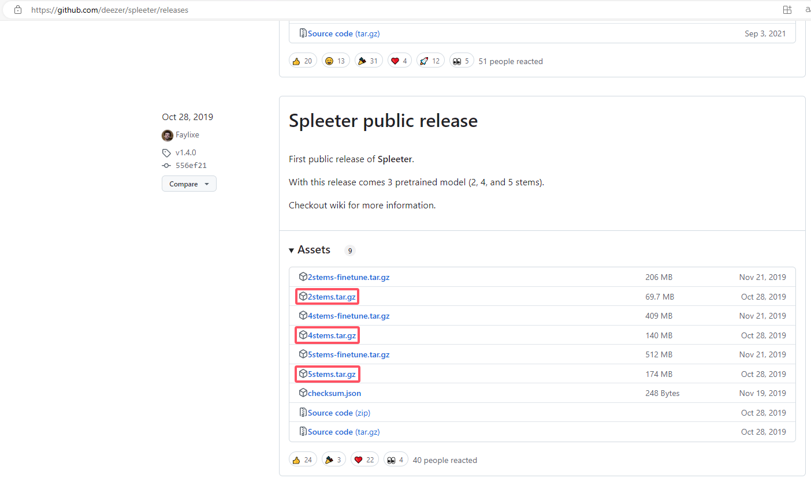
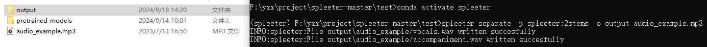
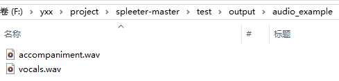

# Spleeter

> Spleeter是一个由Deezer开发的Python库，主要用于音乐源分离。它利用深度学习技术，能够将音频文件中的不同声音成分（如人声、钢琴、鼓、贝斯等）分离开来。Spleeter提供了多种预训练模型，如`2stems`、`4stems`、`5stems`等，用户可以根据需求选择合适的模型。
>
> 官方仓库：[GitHub - deezer/spleeter: Deezer source separation library including pretrained models.](https://github.com/deezer/spleeter)
>
> 人声分离方案：[2023.08 迄今最强的开源免费人声分离解决方案MVSEP-MDX23，赶紧把你的Spleeter丢了 - 哔哩哔哩 (bilibili.com)](https://www.bilibili.com/read/cv25687432/)
>
> 模型选择分离：[MVSEP - 音乐与语音分离](https://mvsep.com/zh)

## 安装教程

依赖下载：

```
# 依赖ffmpeg
conda install -c conda-forge ffmpeg libsndfile

pip install spleeter
```

模型下载：

> [Releases · deezer/spleeter (github.com)](https://github.com/deezer/spleeter/releases)



- `2stems.tar.gz`：模型会将音频分离为两个音轨，通常是伴奏（accompaniment）和人声（vocals）
- `4stems.tar.gz`：会将音频分离为四个音轨，通常包括鼓（drums）、贝斯（bass）、其他乐器（other）和人声（vocals）
- `5stems.tar.gz`：会将音频分离为五个音轨，通常包括鼓（drums）、贝斯（bass）、钢琴（piano其他乐器（other）和人声（vocals）

## 示例使用

> 如果只是简单地想要分离人声和伴奏，`2stems`就足够了

将模型解压到命令运行目录下的`pretrained_models`目录下：

```
# 示例命令
spleeter separate -p spleeter:2stems -o output audio_example.mp3
```

运行分离：

> 
>
> 

