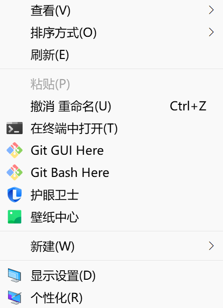

# Git基本使用

## Git概述

Git是一个分布式版本控制工具，主要用于管理开发过程中的源代码文件(Java类、xml文件、html页面等)

Git的主要功能有：

- 代码回溯
- 版本切换
- 多人协作
- 远程备份

Git仓库分为两种：

- 本地仓库：开发人员自己电脑上的Git仓库
- 远程仓库：远程服务器上的Git仓库


> commit：提交，将本地文件和版本信息保存到本地仓库
>
> push：推送，将本地仓库文件和版本信息上传到远程仓库
>
> pull：拉取，将远程仓库文件和版本信息下载到本地仓库



> Git GUI Here：打开Git图形界面
>
> Git Bash Here：打开Git命令行

## Git代码托管服务

常用的Git代码托管服务：


在码云上创建自己的远程仓库


## Git常用命令

### Git全局设置


> ```
> git config --global user.name "xxx"
> git config --global user.email "xxx"
> 
> git config --list
> ```

### 获取Git仓库


本地初始化仓库


克隆远程仓库


> ```
> git clone https://gitee.com/yxx7318/hellogit.git
> ```

### 工作区、暂存区、版本库概念


### Git工作区中文件的状态


> ```
> git status
> ```
>
> 查看当前仓库下文件的状态

### 本地仓库操作


> ```
> git add xxx.java
> git reset xxx.java
> git commit -m "message" xxx.java
> ```
>
> 切换文件到指定版本：
>
> 
>
> 注意在复制和粘贴的时候，不能使用传统的复制快捷键，使用鼠标右键选择复制即可
>
> ```
> git reset --hard xxxxxxxxxxxxx
> ```

### 远程仓库操作


> 查看远程仓库详细信息：
>
> ```
> git remote -v
> ```
>
> 
>
> 添加远程仓库(与本地创建的初始化仓库建立关联关系)：
>
> ```
> git remote add origin https://gitee.com/yxx7318/hellogit.git
> ```
>
> 克隆远程仓库到本地：
>
> 
>
> ```
> git clone https://gitee.com/yxx7318/hellogit.git
> ```
>
> 从远程仓库拉取(将他人提交的代码与自己的合并)：
>
> ```
> git pull
> ```
>
> > 
>
> 推送到远程仓库(在添加到暂存区`git add`，并提交到本地仓库`git commit -m`之后才能推送)：
>
> ```
> git push origin master
> ```
>
> > 第一次提交需要输入"码云"的账号密码

### 分支操作


查看分支：


创建分支：


切换分支：


推送至远程仓库分支：


合并分支：


> 没有冲突的情况下，如果跳出提示框，可以使用`:wq`退出

**冲突解决**：

当两个分支都修改了同一个文件，合并时会报错


此时那个文件


手动修改


再将此文件通过`git add xxx.txt`命令进行提交，再通过`git commit -m "xxx" xxx.txt -i`提交到本地仓库，此时就可以推送到远程仓库了

### 标签操作


