# 在IDEA中使用Git

## 基本使用

### 在IDEA中配置Git

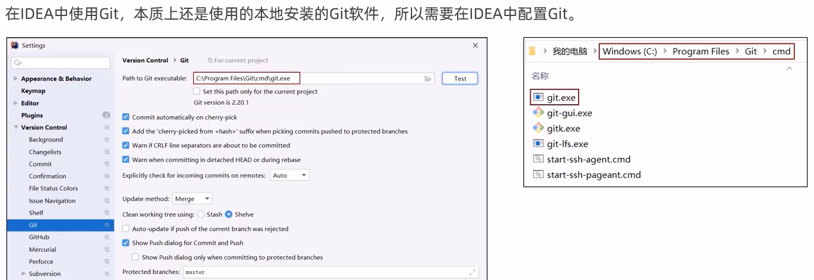

> 点击旁边的测试如果显示有版本号则代表没有问题

### 获取Git仓库

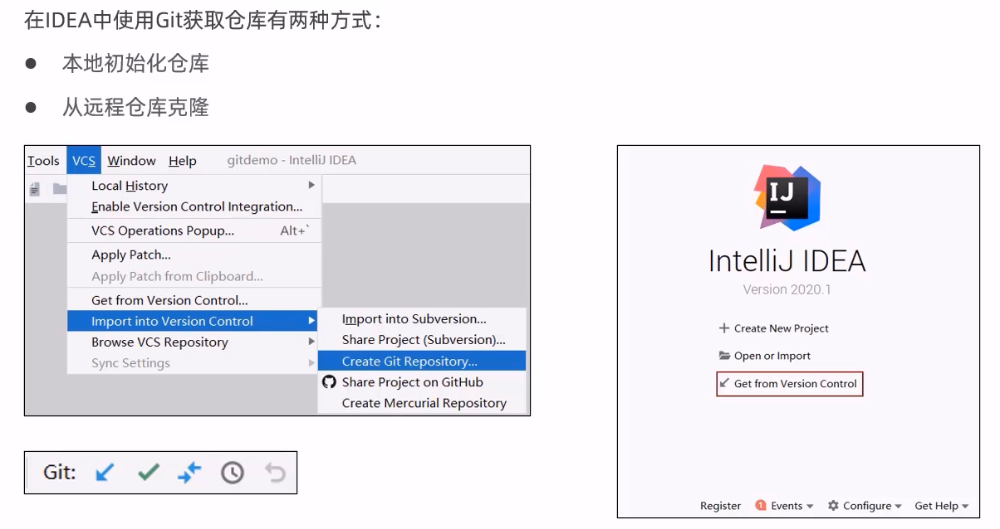

> 
>
> 通过初始化生成的仓库，会生成一个.gitignore，代表Git需要忽略的文件目录

### 本地仓库操作


> 在创建文件时会有提醒，是否需要加到暂存区：
>
> 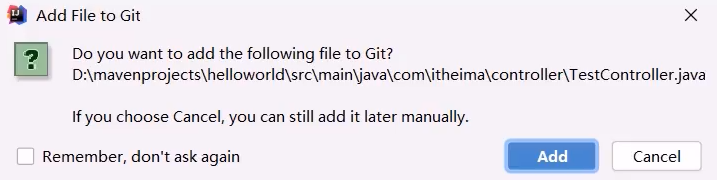
>
> 加入后文件会变成绿色，否则是橘红色(**原文件为黑色，有修改的文件为蓝色**)，后面还可以右键加入进去
>
> 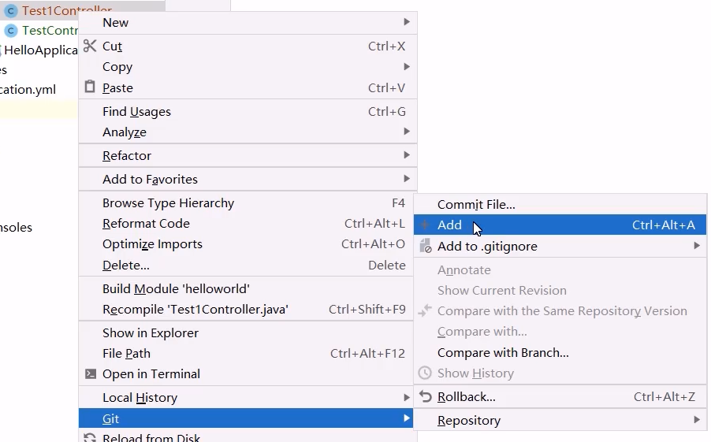
>
> 提交文件可以通过Git工具栏的"绿色的勾"提交到本地仓库：
>
> 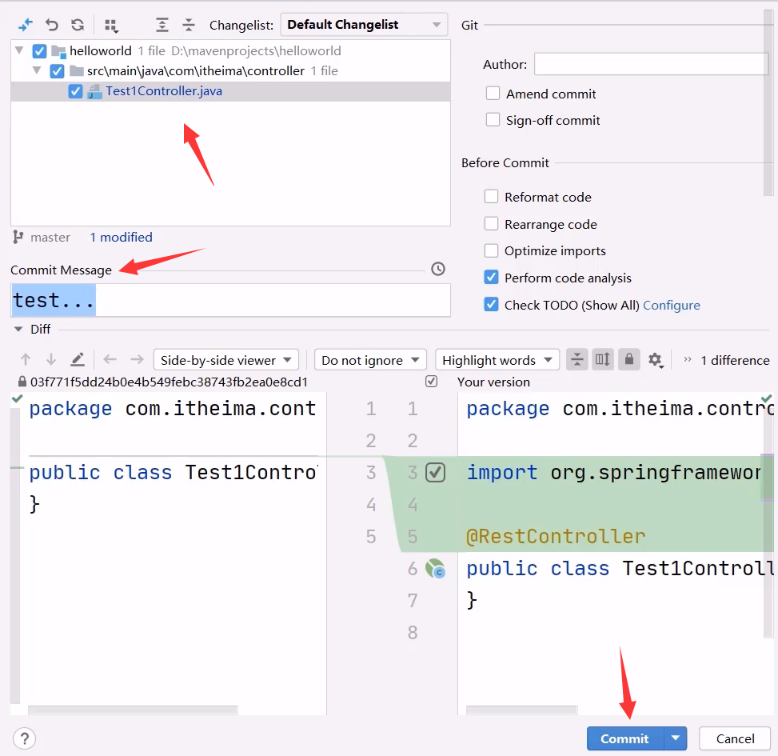
>
> 查看Git日志可以通过Git工具栏的"时钟图标"进行查看：
>
> 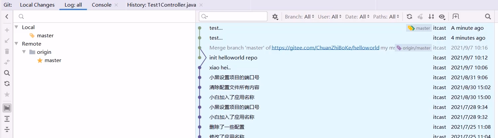

### 远程仓库操作


> 查看和添加远程仓库：
>
> 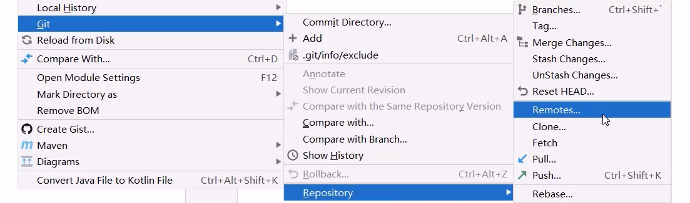
>
> 可以右键后选择Git选择Push推送至远程仓库，更为便捷的操作是在提交本地仓库时同步到远程仓库：
>
> 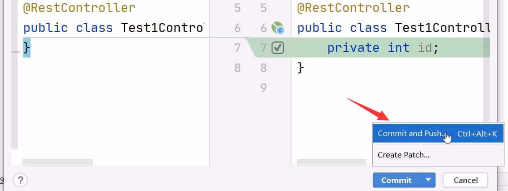
>
> 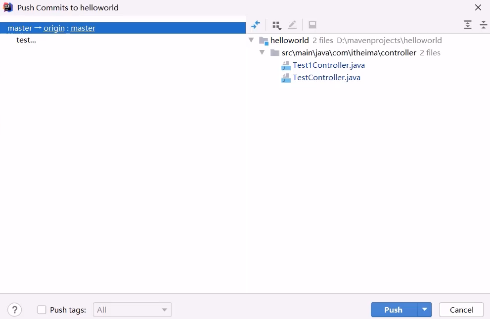
>
> 可以右键后选择Git选择Pull拉取远程仓库代码：
>
> 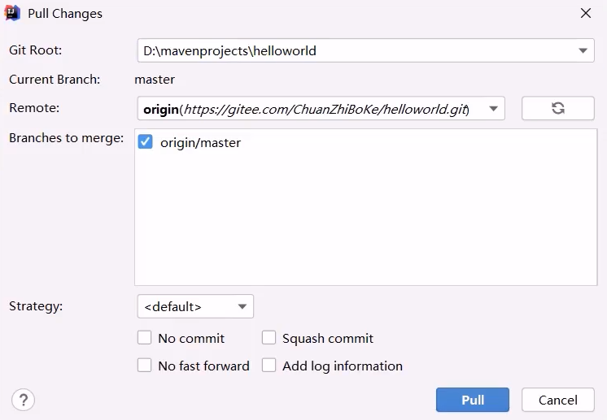
>
> > 更为便捷的方式可以点击Git工具栏的"向下的蓝色箭头"拉取远程仓库代码：
> >
> > 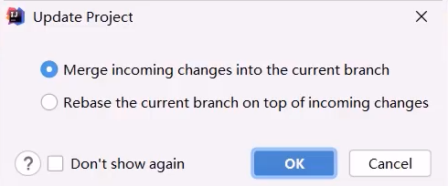

### 分支操作


> 在Git选项下，或者IDEA的右下角，可以打开分支列表：
>
> 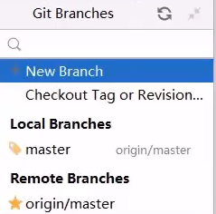
>
> 创建分支(这里是创建且切换到此分支下)：
>
> 
>
> 选择本地分支后选择"Checkout"切换分支：
>
> 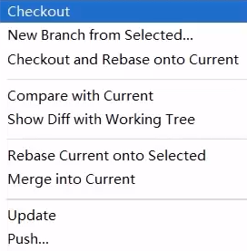
>
> 选择本地分支后选择"Push"推送到远程仓库：
>
> 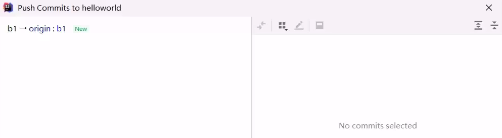
>
> 切换到master分支后选择"Merge into Current"合并分支：
>
> 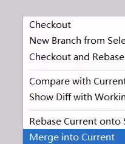

## 操作项目

### 关联远程仓库

创建远程仓库

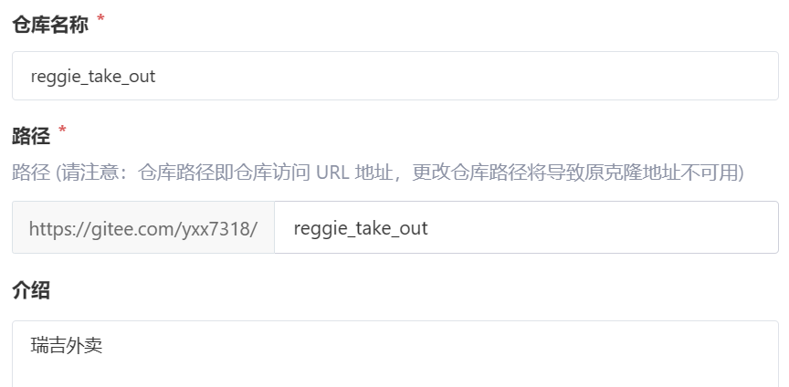

创建本地仓库

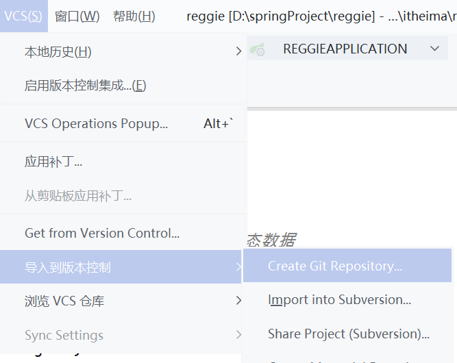

选择项目目录

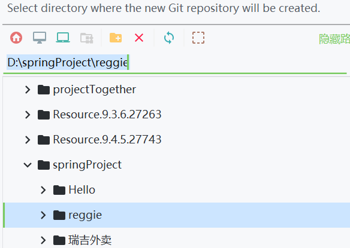

关于配置文件(.idea里面会生成，这里是添加到本地仓库)


将文件都提交到此本地仓库

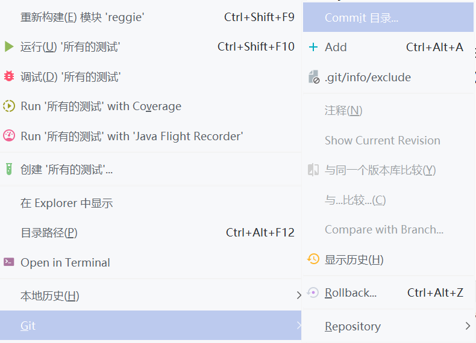

确定提交目录后选择Commit and Push

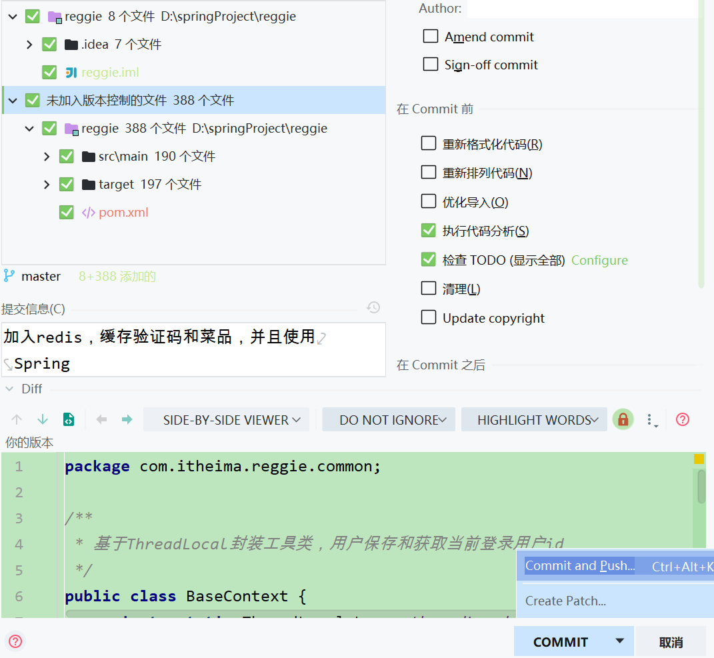

输入远程仓库地址后继续点击Push即可

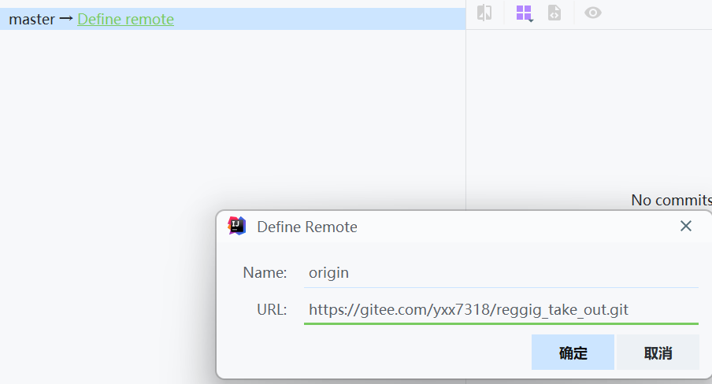

> 勘误：这里地址应该是
>
> ```
> https://gitee.com/yxx7318/reggie_take_out.git
> ```

### 创建分支

新建分支

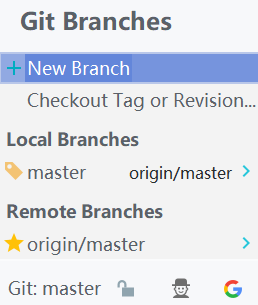

命名(创建后自动切换到此分支)

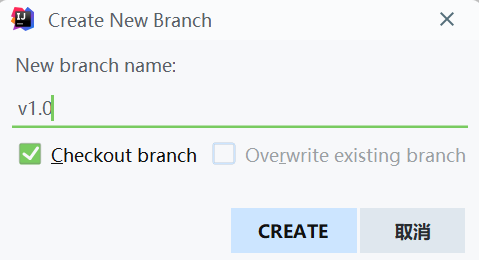

提交此分支到远程(因为本地仓库在创建时添加了过去，所以直接Push)

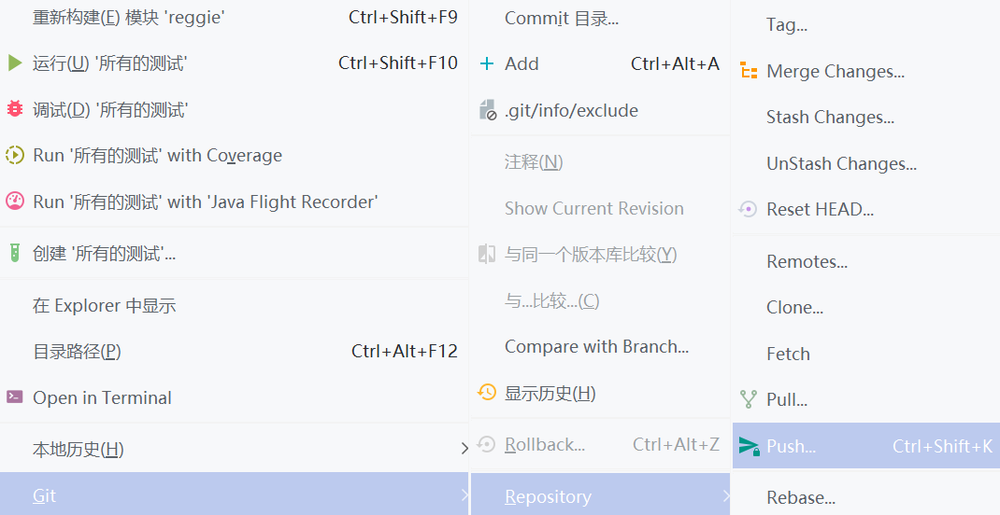

查看远程仓库

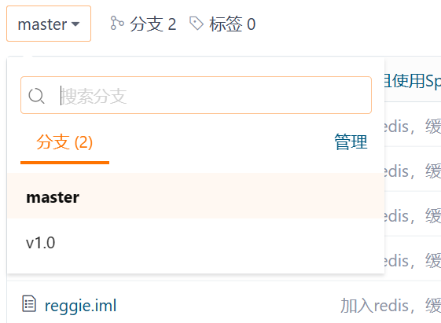

### 合并分支

当分支上面的代码提交后需要合并到主分支，需要先切换到主分支

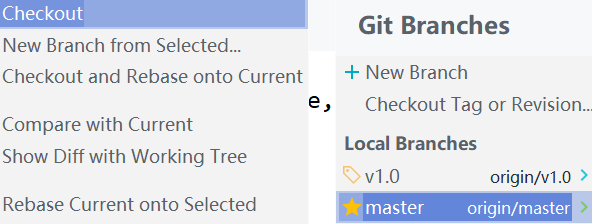

选择合并的分支

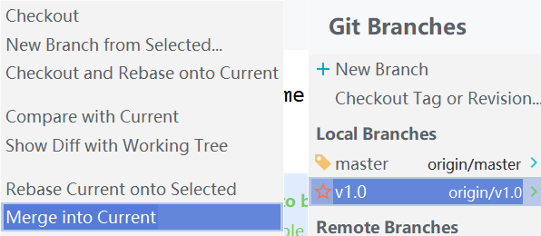