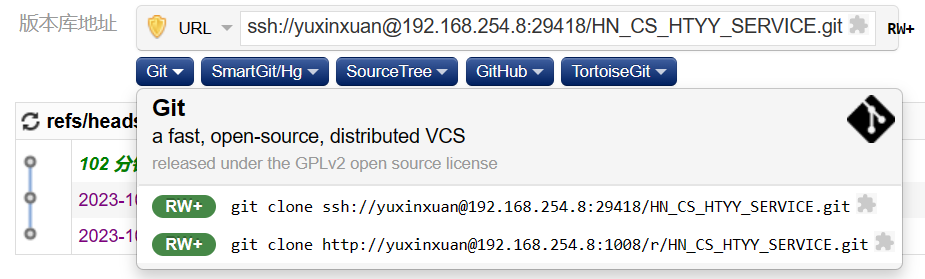
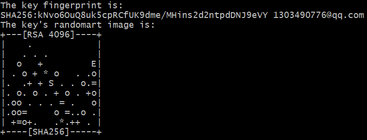
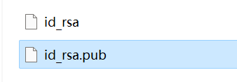
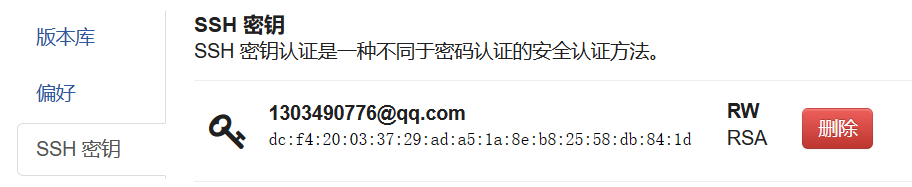

# Git安全

## 凭证管理

Git提供了几种凭证管理方式，包括使用cache、store和helper等选项

- cache：使用`git config --global credential.helper cache`命令可以启用凭证缓存。Git会在一段时间内缓存的凭证，在此期间内不需要再次输入密码。默认情况下，凭证在15分钟内保持有效，之后过期并需要重新输入
- store：使用`git config --global credential.helper store`命令可以启用凭证存储。Git会将凭证保存在明文文件中，以后的每次拉取操作都会从该文件中读取凭证信息，无需再次输入密码。这种方式会将凭证以明文形式存储在本地，安全性较低，因此不建议在公共或共享计算机上使用
- helper：使用`git config --global credential.helper <helper>`命令可以指定其他凭证管理程序。例如，可以使用`git config --global credential.helper wincred`来使用Windows凭证管理器，或者使用其他适合的凭证管理器

> Git Credential Manager for Windows保存登录凭证：https://github.com/microsoft/Git-Credential-Manager-for-Windows/releases
>
> 启用命令
>
> ```
> git config --global credential.helper manager
> ```

通过使用Git自带的凭证或者其他登录凭证管理工具，就可以在每次拉取操作时自动保存登录凭证，无需手动输入密码

## SSH密钥对

如果拉取项目的时候使用的是ssh，而非http，则保存登录凭证的方式就无法生效了，每次拉取都需要再输入密码



当使用SSH密钥对进行身份验证时，不需要输入密码，而是使用私钥来进行身份验证。此时，如果想在每次Git操作时无需输入密码，可以使用SSH密钥对进行身份验证，并将公钥添加到私服账户中

生成ssh密钥命令

```
ssh-keygen -t rsa -b 4096 -C "your_email@example.com"
```

- `ssh-keygen`：用于生成SSH密钥对的命令。
- `-t rsa`：指定要生成的密钥类型为RSA。RSA是一种非对称加密算法，用于生成公钥和私钥对。
- `-b 4096`：这个选项指定生成的RSA密钥的位数。在这个例子中，密钥的位数为4096，提供更高的安全性。
- `-C "your_email@example.com"`：这个选项用于在生成的公钥中添加注释，通常是电子邮件地址，可以帮助识别不同的密钥

回车确认生成完毕



默认生成在C盘->用户->`.ssh`目录下



将公钥`id_rsa.pub`放到GIt私服上，拉取提交时就无需输入密码

