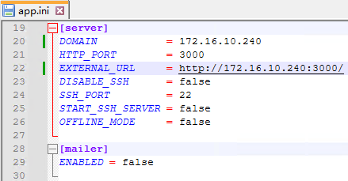

# Gogs

> 一款极易搭建的自助Git服务，官网：[Gogs: A painless self-hosted Git service](https://gogs.io/)

下载：


## Linux安装

```
tar -zxvf gogs_0.13.0_linux_amd64.tar.gz

cd gogs

./gogs web &> gogs.log &
```

> 

## Windows安装

解压zpi，并添加目录到环境变量：


在目录下运行启动服务：

```
gogs web
```


访问`http://localhost:3000/`即可在网页配置Gogs

## 配置Gogs

### 配置ip

默认的域名为`localhost`，不方便访问拉取，需要手动修改配置文件为IP地址，修改`custom/conf/app.ini`文件：



修改为自身IP即可，重启生效：


### 数据库配置

执行sql命令创建用户和数据库：

```sql
-- 'localhost'表示仅允许本机连接，'%'表示允许任何人连接
-- DROP USER 'gogs_user'@'localhost';
-- 创建仅允许本机连接的用户gogs_user
CREATE USER 'gogs_user'@'localhost' IDENTIFIED BY 'gogs123';
-- 如果不存在则创建数据库gogs_mysql
CREATE DATABASE IF NOT EXISTS gogs_mysql;
-- 授予gogs_mysql数据库所有权限给从本地主机以用户gogs身份登录的用户
GRANT ALL PRIVILEGES ON `gogs_mysql`.* TO 'gogs_user'@'localhost';
-- 刷新权限，使更改立即生效
FLUSH PRIVILEGES;

```

> ```sql
> -- 设置变量
> SET @custom_user = 'gogs_user';
> SET @custom_password = 'gogs123';
> SET @custom_db = 'gogs_mysql';
> SET @custom_host = 'localhost';
> 
> -- 检查用户是否存在
> SET @sql_check = CONCAT('SELECT EXISTS(SELECT 1 FROM mysql.user WHERE User = ''', @custom_user, ''' AND Host = ''', @custom_host, ''')');
> PREPARE stmt_check FROM @sql_check;
> EXECUTE stmt_check;
> DEALLOCATE PREPARE stmt_check;
> 
> -- 如果用户存在，则删除用户
> SET @sql_drop = CONCAT('DROP USER IF EXISTS ''', @custom_user, '''@''', @custom_host, '''');
> PREPARE stmt_drop FROM @sql_drop;
> EXECUTE stmt_drop;
> DEALLOCATE PREPARE stmt_drop;
> 
> -- 创建用户
> SET @sql1 = CONCAT('CREATE USER ''', @custom_user, '''@''', @custom_host, ''' IDENTIFIED BY ''', @custom_password, '''');
> PREPARE stmt1 FROM @sql1;
> EXECUTE stmt1;
> DEALLOCATE PREPARE stmt1;
> 
> -- 查询MySQL版本
> SELECT VERSION() INTO @mysql_version;
> 
> -- 设置字符集变量
> SET @charset = IF(@mysql_version LIKE '5.7.%', 'utf8', 'utf8mb4');
> SET @collate = IF(@mysql_version LIKE '5.7.%', 'utf8_general_ci', 'utf8mb4_general_ci');
> 
> -- 构建创建数据库命令
> SET @sql2 = CONCAT('CREATE DATABASE IF NOT EXISTS `', @custom_db, '` CHARACTER SET ', @charset, ' COLLATE ', @collate);
> 
> -- 准备并执行SQL语句
> PREPARE stmt2 FROM @sql2;
> EXECUTE stmt2;
> DEALLOCATE PREPARE stmt2;
> 
> -- 授予数据库所有权限
> SET @sql3 = CONCAT('GRANT ALL PRIVILEGES ON `', @custom_db, '`.* TO ''', @custom_user, '''@''', @custom_host, '''');
> PREPARE stmt3 FROM @sql3;
> EXECUTE stmt3;
> DEALLOCATE PREPARE stmt3;
> 
> -- 刷新权限
> FLUSH PRIVILEGES;
> 
> ```
>
> 


### 应用基本设置

在解压目录下创建`repositories`，修改仓库目录为此：

```
D:\LenovoSoftstore\gogs_0.13.0_windows_amd64\gogs\repositories
```

> 

### 可选参数

根据实际需求修改：

> 

## 基本使用

### 注册用户


### 登录账户


### 创建仓库

填写信息：


创建结果：


### 上传代码

新仓库：

```
touch README.md
git init
git add README.md
git commit -m "first commit"
git remote add origin http://localhost:3000/yxx/test.git
git push -u origin master
```

已有仓库：

```
git remote add origin http://localhost:3000/yxx/test.git
git push -u origin master
```

使用注册的账户名和密码上传代码：

> 