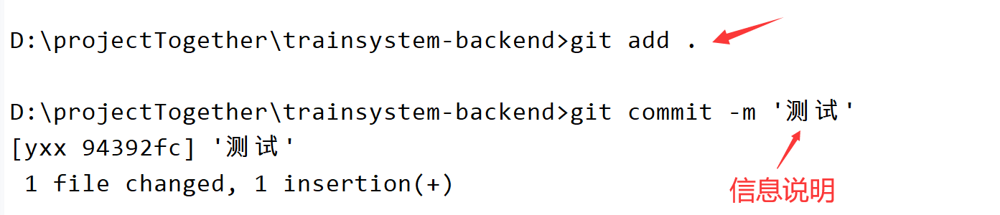

# git

## 提交步骤

第一步


第二步



第三步


提交完成

> `git pull`是`git fetch`和`git merge`的组合：
>
> - `git fetch`：把远程仓库的数据拉取到本地仓库
> - `git merge`：把拉取下来的数据和工作目录合并
>
> `git commit -am "测试"`只会将已经跟踪过的文件的更改提交到本地仓库，新文件（非跟踪文件）不会被提交，并不是两个命令的完全结合
>
> - `git add .`：这将当前目录下的所有更改（包括新文件，也就是非跟踪文件）都加入到暂存区
> - `git commit -m "测试"`：将暂存区的所有更改提交到本地仓库

## 撤回和部分提交

- 对于只想要撤回工作区修改
  - `git checkout .`：不会影响暂存区或提交历史
- 对于已经使用`git add`，想要撤回
  - `git reset HEAD <file>`：单个文件
  - `git reset HEAD`：所有文件
- 对于已经使用`git commit`，想要撤回(先使用`git log`查看哈希值)
  - `git revert <commit-hash>`：反转指定的提交 `<commit-hash>` 的更改，不会改变现有的历史记录
  - `git reset --hard "<commit-hash>^"`：将HEAD指针移动到指定的 `<commit-hash>` 的前一个提交，并且丢弃该提交之后的所有更改(`<commit-hash>^` 代表的是 `<commit-hash>` 提交的父提交)

## 大小写敏感

> Git在默认情况下是对大小写敏感的，最终是否大小写敏感取决于文件系统以及Git的配置
>
> Windows文件系统是大小写不敏感的，而macOS和Linux文件系统通常是大小写敏感的

git全局开启大小写敏感

```
git config --global core.ignorecase false
```

> 如果全局配置（`~/.gitconfig`或`C:\Users\YourUsername\.gitconfig`）中设置了`core.ignorecase`为`true`（即大小写不敏感），并且仓库的`.git/config`文件中没有覆盖这个设置，那么全局配置会生效，Git 会以大小写不敏感的方式处理文件

针对一个仓库，仓库目录下执行，会修改`.git/config`配置文件

```
git config core.ignorecase false
```

> 设置会立即对该仓库生效

## .gitattributes

- `Windows (CR LF)`：在 Windows 系统中，文本文件的行结束是由两个字符组成的：回车（Carriage Return, CR, 表示为`\r`）和换行（Line Feed, LF, 表示为`\n`）。因此，Windows 系统中的行结束符是`\r\n`
- `Unix/Linux (LF)`：Unix 和 Linux 系统使用单个换行符（LF,`\n`）来表示行结束

许多版本控制系统（包括 Git）默认会进行一种称为"转义"（或"转换"）的操作，即将文件的行结束符从一种格式转换为另一种格式。例如，在 Windows 系统上克隆一个 Git 仓库时，Git 会自动将文件中的`\n`转换为`\r\n`，以便于在 Windows 系统上正确显示。同样，当在 Unix/Linux 系统上克隆一个仓库时，Git 会将`\r\n`转换为`\n`

> 可以使用Notepad++的`编辑->文档格式转换`去进行转换

Git 允许通过`.gitattributes`文件来指定哪些文件应该被转义，哪些不应该。可以将所有文件的`text`属性设置为`false`，只会影响在此之后的文件，已经转义的文件不会受到影响

```
# 不会对文件名中的特殊字符进行引用（转义）处理
* -text
```

> git全局配置
>
> ```
> git config --global core.autocrlf false
> ```
>
> 单个仓库
>
> ```
> git config core.autocrlf false
> ```