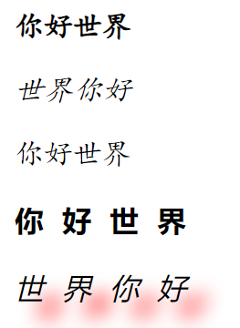
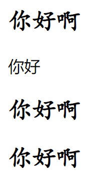

# CSS3样式

## 属性选择器

1. 以xx开头：选择器[属性名^=值]{文本样式属性}
2. 以xx结尾：选择器[属性名$=值]{文本样式属性}
3. 包含xx：选择器[属性名*=值]{文本样式属性}

```css
<style type="text/css">
		.one1{font-weight: bold;}
		.one2{font-style: italic;}
		#onemate{font-weight: bold;}
		#twomate{font-style: italic;}
		p[class^="one"]{
			font-family: 楷体;
		}
		p[id$="mate"]{
			letter-spacing: 10px;
		}
		p[id*="w"]{
			text-shadow:10px 10px 10px red;
		}
</style>

<p class="one1">你好世界</p>
<p class="one2">世界你好</p>
<p class="one3">你好世界</p><!--对于符合条件但是没有定义的类会使用属性选择器中定义的属性来自动初始化-->
<p id="onemate">你好世界</p>
<p id="twomate">世界你好</p>
```



## 关系选择器

### 子代选择器：>

主要用来选择某个元素的第一级子元素（注意：儿子的儿子不生效）

```css
<style type="text/css">
		.two>.three{/*这里换成p>span，下面删去class，效果会保持一致。如果没有定义过,会自动初始化*/
			font-family: 楷体;
		}
</style>
```

### 兄弟选择器：临近：+	普通：~

#### 1，临近兄弟选择器：在p之后的第一个h2选择器会发生变化

```css
<style type="text/css">
		p+h2{
			letter-spacing: 20px;
		}
</style>

<h2><span>你好啊</span></h2><!--可以影响到子类-->
<p>你好</p>
<h2><span>你好啊</span></h2>
```

#### 2，普通兄弟选择器：与p同为一个父元素的h2选择器都会发生变化

```css
<style type="text/css">
		p~h2{
			font-family: 楷体;
		}
</style>

<h2><span>你好啊</span></h2>
<p>你好</p>
<h2><span>你好啊</span></h2>
<h2>你好</h2>
```



## 结构化伪类选择器

### :root选择器

用于匹配文档根元素，在HTML中，根元素始终是html元素，也就是使用“:root选择器”定义的样式，对所有页面元素都生效

**例如**：:root{color:red;}，将所有文本设置为红色

### :not选择器

用于排除这个结构元素下面的子结构元素，使它不适用这个样式

**例如**：body *:not(h3){color:orange;}(注意body后面有空格)，排除body结构中的子结构元素h3

### :only-child选择器

用于匹配属于某父元素的唯一子元素的元素，也就是说，某个父元素只有一个子元素，则可以通过该选择器选择这个元素

**例如**：li:only-child{color:red;}，设置作为ul唯一子元素的元素

### :first-child和:last-child选择器

分别用于为父元素中第一个和最后一个子元素的设置样式

**例如**：p:first-child{color:pink;} p:last-child{color:pink;}，只有父元素body中第一个和最后一个p标记受影响

### :nth-child(n)和:nth-last-child(n)选择器

可以选择父元素中第n个子元素的设置样式

**例如**：p:nth-child(2){color:pink;} p:nth-last-child(n){color:pink;}，父元素body中第2个和倒数第2个p标记受影响

### :nth-of-type(n)和:nth-last-of-type(n)选择器

与上面选择器的差别在于此选择器匹配父元素的子元素时，和元素类型无关，上面那个是匹配特定的元素类型

**例如**：h2:nth-of-type(odd){color:pink;} h2:nth-of-type(even){color:blue;} p:nth-last-of-type(2){font-weight:bold;}，将所有h2元素中第奇数行的字体设置为粉红色，将所有偶数行的字体设置为蓝色，将倒数第2个p元素字体加粗

### :empty选择器

选择没有子元素或文本内容为空的所有元素

**例如**：:empty{background-color:red;}，将没有子元素或者文本内容的元素背景设置为红色

### :target选择器

用于为页面中的某个tager元素（该元素的id被当做页面中的超链接来使用）指定样式。只有用户单击了页面中的超链接，并且跳转到tager元素后，:target选择器所设置的样式才会起作用。

**例如**：:target{background-color:blue;}，点击跳转到对应位置后会跳转的目标会设置为对应的背景的颜色，点击下一个时上一个失效

## 伪选择器

是针对CSS中已定义好的伪元素使用的选择器，伪元素选择器用于在被选元素的内容前面或者后面插入内容，必须配合content属性来指定要插入的具体内容

### :before选择器

**例如**：p:before{content:"你好世界";}，在p标记之前插入文字

### :after选择器

**例如**：p:after{content:url(1/1.jpg);}，在p标记之后插入图片(url填绝对地址或相对地址)

## 链接伪类

定义超链接时，为了提高用户体验，经常需要为超链接指定不同的状态，使得超链接在单击前、单击后和鼠标悬停时的样式不同

|   超链接标记<a>的伪类   |             含义             |
| :---------------------: | :--------------------------: |
|  a:link{CSS样式规则;}   |     未访问时超链接的状态     |
| a:visited{CSS样式规则;} |      访问后超链接的状态      |
|  a:hover{CSS样式规则;}  | 鼠标经过、悬停时超链接的转台 |
| a:active{CSS样式规则;}  |  鼠标单击不动时超链接的状态  |

