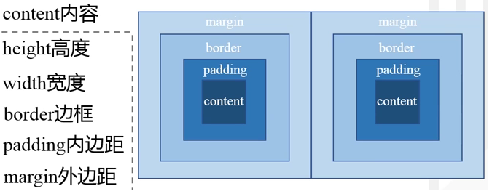
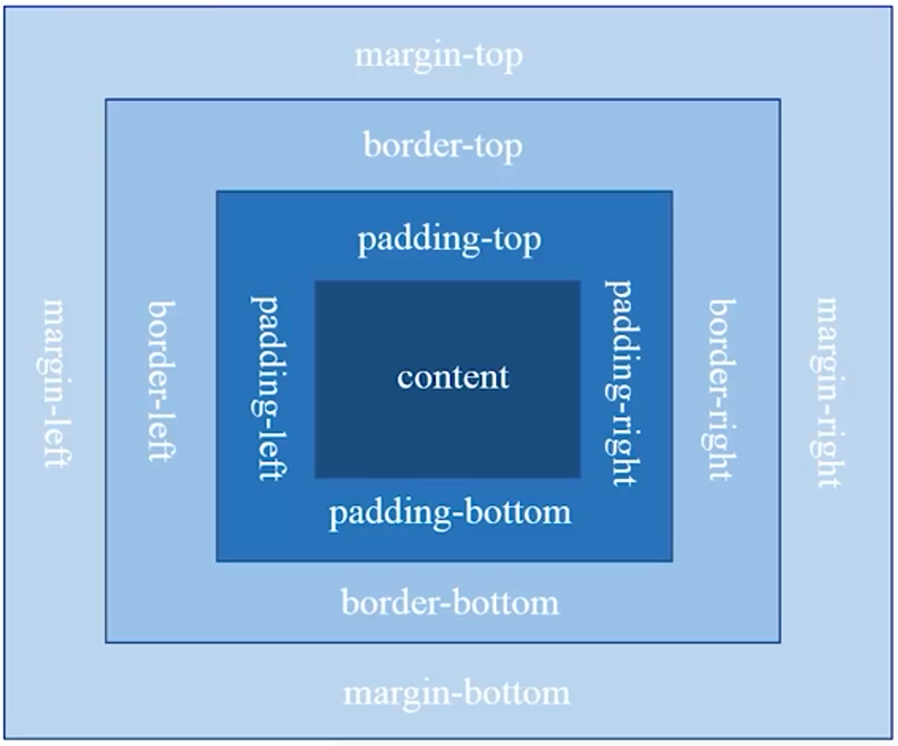
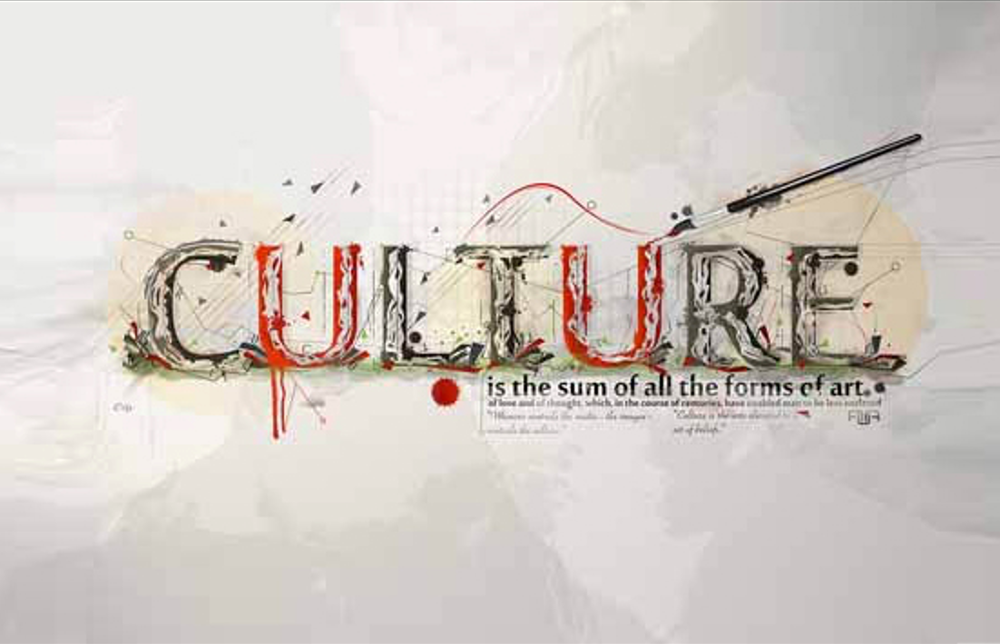
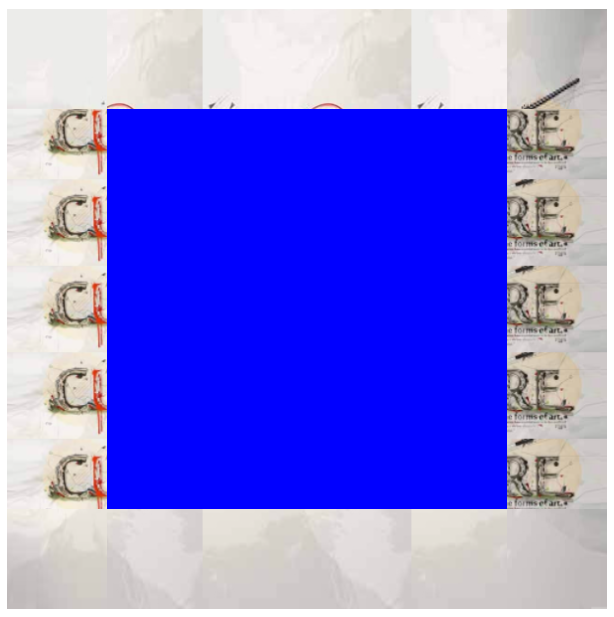
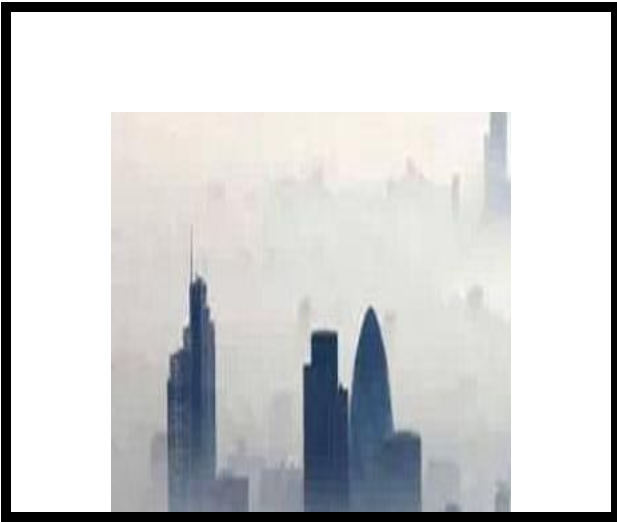

# 盒子模型

## 盒子模型的组成



**（注：除了content内容以外，其他都是CSS样式的属性）**



**（注：元素的width和height属性仅指块级元素内容的宽度和高度）**

## div标记

div标记简单而言就是一个区块容器标记，可以将网页分割为独立的、不同的部分，以实现网页的规划和布局

## 边框属性(border)

|   设置内容   |                           样式属性                           |                          常用属性值                          |
| :----------: | :----------------------------------------------------------: | :----------------------------------------------------------: |
|   边框样式   |             border-style:上边 [右边 下边 左边];              | none 无(默认)、solid 单实线、dashed 虚线、dotted 点线、double 双实现 |
|   边框宽度   |             border-width:上边 [右边 下边 左边];              |                            像素值                            |
|   边框颜色   |              border-color:上边 [右边 下边 左边]              |         颜色值、#十六进制、rgb(r,g,b)、rgb(r%,g%,b%)         |
| 综合设置边框 |              border:四边宽度 四边样式 四边颜色               |                                                              |
|   圆角边框   |           border-radius:水平半径参数/垂直半径参数            |                        像素值或百分比                        |
|   图片边框   | border-image:图片路径 裁切方式/边框宽度/边框扩展距离 重复方式 |                                                              |

## 边框样式(border-style)

使用border-style属性综合设置四边样式时，必须按**上右下左的顺时针顺序**，省略时采用值赋值的原则，即一个值为四边，**两个值为上下/左右**，**三个值为上/左右/下**。

## 边框宽度(border-width)

border-width属性常采用取值单位为像素px，并且同样遵循**值赋值原则**

## 边框颜色(border-color)

border-color的属性值可为预定义的颜色、十六进制#RRGGBB(最常用)或RGB代码rgb(r,g,b)。同样遵循**值赋值原则**。**(可以通过top、right、bottom、left单独设置，如border-top-colors)**

**（注：设置边框颜色时必须设置边框样式，如果未设置样式或设置为none，则其他的边框属性无效）**

## 综合设置边框(border)

**border:宽度 样式 颜色;** 宽度、样式、颜色的顺序不分先后，可以只指定需要设置的属性，涉略的部分将取默认值**（样式不能省略）**。

## 圆角边框(border-radius)

border-radius:参数1/参数2;它们的取值可以是像素值或百分比。**参数1表示圆角水平半径**，**参数2表示圆角垂直半径**，两个参数之间用"/"分隔开。参数1和参数2均可以设置1~4个参数值，遵循**值赋值原则**。（左上、右上、右下、左下）**（倾斜45°）**

## 图片边框(border-image)

border-image属性是一个简写属性，用于设置border-image-source、border-image-slice、border-image-width、border-image-outset以及border-image-repeat等属性。

```css
border-image:border-image-source border-image-slice border-image-width/border-image-outset border-image-repeat;
```

|        属性         |                             说明                             |
| :-----------------: | :----------------------------------------------------------: |
| border-image-source |                     指定图片半径(url())                      |
| border-image-slice  | 指定边框图像顶部、右侧、底部、左侧内偏移量(按百分比切割后向边框填充) |
| border-image-width  |                       指定边框宽度(px)                       |
| border-image-outset |             指定边框背景向盒子外部延伸的距离(0)              |
| border-image-repeat |   指定背景图片的平铺方式((not) repeat/strentch(拉伸填充))    |

```css
div{
	width: 200px;
	height: 200px;
	border: 50px solid;/*这两个属性必须得有*/
	border-image-source: url(images/222.jpg);
	border-image-slice: 30%;
	border-image-repeat: repeat;
	background-color: blue;
}
```





## 边距属性

CSS边距属性包括“内边距”和“外边距”两种

### 内边距(padding)

同border一样，padding也是复合属性，遵循**值赋值原则**，也可以单独设置(padding-bottom:下内边距)。padding相关属性的取值可为不同单位的数值、相对于父元素(或浏览器)宽度的百分比(%)，实际工作中最常用的是像素值(px)，不允许使用负值。

```css
<style type="text/css">
div{
	width: 200px;
	height: 200px;
	border: 5px solid;/*这两个属性必须得有*/
	padding: 50px 50px 0px 50px;
	margin: 100px auto;
}
img{
	width: 200px;
	height: 200px;
}
```

```html
<div></div>
```



### 外边距(margin)

网页由多个盒子组成，想要拉开盒子之间的距离，就需要为盒子设置外边距。同padding一样，margin也是一个复合属性，遵循**值赋值原则**，也可以单独设置(magrin-bottom:下内边距)，但是**外边距可以使用负值，使相邻元素重叠**。

当对**块级元素**应用**宽度属性width，并将左右的外边距都设置为auto，可使块级元素水平居中**，实际工作中常用这种方式进行网页布局。

## box-shadow属性

box-shadow属性可以为盒子添加阴影效果

```css
box-shadow:像素值1 像素值2 像素值3 像素值4 颜色值 阴影类型;
```

|  参数值  |                   说明                   |
| :------: | :--------------------------------------: |
| 像素值1  | 表示元素水平阴影距离，可以为负值（必填） |
| 像素值2  | 表示元素垂直阴影距离，可以为负值（必填） |
| 像素值3  |           阴影模糊半径（可填）           |
| 像素值4  |     阴影扩展半径，不能为负值（可填）     |
|  颜色值  |             阴影颜色（可填）             |
| 阴影类型 |  内阴影（inset）/外阴影（默认）（可填）  |

## box-sizing属性

box-sizing属性用于定义盒子的宽度值和高度值**是否包含元素的内边距和边框**

```css
box-sizing:content-box/border-box;
```

content-box：当定义width和height时，它的参数值不包括border和padding。

border-box：当定义width和height时，border和padding的参数值被包含在width和height之内。

## 背景属性

### 设置背景颜色(background-color)

**background-color**：用来设置网页元素的背景颜色，其属性与文本颜色的取值一样，可使用预定义的颜色值、十六进制#RRGGBB或RGB代码rgb(r,g,b)。默认值为transparent，即透明，此时子元素会显示父元素的背景颜色。

### 设置背景图像(background-image)

**background-image**：用来设置背景图像

```css
body{
    background-image:url(images/jianbian.png);
}
```

### 背景与图片不透明度设置(opacity)

**RGBA模式**

RGBA模式是CSS3新增的颜色模式，它是RGB颜色模式的延伸，该模式是在红、绿蓝三原色的基础上添加了不透明度系数

```css
rgba(r,g,b,alpha);
```

例如使用RGBA模式为p元素指定透明度为0.5，颜色为红色的背景

```css
p{
    background-color:rgba(255,0,0,0.5);
}
```

**opacity属性**

使用opacity属性能够使任何元素呈现出透明效果

```css
opacity:opacityValue;
```

opacityValue表示不透明值，它是介于0~1的浮点值。其中0表示完全透明，1表示完全不透明，0.5表示半透明。

### 设置背景图像平铺(background-repeat)

默认情况下，背景图像会自动沿着水平和竖直两个方向平铺，如果不希望图像平铺，或者只沿一个方向平铺，可以通过background-repeat属性来控制，相关取值如下。

- repeat：沿着水平和竖直两个方向平铺（默认值）
- no-repeat：不平铺（**图像位于左上方，只显示一个**）
- repeat-x：只沿着水平方向平铺
- repeat-y：只沿着竖直方向平铺

### 设置背景图像位置(background-position)

通过background-position设置背景图像的位置，其取值有多种

使用像素值

```css
background-position:20px 30px;/*图像左边距离最左边20px，距离上边30px*/
```

使用预定义的关键字指定背景图片在元素中的对齐方式

- 水平方向值：left、center、right
- 数值方向值：top、center、bottom

两个关键字的顺序任意，若只有一个值则另一个默认为center，center相当于center center（居中显示），top相当于center top（水平居中、上对齐）

使用百分比

```css
background-position:20% 40%;/*图像左边距离最左边20%，距离上边40%*/
```

### 设置图像背景固定(background-attachment)

如果希望背景图像固定在屏幕的某一位置，不随着滚动条移动，可以使用background-attachment属性来设置，其中scroll值为图像随着页面一起滚动（默认值），fixed为图像固定在图像上，不随着页面元素滚动

### 设置背景图片大小(background-size)

通过background-size属性设置背景图片大小

```css
background-size:属性值1 属性值2;
```

属性值可以是像素值、百分比、“cover”或“contain”关键字

- cover：把背景图像扩展至足够大，使背景图像完全覆盖背景区域。背景图像的某些部分也许无法显示在背景定位区域中
- contain：把背景图像扩展至最大尺寸，以使其宽度和高度完全适应内容区域

### 设置背景的显示区域(background-origin)

background-origin属性可以改变总是以元素左上角为坐标原点定位背景图像，自行定义背景图像的相对位置

```css
background-origin:属性值;
```

- padding-box：背景图像相对于内边距区域来定位
- border-box：背景图像相对于边框来定位
- content-box：背景图像相对于内容来定位

### 设置背景图像的裁剪区域(background-clip)

background-clip用于定义背景图像的裁剪区域，与background-origin属性的取值相似，但含义不同

- border-box：默认值，从边框区域向外裁剪背景
- padding-box：从内边距区域向外裁剪背景
- content-box：从内容区域向外裁剪背景

### 设置多重背景图像
