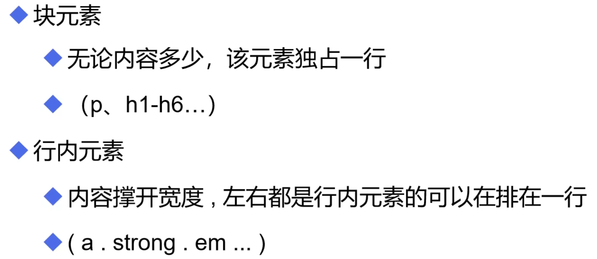

# 元素和列表

## 行内元素和块元素



## 列表

```html
<ol>
    <li>内容1</li>
    <li>内容2</li>
</ol><!--有序列表(数字)-->
```

```html
<ul>
    <li>内容1</li>
    <li>内容2</li>
</ul><!--无序列表(点)-->
```

```html
<dl>
    <dt>列表名称</dt>
    <dd>列表内容</dd>
</dl><!--自定义列表-->
运行结果为：
列表名称
    列表内容
```


