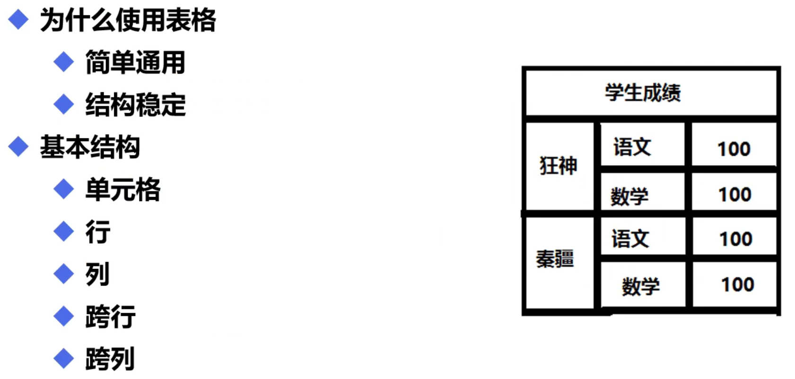

# 表格



```html
<table>(border="1px"(边框))
    <tr>行</tr>(rowspan="3"(跨3行))
    <td>列</td>(colspan="3"(跨3列))
</table>
```

```html
<!DOCTYPE html>
<html>
<head>
	<meta charset="utf-8">
	<meta name="viewport" content="width=device-width, initial-scale=1">
	<title>表格</title>
</head>
<body>
<table border="2px">
	<tr>
		<td align="center" colspan="3">
			学生成绩
		</td>
	</tr>
	<tr>
		<td rowspan="2">
	        狂神
	    </td><!--这里跨了两行相当于下一行直接多了一列,下一行就只需要两列-->
	    <td>语文</td>
    	<td>100</td>
    </tr>
    <tr>
    	<td>数学</td>
    	<td>100</td>
    </tr>
    <tr>
    	<td rowspan="2">
    		秦疆
    	</td>
    	<td>语文</td>
    	<td>100</td>
    </tr>
    <tr>
    	<td>数学</td>
    	<td>100</td>
    </tr>
</table>
</body>
</html>
```

