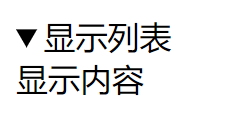
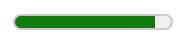

# HTML5页面元素及属性

## 结构元素

### header元素

header元素是一种具有引导和导航作用的结构元素，该元素可以包含所有通常放在页面头部的内容，通常用来放置标题、网站Logo图片、搜索表单或者其他相关内容

```html
<header>
    <h1>
        网页主题
    </h1>
    ...
</header>
```

### nav元素

nav元素用于定义导航链接，可以将具有导航性质的链接归纳在一个区域中，使页面元素的语义更加明确。其中的导航元素可以链接到站点的其他页面，或者当前页的其他部分，例如如下代码：

```html
<nav>
	<ul>
        <li><a href="#">首页</a></li>
        <li><a href="#">公司概况</a></li>
        <li><a href="#">产品展示</a></li>
        <li><a href="#">联系我们</a></li>
    </ul>
</nav>
```

### article元素

article元素代表文档、页面或者应用程序中与上下文不想关的独立部分，该元素经常被用于定义一篇日志、一条新闻或用户评论等

### aside元素

aside元素用来定义当前页面或者文章的附属信息部分，它可以包含与当前页面或主要内容相关的引用、侧边栏、广告、导航条等其他类似的有别于主要内容的部分

### section元素

section元素用于对网站或应用程序中页面上的内容进行分块，一个section元素通常由内容和标题组成(如果article元素、aside元素或nav元素更符合使用条件，那么不要使用section元素，但是如果想要将一块内容分成多段时，应该使用section元素)

### footer元素

footer元素用于定义一个页面或者区域的底部，它可以包含所有通常放在页面底部的内容

## 分组元素

用于对页面中的内容进行分组

### figure元素和figcaption元素

figure元素用于定义独立的流内容(图像、图标、照片、代码等)，一般值一个单独的单元，figure元素的内容应该与主内容有关，figcaption元素用于为figure元素组添加标题，一个figure元素内最多允许使用一个figcaption元素

### hgroup元素

hgroup元素用于将多个标题(主标题和副标题或者子标题)组成一个标题组，通常它与h1~h6元素组合使用，通常，将hgroup元素放在header元素中

## 页面交互元素

### detail元素和summary元素

```html
<details>
		<summary>显示列表</summary>
		显示内容
</details>
```



### progress元素

```html
<progress value="20" max="100"><!--value:已经完成的工作量，max：总共的工作量-->
```


### meter元素

```html
<meter value="90" min="0" max="100" low="20" high="80" optimum="100"></meter><!--value:定义度量的值，min：定义最小值，max：定义最大值，low：定义度量的值位于哪个点为低，high：定义度量的值位于哪个点为高，optimum：定义什么样的值为最佳值，如果值高于high，意味着越高越好(为绿色)，如果低于low，意味着越低越好(为绿色)。值处于high于low之间为黄色，偏离optimum为红色
```



