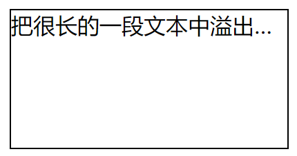
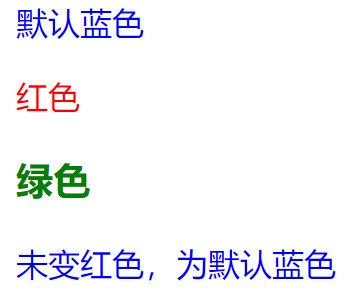
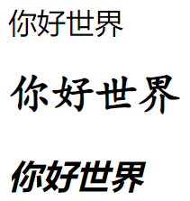
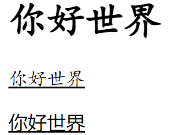

# CSS3入门

## CSS样式规则

```CSS
选择器{属性1:属性值1;属性2:属性值2;}/*没有英文引号*/
```

## 引入CSS样式表

### 行内式

```CSS
<标记名 style="属性1:属性值1;属性2:属性值2;">内容</标记名>/*行内式*/
```

### 内嵌式

```css
<head>
	<style type="text/css">
    选择器{属性1:属性值1;属性2:属性值2;}
    </style>
</head>/*内嵌式*/
```

### 链入式

```css
<head>
	<link href="CSS文件的路径" type="text/css" rel="stylesheet" />
</head>/*链入式*/
```

例如：html文件代码为：

```css
<!doctype html>
<html>
<head>
	<meta charset="utf-8">
	<title></title>
	<link href="测试.css" type="text/css" rel="stylesheet" /><!--href后可填相对地址或绝对地址，这里为了方便默认同一目录-->
</head>
<body>
	<p>把很长的一段文本中溢出的内容隐藏，出现省略号</p>
</body>
</html>
```

CSS3代码为：**(注意文件名应该为"测试.css"，且和对应的html在同一目录)**

```css
p{
    width:200px;
    height:100px; 
    border:1px solid #000;
    white-space: nowrap;
    overflow: hidden;
    text-overflow: ellipsis;
}
(代码格式为：选择器{属性1:属性值1;属性2:属性值2;})
```



优先级：行内式>内嵌式>链入式>默认

**（注意：CSS区分大小写，而且CSS注释方式于html有所不同）**

## CSS基础选择器

### 标记选择器

 ```css
 标记名{属性1:属性值1;属性2:属性值2;}/*标记选择器*/
 例如：
 p{font-size:12px;color:#666;font-family:"微软雅黑";}
 /*能快速为页面中同类型的标记统一样式，不能差异化设计*/
 ```

### 类选择器

```css
.类名{属性1:属性值1;属性2:属性值2;}
例如：
.red{color:red;} .font22{font-size:22px;}

<p class="red font22">段落文本</p>
/*可以为元素对象定义单独或者相同的样式*/
```

### id选择器

```css
#id名{属性1:属性值1;属性2:属性值2;}
例如：
#bold{font-weight：bond;}

<p id="bold">段落文本</P>
/*id选择器不像类选择器可以定义多个值*/
```

### 通配符选择器

```css
*{属性1:属性值1;属性2:属性值2;}
例如；*{margin：0;padding：0;}
/*设置的样式对所有HTML标记都生效，一般不推荐使用*/
```

### 标签指定式选择器（不加空格）（只能标记选择器和class选择器(id选择器)之间）

```css
由两个选择器构成，其中第一个为标记选择器，第二个为class选择器或id选择器，如h3.specizl或p#one
例如：
<style type="text/css">
	p{color:blue;}/*所有后代都会继承blue属性*/
	.special{color:green;}
	p.special{color:red;}/*本质上可以看成一个只能在p标记中使用的.special类*/
	p .special0{color:red;}/*后代选择器*/
</style>

<p>蓝色</p><!--标记选择器决定-->
<p class="special">红色</p><!--有p和special，标签指定决定-->
<h3 class="special">绿色</h3><!--类选择器决定-->
<p class="special0">未变红色，为默认蓝色</p><!--多了空格，就需要嵌套才能调用（后代选择器）-->
```



### 后代选择器（加了空格）（任何两个选择器之间都可以）

```css
其写法就是把外层写在前面，内层标记写在后面，中间用空格分隔。当标记发生嵌套时，内层标记就成为外层标记的后代
例如：
<style type="text/css">
	.one .two{font-family: 楷体;font-size: 24px;}/*若不加空格，则效果two不存在*/
	h3 span{
			font-style:italic;/*这里直接指定h3的后代的span标记选择器样式*/
		}
</style>

<p class="two">你好世界</p><!--未嵌套，设置无效，默认输出-->
<p class="one"><strong class="two">你好世界</strong></p><!--成功嵌套，设置有效-->
<h3><span>你好世界</span></h3><!--会经常常用到，需要注意-->
```



**(注意：命名不能以数字开头。最好使用后代选择器，可以解放关键字标记选择器，且不易混淆)**

### 并集选择器

```css
并集选择器可以同时定义多个属性相同的样式，与各个选择器单独定义样式完全相同，可以使css代码更加简洁，同一选择器可以被多次定义，起到叠加效果
例如：
<style type="text/css">
	h1,p{font-family:楷体;}
	p,.one{text-decoration:underline;}
</style>

<h1>你好世界</h1><!--定义为楷体-->
<p>你好世界</p><!--既定义为楷体，又定义了下划线-->
<span class="one">你好世界</span><!--定义了下划线-->
```



