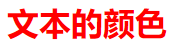
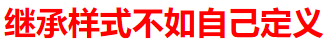

# CSS3文本样式属性

## 字体样式属性

### 1，font-size:字号大小

| 相对长度单位 |              说明              |
| :----------: | :----------------------------: |
|      em      | 相对于当前对象内文本的字体尺寸 |
|      px      |     像素，最常用，推荐使用     |

| 绝对长度单位 | 说明 |
| :----------: | :--: |
|      in      | 英寸 |
|      cm      | 厘米 |
|      mm      | 毫米 |
|      pt      |  点  |

### 2，font-family:字体

```css
body{font-family:"华文彩云","宋体"，"黑体";}/*如不支持第一个，会尝试第二个，中文字体名需要在英文前面
```

### 3，font-weight:字体粗细

|           值           |                                                              |
| :--------------------: | :----------------------------------------------------------: |
|         normal         |                    默认值。定义标准的字符                    |
|          bold          |                         定义粗体字符                         |
|         bolder         |                        定义更粗的字符                        |
|        lighter         |                        定义更细的字符                        |
| 100~900（100的整数倍） | 定义由粗到细的字符。其中400等同于normal。700等同于bold，值越大字体越粗 |

### 4，font-style:字体风格

- normal:默认值，浏览器会显示标准的字体样式

- italic:浏览器会显示斜体的字体样式

- oblique:浏览器会显示倾斜的字体样式

### 5，font:综合设置字体样式

```css
选择器{font:font-style font-weight font-size/line-height font-family;}
例如p{font:italic bond 30px/40px Arial,"宋体":}/*风格，粗细，字号，字体。必须保留字号和字体*/
```

### 6，@font-face属性

```css
@font{
    font-family:字体名称;
    scr:字体路径;
}
```

### 7，word-wrap属性

```css
选择器{word-wrap:属性值;}/*值:normal：只允许断字点换行（默认），break-word：在长单词或URL内部进行换行
```

## 文本外观属性

### 1，color:文本颜色

- 预定义颜色值：如red，green，blue等。

- 十六进制，如#FF0000，#FF6600，#29D794等。实际工作中，十六进制是最常用的定义颜色的方式

- RGB代码，如红色可以表示为rgb(255,0,0)或rgb(100%,0%,0%)

### 2，letter-spacing:字间距

字间距就是字符与字符之间的空白，其属性值可为不同单位的数值，允许使用负值

### 3，word-spacing:单词间距

定义英文之间的间距，中文字符无效，其属性值可为不同单位的数值，允许使用负值

### 4，line-height:行间距

行间距就是行与行之间的距离，即字符的垂直间距，常用属性值有3种，像素px，相对值em和百分比%

### 5，text-transform:文本转化

- none：不转换（默认）
- capitalize：首字母大写
- uppercase：全部字符转化为大写
- lowercase：全部字符转化为小写

### 6，text-decoration:文本装饰

- none：没有装饰（默认）
- underline：下划线
- overline：上划线
- line-through：删除线

### 7，text-align:水平对齐方式

- left：左对齐
- right：右对齐
- center：居中对齐

### 8，text-indent:首行缩进

用于设置首行文本的缩进，其属性可为不同单位的数值，em字符宽度的倍数，或相对于浏览器窗口宽度的百分比%，允许使用负值，推荐使用em作为设置单位。

### 9，while-space:空白符处理

使用HTML制作网页时，不论代码有多少空格，在浏览器中只会显示一个字符的空白。

- normal：常规（默认值）
- pre：预格式化，按文档的书写格式保留空格、空行原样显示
- nowrap：空格空行无效，强制文本不能换行，除非遇到换行标记。内容超出元素的边界也不换行，若超出浏览器页面则会自动添加滚动条

### 10，text-shadow:阴影效果

```css
选择器{text-shadow:h-shadow v-shadow blur color;}/*h-shadow用于设置水平阴影的距离，v-shadow用于设置垂直阴影的距离，blur用于设置模糊半径，color用于设置阴影颜色*/
例如p{text-shadow:10px 10px 10px red;}
```

### 11，text-overflow:标示对象溢出文本

```css
选择器{text-overflow:属性值;}/*clip：修剪溢出文本，不显示省略标记"…",ellipsis：用省略标记"..."标示被修剪的文本，省略标记插入的位置
```

```css
<style type="text/css">
    p{
    	width:200px;
    	height:100px; 
    	border:1px solid #000;/*定义边界*/
    	white-space: nowrap;/*强制文本不能换行*/
    	overflow: hidden;/*隐藏溢出文本（触发显示省略标记）*/
    	text-overflow: ellipsis;/*显示省略标记（三者缺一不可）*/
    }
</style>
<p>把很长的一段文本中溢出的内容隐藏，出现省略号</p>
```


## CSS优先级

对于由多个基础选择器构成的复合选择器（并集选择器除外），其权重为这些基础选择器权重的叠加。

```css
p strong{color:black;} /*权重为：1+1*/
strong.blue{color:green;} /*权重为：1+10*/
.father strong{color:yellow;} /*权重为：10+1*/
p.father strong{color:oranger;} /*权重为：1+10+1*/
p.father .blue{color:gold;} /*权重为：1+10+10*/
#header strong{color:pink;} /*权重为：100+1*/
#header strong.blue{color:red;} /*权重为：100+1+10*/
/*标记样式为1 class样式为10 id样式为100*/
```

对应HTML结构为：

```html
<p class="father" id="header">
    <strong class="blue">文本的颜色</strong>
</p>
```



但是存在一些特殊情况：**继承样式的权重为0**。即在嵌套结构中，不管父元素样式的权重多大，被子元素继承时，它的权重都为0，也就是说子元素定义的样式会覆盖继承原来的样式。

例如下面的CSS样式代码：

```css
strong{color:red;}
#header{color:green;}
```

对应HTML结构为：

```html
<p id="header" class="blue">
    <strong>继承样式不如自己定义</strong>
</p>
```



虽然#header具有权重100，但被strong继承时权重为0，而strong选择器的权重虽然为1，但它大于继承样式的权重，所以页面中的文本显示为红色。

**行内样式优先**。应用style属性的元素，其行内式的权重非常高，可以理解为远大于100。总之，它拥有比上面提到的选择器都大的优先级

**权重相同时，CSS遵循就近原则**。也就是说靠近元素的样式具有最大的优先级，或者说排在最后的样式优先级最大。
