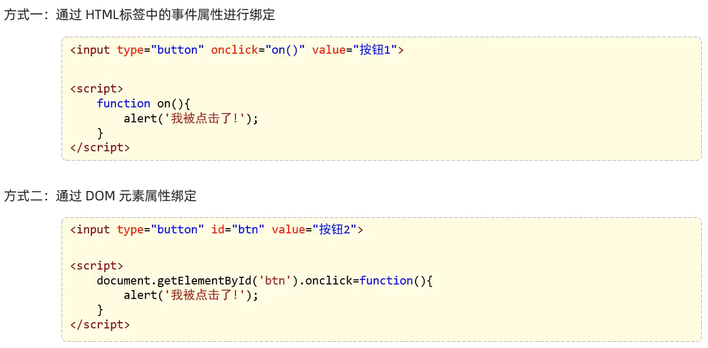
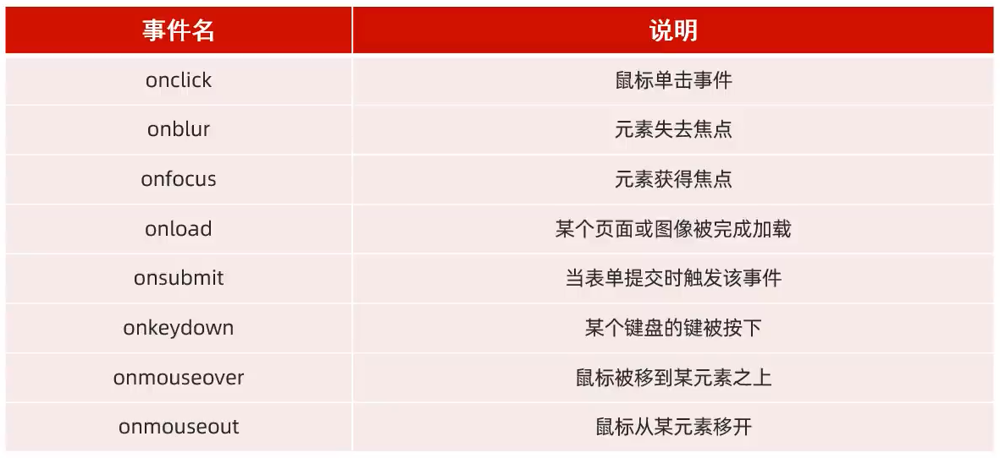
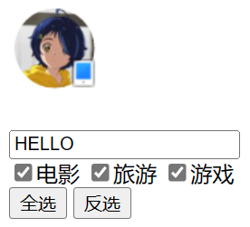

# 事件

HTML事情是发生在HTML元素上的”事情“，比如：

- 按钮被点击
- 鼠标移动到元素上
- 按下键盘按键

事件监听是JavaScript可以在事件被侦测到时**执行代码**

## 事件绑定



## 常见事件



> 事件绑定方式：
>
> - 使用事件处理器属性
>
>   - ```js
>             // 假设有一个按钮元素，其id为'myButton'
>             document.getElementById('myButton').onclick = function () {
>                 alert('Button clicked!');
>             };
>     ```
>
> - 使用`addEventListener`方法
>
>   - ```js
>             // 获取按钮元素
>             var button = document.getElementById('myButton');
>     
>             // 绑定点击事件
>             button.addEventListener('click', function () {
>                 alert('Button clicked!');
>             });
>     ```
>
> > 使用`addEventListener`方法的优势在于它可以给同一个元素绑定多个相同类型的事件处理函数，而事件处理器属性（如`onclick`）只能设置一个处理函数，后面的设置会覆盖前面的设置
>
> 注意：`onClick`是原生JavaScript的事件处理方式，而`@click`是Vue.js框架提供的语法糖

```html
<!DOCTYPE html>
<html lang="en">
<head>
    <meta charset="UTF-8">
    <meta name="viewport" content="width=device-width, initial-scale=1.0">
    <title>Document</title>
</head>
<body>
    <br><br>
    <input type="text" id="text"><br>
    <input type="checkbox" name="hobby">电影
    <input type="checkbox" name="hobby">旅游
    <input type="checkbox" name="hobby">游戏
    <br>
    <input type="button" value="全选" id="btn1">
    <input type="button" value="反选" id="btn2" onclick="btn2()">
</body>
    <script>
        
        // 点击亮或者暗
        var img = document.getElementById('h1')
        img.onclick = function(){
            if(img.src.includes('off')){
                img.src = 'img/on.png'
            }else{
                img.src = 'img/off.png'
            }
        }

        // 失去焦点时展示小写，输入时展示大写
        var text = document.getElementById('text')
        text.onfocus = function(){
            var input = document.getElementById('text')
            input.value = input.value.toLowerCase()
        }
        text.onblur = function(){
            var input = document.getElementById('text')
            input.value = input.value.toUpperCase()
        }

        // 实现点击全选
        var btn1 = document.getElementById('btn1')
        btn1.onclick = function(){
            let ins = document.getElementsByName('hobby')
            for (let i = 0; i < ins.length; i++) {
                const element = ins[i]
                element.checked = true
            }
        }

        // 实现点击全取消(这里就不能再获取变量btn2，否则会和函数名冲突)
        function btn2(){
            let ins = document.getElementsByName('hobby')
            for (let i = 0; i < ins.length; i++) {
                const element = ins[i]
                element.checked = false
            }
        }
    </script>
</html>
```

> 