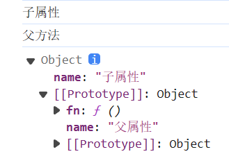
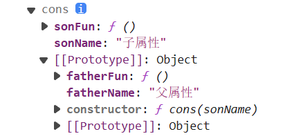
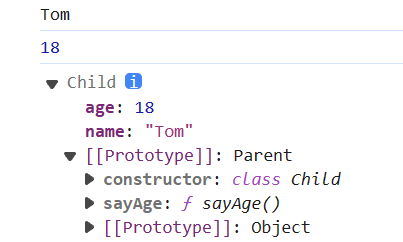

# this和原型链继承

## this

> js 中的 this 是隐式参数，它与函数运行时上下文相关

对于对象外的函数，其this对象是指向window全局变量的

```js
    function study(subject) {
        console.log(this.name + "在" + subject)
    }
    study("学习") // 在学习
```

对于对象内的函数，其this对象指向对象

```js
    let stu = {
        name:"小白",
        study
    }
    stu.study("学习") // 小白在学习
```

### 匿名函数的this

对于很多回调函数有自己的`this`上下文，所以使用匿名函数会导致this的指向变化

```js
    let stu = {
        name: "老师",
        friends: ["小白","小黑","小明"],
        teach() {
            this.friends.forEach(function(e){
                console.log(this.name + "在教导" + e);
            });
        }
    }
    stu.teach()
    // 在教导小白
    // 在教导小黑
    // 在教导小明
```

### 箭头函数的this

对于箭头函数来说，不会创建自己的上下文，而是会从外围作用域继承`this`

```js
    let stu = {
        name: "老师",
        friends: ["小白","小黑","小明"],
        teach() {
            this.friends.forEach((e) => {
                console.log(this.name + "在教导" + e);
            });
        }
    }
    stu.teach()
    // 老师在教导小白
    // 老师在教导小黑
    // 老师在教导小明
```

> 也可以引用赋值外围的`this`来实现类似的效果：
>
> ```js
>    	let stu = {
>    	 name: "老师",
>    	 friends: ["小白","小黑","小明"],
>    	 teach() {
>    		 let me = this
>    		 this.friends.forEach(function(e){
>    			 console.log(me.name + "在教导" + e);
>    		 });
>    	 }
>    	}
>    	stu.teach()
>    	// 在教导小白
>    	// 在教导小黑
>    	// 在教导小明
> ```

## 改变函数运行的上下文

> 函数对象的`call()`、`apply()`和`bind()`方法都是用来改变函数运行时的上下文（`this` 的值）的。它们都是函数对象的方法，可以在任何函数上调用

- `apply()`：接受一个对象和一个参数数组，然后调用该函数

  - ```js
        function greet(greeting, punctuation) {
            console.log(`${greeting}, ${this.name}${punctuation}`);
        }
    
        let user = { name: "yxx" };
    
        greet.apply(user, ["Hello", "!"]);  // 输出 "Hello, yxx!"
    ```

- `call()`：和 `apply()` 方法非常相似，区别在于 `call()` 接受一个对象和一个参数列表(不加`[]`)，而不是参数数组

  - ```js
    export default function debounce(callback, delay) {
        let timeout = null
        return function () {
            if (timeout) {
                clearTimeout(timeout)
            }
            timeout = setTimeout(() => { callback.call(this, ...arguments) }, delay)
        }
    }
    // arguments为参数数组，...arguments展开为参数列表
    ```

- `bind()`：创建一个新的函数，这个函数在调用时将 `this` 的值设置为提供的值，通过参数列表传递参数，参数可以在定义时或者函数执行时传递

  - ```js
        function greet(greeting, punctuation) {
            console.log(`${greeting}, ${this.name}${punctuation}`);
        }
    
        let user = { name: "yxx" };
    
        let greetUser = greet.bind(user, "Hello");
    
        greetUser("!");  // 输出 "Hello, yxx!"
    ```

## 原型链继承

> 原型链继承是JavaScript中最基本的继承方式，它是基于原型的继承。在JavaScript中，每个对象都有一个指向它的原型（prototype）的链接，这个链接叫做原型链。当试图访问一个对象的属性时，如果对象自身没有这个属性，那么JavaScript会沿着原型链去查找这个属性

### 对象的原型链继承

```js
    let father = {
        name: '父属性',
        fn: function() {
            console.log("父方法");
        }
    }
    
    let son = Object.create(father); // 通过创造一个新对象，这个对象继承于father
    son.name = "子属性"

    console.log(son.name); // 打印 子属性
    son.fn(); // 打印 父方法
    console.dir(son)
```

> son 里有特殊属性 `__proto__` 代表它的父对象，为 son 的原型对象：
>
> 

### 函数的原型链继承

> 函数有个特殊的属性 prototype，它就是函数创建的子对象的父对象，可以通过函数创建子对象，给子对象提供属性、方法，功能上相当于构造方法

```js
    function cons(sonName) {
        // 创建子对象(this), 给子对象提供属性和方法
        this.sonName = sonName;
        this.sonFun = function () {
            console.log("子方法");
        }
    }

    // cons.prototype 就是父对象
    cons.prototype.fatherName = "父属性";
    cons.prototype.fatherFun = function () {
        console.log("父方法");
    }

    let son = new cons("子属性")
    console.dir(son)
```

> 子对象的 `__proto__` 就是函数的 `prototype` 属性：
>
> 

### 类的原型链继承

> 函数和对象的原型链继承与ES6中类的原型链继承在本质上是相同的

```js
    class Parent {
        constructor(name) {
            this.name = name;
        }

        sayName() {
            console.log(this.name);
        }
    }

    class Child extends Parent {
        constructor(name, age) {
            super(name); // 调用父类的constructor
            this.age = age;
        }

        sayAge() {
            console.log(this.age);
        }
    }

    let child1 = new Child('Tom', 18);
    child1.sayName(); // 输出 'Tom'
    child1.sayAge(); // 输出 18
```

> 