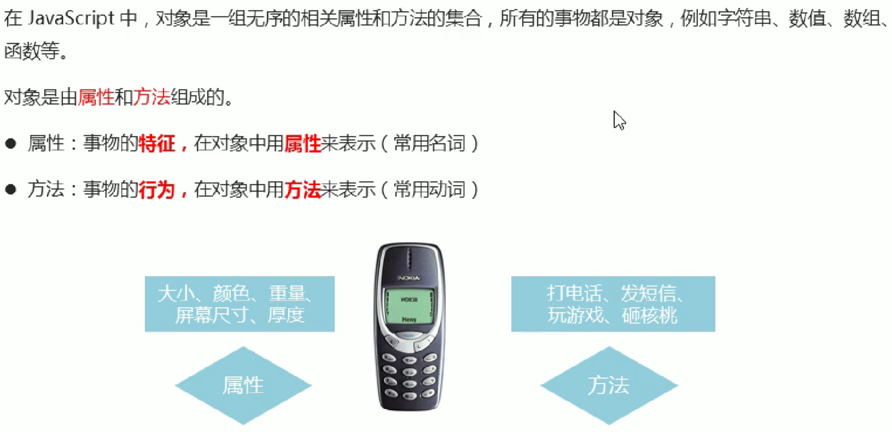
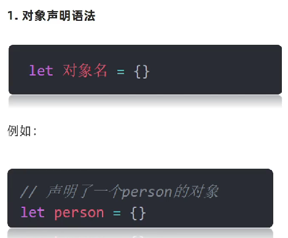
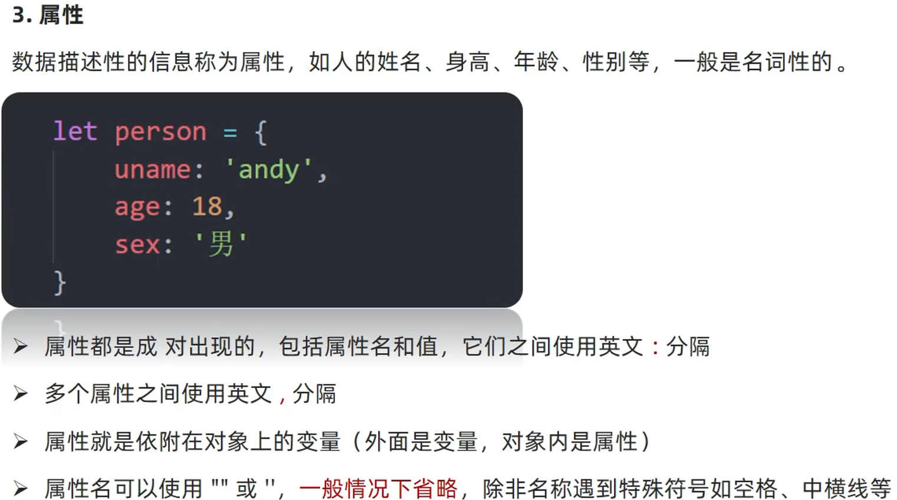
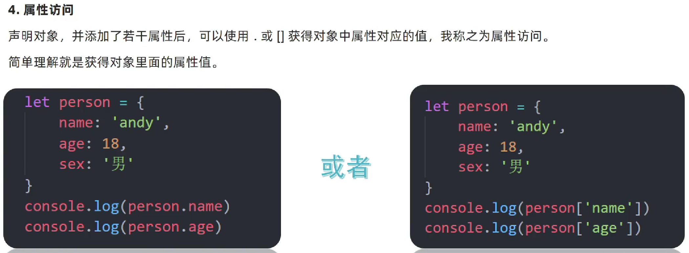
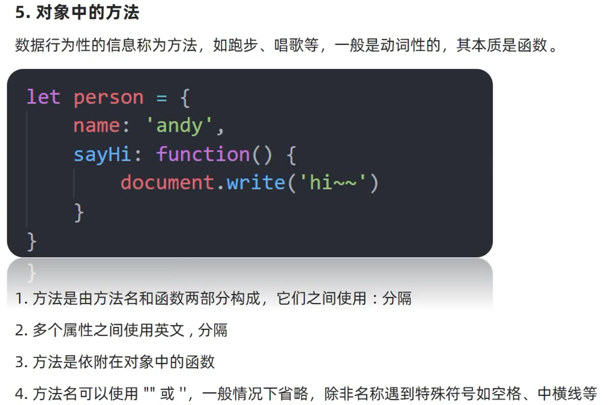
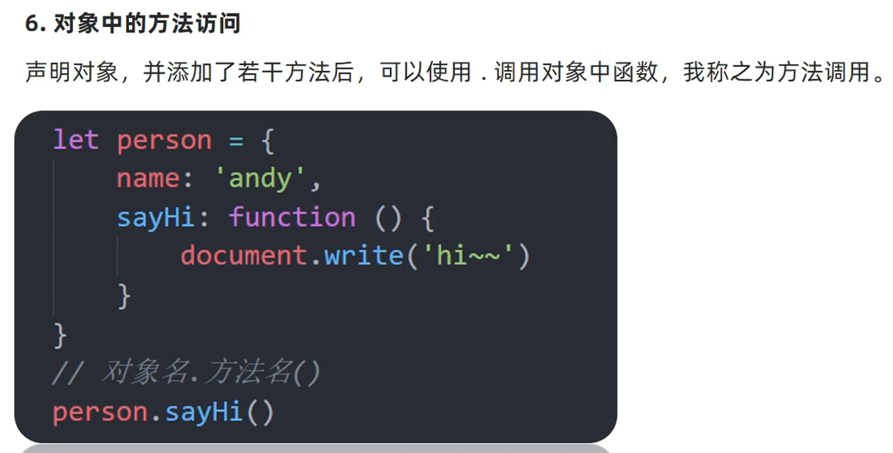
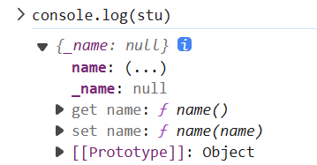
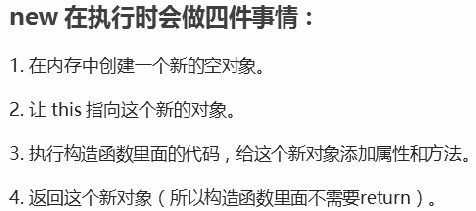
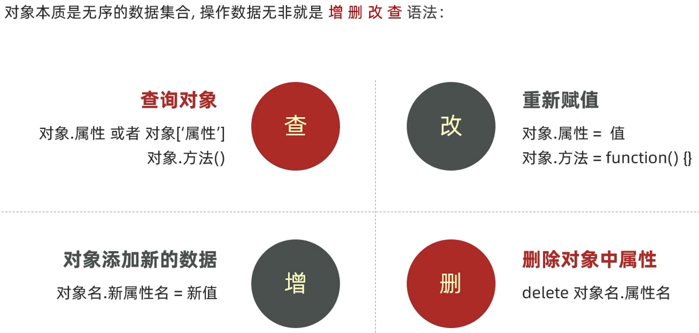
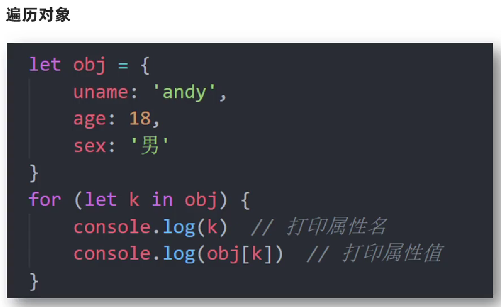

# 对象

## 基本概念



## 对象声明



## 属性



### 属性访问

**与Python中的“字典”类似，通过“键值对“的方式存储**



## 对象中的方法

**定义方法采取的方式多采取”匿名函数“的方式定义，同样也是”键值对“的方式存储**



### 方法访问



## Get、Set方法

> js中的Get、Set方法定义相对来说比较特殊，需要使用`get`和`set`来定义，并在将定义的方法名作为属性，调用修改时触发

```js
    let stu = {
        _name: null, /* 类似于java中私有成员变量，但实际还是可以访问的 */
        get name() {
            console.log("进入了get")
            return this._name
        },
        set name(name) {
            console.log("进入了set")
            this._name = name
        }
    }
```

调用Get、Set方法

```
stu.name // 进入了get

stu.name = "yxx" // 进入了set
```

> 
>
> 在对象定义后再添加Get和Set方法：
>
> ```js
>    	Object.defineProperty(stu, "name", {
>    		get() {
>    		 return this._name
>    		},
>    		set(name) {
>    		 this._name = name
>    		}
>    	})
> ```
>
> `Object.defineProperty()`用于在一个对象上定义一个新的属性，或者修改一个对象的现有属性，并返回这个对象，方法有三个参数：
>
> - 第一个参数是要在其上定义或修改属性的对象
> - 第二个参数是要定义或修改的属性的名称
> - 第三个参数是一个描述符对象，该对象描述了这个属性的行为

## 使用Object创建对象

可以通过`new Object`的方式创建一个新的对象

```html
	<script>
        let person = new Object()
        person.name = 'andy'	//注意这里是用的"="
        person.sayHi = function(){
            document.write('hi~~')
        }
        document.write(person['name'])	//调用方式保持一致
        person.sayHi()
	</script>
```

## 使用构造函数创建对象

与Java不同，**JS的构造函数本身可以作为一个单独的函数来调用**，JS的构造函数抽象了对象的公共部分封装到了函数里面，它**泛指某一大类（只有Java的class的抽象功能，没有面向对象的特征）**（Java也可以通过方法或者构造函数实现接口的重写）

```html
	<script>
        function fn(name){	//构造函数
            this.name = name
            this.sayHi = function(say){
                document.write(say)
            }
        }
        let person = new fn('andy') //调用new fn()就相当于创建了一个对象
        document.write(person['name'])
        person.sayHi('hi~~')	//输入形参
	</script>
```

### 执行过程



## 操作对象



## 遍历对象

- 对象没有像数组一样的length属性，所以无法确定长度
- 对象里面时无序的键值对，没有规律，不像数组里有规律的下标



注意：这里**obj[k]里面的k不能加`''`**，否则会被判定为obj里面的属性

（类似于Java的增强for循环`for(String s : obj){System.out.println(s);}`）

## 内置对象

指JS语言自带的一些对象，这些对象供开发者使用，并了提供一些常用的或是最基本的且必要的功能（属性或者方法）JavaScript提供了多个内置对象：Math、Date、Array、String等

- 数学函数：
  - `Math.abs(x)`：取x的绝对值
  - `Math.pow(2,53)`：=>9007199254740992： 2 的 53 次方
  - `Math.random()`：生成包含0不到1的随机数
  - `Math.round(.6)`：=>1：舍入到最接近的整数
  - `Math.ceil(.6)`：=>1：向上舍入到一个整数
  - `Math.floor(.6)`：=>0：向下舍入到一个整数

