# 函数

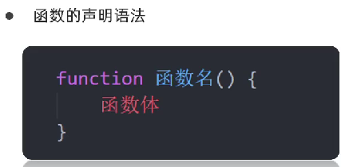

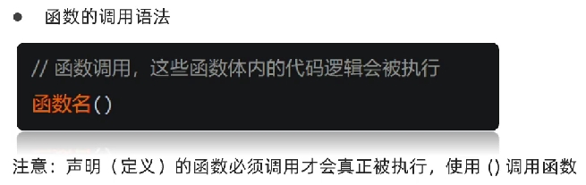

函数需要返回值时，**直接使用return语句**即可

## return语句

没有return，则返回的是`undefined`。值得注意的是，**JS中的return语句只能返回一个“值”**，这个“值”不仅仅只是值，还可以是对象或者数组之类的包含多组值的地址。（Python的函数可以返回多个值）

例如：

- `return 1,2`只能返回**最末尾的2**

- `return [1,2]`则是返回的是一个**数组的地址**

## 函数返回多个值的方法

```html
	<script>
		function fn(x,y){//fn(x = 0,y = 0)形参默认值为0，有输出值时以输入的值为准(Java不支持为形参赋初值)
			x = x || 0	//在输入为空时会赋值为0，这样就不会导致fn()的结果为NaN
			y = y || 0
			return [(x+y),(x-y)]
		}
		let a = fn(1,2)
		document.write(typeof a)//fn(1,2)为object类型
		document.write(`</br>相加之后的结果为${a[0]}，相减之后的结果为${a[1]}`)	//注意这里用的是"`"
	</script>
```

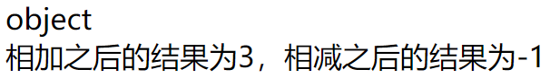

## argument的使用

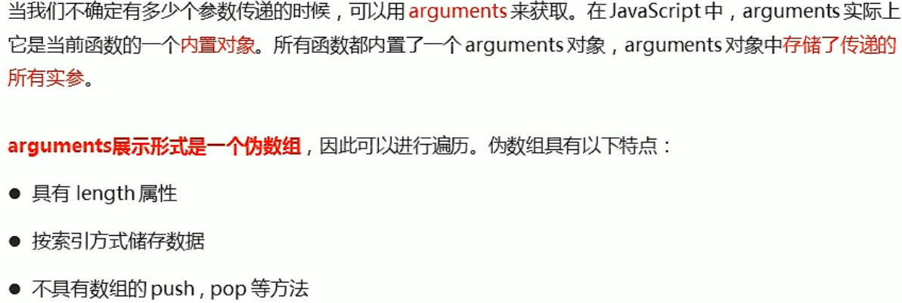

```html
	<script>
		function fn(){
            for(let i in arguments)
                document.write(arguments[i])
        }
        fn(1,2,3,4,5)
	</script>
<!--输出结果为：12345-->
```

## 函数之间互相调用

```html
	<script>
		function fn(){
            for(let i in arguments) // arguments为方法对象的参数列表，所以能够获取到值
                console.log(arguments[i])
        }
        function fn1(){
            fn(1,2,3,4,5) // 调用了函数fn()
        }
        fn1() // 调用fn1()来调用fn()
	</script>
```

## 函数作用域

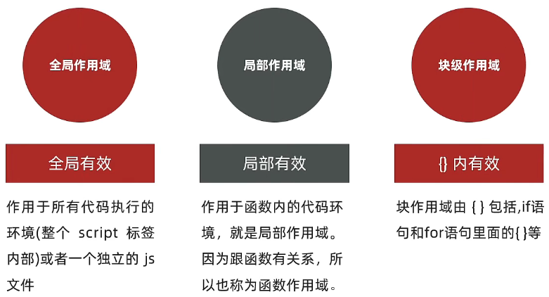

```html
    <script>
        var num = 1
        function fn1(){
            var num = 2	//num只在函数内部改变，出了函数num依旧是1，不像Python有global关键字来覆盖
            document.write(num)
        }
        fn1()
        document.write(num)
	</script>
```

- JS只有函数作用域和全局作用域，**没有块级作用域(ES6后才新增的)**，所以**`{}`限定不了`var`声明变量的访问范围**，而**`let`可以声明块级别作用域变量(只在{}范围内有效)**。
- `let`非常适合用于 `for`循环内部的块级作用域。JS中的for循环体比较特殊，**每次执行都是一个全新的独立的块作用域**，用let声明的变量传入到 for循环体的作用域后，不会发生改变，不受外界的影响。

```js
    for (var i = 0; i <10; i++) {  
      setTimeout(function() {  //同步注册回调函数到"异步的"宏任务队列。
        console.log(i);        //执行此代码时，同步代码for循环已经执行完成
      }, 0);
    }
    // 输出结果
    10   共10个
    // 这里面的知识点： JS的事件循环机制，setTimeout的机制等
```

```js
    // i虽然在全局作用域声明，但是在for循环体局部作用域中使用的时候，变量会被固定，不受外界干扰。
    for (let i = 0; i < 10; i++) { 
      setTimeout(function() {
        console.log(i);    //i是循环体内局部作用域，不受外界影响。
      }, 0);
    }
    // 输出结果：0  1  2  3  4  5  6  7  8  9
```

## 匿名函数

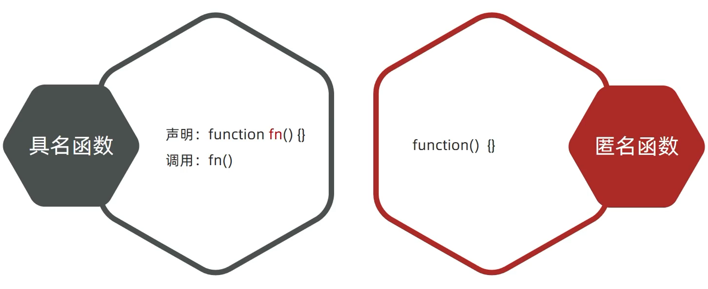

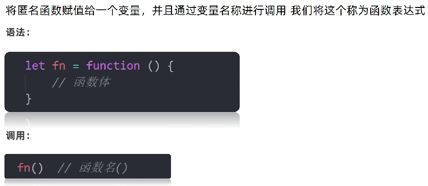

```html
	<script>
		let b = function(x,y){//定义了一个匿名函数赋值给了对象b
			return [(x+y),(x-y)]
		}
		let a = b(1,2)
    </script>
```

## 立即执行函数

1. 创建一个独立的作用域，这个作用域里面的变量，外面访问不到，这样就可以避免变量污染。

2. 闭包和私有数据。

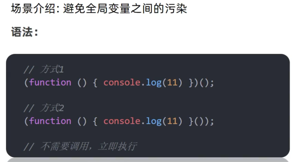

**第一个括号为形参，第二个括号为实参**

## 箭头函数

ES6及之后，有一种定义函数的简写方式。这种简洁的语法使用"=>"来分隔参数列表和函数体，因此以这种方式定义的函数被称为箭头函数

```html
    <script>
        const a = x => x + 1
        console.log(a(10));
    </script>
```

> a为函数名字，x为函数形参，(x + 1)为函数返回值

## var和let的区别

let是es6中新增命令，也是用来声明变量的，随着ES6普及，`let`使用会越来越频繁,，**let和var的基本区别体现在作用域上**

- `var`变量在函数外部声明，它将属于全局作用域；如果在函数内部声明，它的作用域将被限制在该函数内
- **`let`则被规定为块作用域**，它的作用域被限制在最近的一层块级作用域(**`{}`括起来的一段代码**)，块作用域要比函数作用域小一些，但是如果两者既没在函数中，也没在块作用域中定义，那么两者都属于全局作用域，但是，`let`声明的全局变量**不会添加到全局对象**（如`window`对象在浏览器中）中

> var的几点特性
>
> - 变量提升：允许变量在声明变量前访问变量，可以确保作用域中变量的一致性
>
> - 重复声明：可以重复声明变量，后创建的变量会覆盖前创建的变量
>
> - 全局对象：var定义全局变量，都会作为属性存储在全局变量`window`中，可能出现重名问题
>
> - 块作用域：var声明的变量是没有块作用域的，可以在块外被访问
>
>   - ```js
>             for (var i = 0; i < 5; i++) {
>                 setTimeout(() => {
>                     console.log(i) // 5 5 5 5 5
>                 }, i * 1000)
>             }
>     ```

### 全局作用域

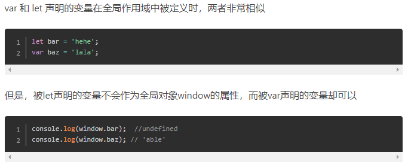

### 函数作用域

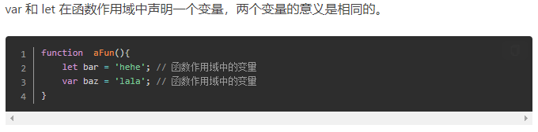

> 如果 var 变量出现了重名，则他俩会被视为同一作用域中的同一个变量
>
> ```js
>            var e = 10
>            if (true) {
>                var e = 20 // 相当于e = 20，进行重新赋值
>                console.log(e) // 打印 20
>            }
>            console.log(e) // 因为是同一个变量，但是值变了，打印 20
> ```
>
> 如果是 let，则视为两个作用域中的两个变量
>
> ```js
>            let e = 10
>            if (true) {
>                let e = 20
>                console.log(e) // 打印 20
>            }
>            console.log(e) // 打印 10
> ```
>
> 要想里面的 e 和外面的 e 能区分开来，最简单的办法是改成let，或者用函数来界定作用域范围
>
> ```js
>                var e = 10
>                if (true) {
>                    function fun() {
>                        var e = 20 // 相当于一个新的变量，不会影响外面的e
>                        console.log(e) // 调用函数后打印 20
>                    }
>                }
>                console.log(e) // 打印 10
> ```
>
> 打印函数的作用域信息
>
> ```js
>            var e = 10
>            function a() {
>                var e = 1
>                function fun() {
>                    console.log(e) // 打印 1
>                }
>                fun()
>                console.dir(fun)
>            }
>            a()
>            console.log(e) // 打印 10
> ```
>
> 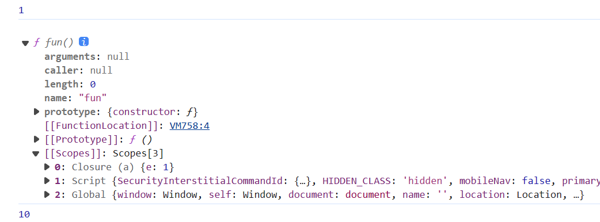
>
> - **Closure**：在这里，`fun`函数可以访问到它的外部作用域，也就是`a`函数中的`e`变量，因此形成了一个闭包(如果有多层嵌套，且存在变量有使用的话就会有多个`Closure`)
> - **Script**：代表的是当前脚本的顶级作用域，也就是`a`函数外部的作用域
> - **Global**：全局作用域，也就是`window`对象。在浏览器环境下，全局作用域就是`window`对象
>
> 当查找变量的时候，JavaScript 会沿着这个链向上查找，直到找到为止，或者到达最顶层的全局作用域

### 块作用域

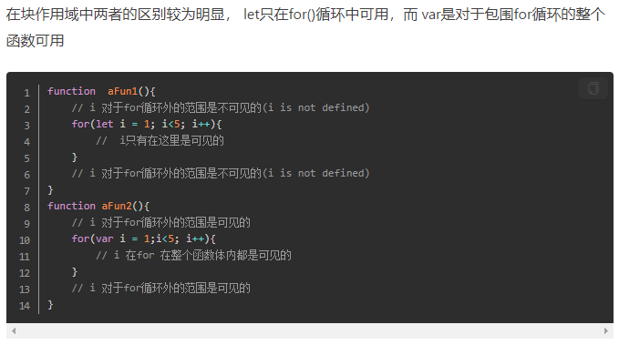

### 与const区别

var**允许在同一作用域中声明同名的变量**，而let不可以，es6中还有一个声明变量的命令const

- **const和let都是在声明的块作用域中有效**，但是**let声明的变量可变，值和类型都可以改变**，没有限制。const声明的变量不能改变，所以，const一旦声明一个变量，就必须马上初始化，不能留到以后赋值
- 对于基本数据类型（如字符串、数字、布尔值等），const意味着值本身不能改变；对于对象和数组，这意味着引用本身不能改变，但对象内部的属性或数组的元素可以被修改

### 应用场景

```html
<ul id=”test”>
    <li>这是第一条</li>
    <li>这是第二条</li>
    <li>这是第三条</li>
</ul>

<script>
    var liList=document.getElementsByTagName('li');
    for(var i=0;i<liList.length;i++)
    {
        liList[i].onclick=function(){
            console.log(i); // 点击任意盒子都是输出3
        }
    };
</script>
```

直观感觉的执行效果是点击第一个li，则会输出1，点击第二个li，则会输出二，以此类推。但是真正的执行效果是，**不管点击第几个li，都会输出3，**因为 i 是贯穿整个作用域的，而不是给每个 li 分配了一个 i，用户触发的onclick事件之前，for循环已经执行结束了，而for循环执行完的时候i=3。

但是如果我们**用了立即执行函数给每个 li 创造一个独立作用域**，就可以改写为下面的这样，这样就能实现**点击第几条就能输出几的功能**。

```html
<script>
    var liList=document.getElementsByTagName('li');
    for(var i=0;i<liList.length;i++)
    {
        (function(ii) {
           liList[ii].onclick=function(){
               console.log(ii);
           }
       })(i)
    };
</script>
```

当然ES6语法中的`let`也能实现类似的功能(可以参考上面的作用域解释)，不会污染块作用域的外部作用域，所以**let多用于循环语句**

```html
<script>
     var liList=document.getElementsByTagName('li');
     for(let i=0;i<liList.length;i++)
     {
            liList[i].onclick=function(){
                console.log(i);
             }
     }
</script>
```

