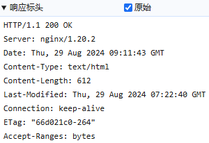

# HTTP

## 版本历史

HTTP（超文本传输协议）是互联网上应用最为广泛的协议之一，它定义了客户端和服务器之间交换数据的格式和传输方式。自1991年发布以来，HTTP经过多次更新，主要版本有以下几个：

**HTTP/0.9**

- 发布时间：1991年
- 设计目标：主要用于学术交流，简单易实现
- 限制：仅支持GET请求，无请求头或响应头

**HTTP/1.0**

- 发布时间：1996年
- 设计目标：支持更广泛的互联网应用，传输不同类型的资源。
- 关键改进
  - 增加了请求和响应头，允许传输元数据
  - 引入了状态码，如200、404等，用于表示请求结果
  - 支持多类型内容，如图片、视频等

**HTTP/1.1**

- 发布时间：1997年（RFC 2068），1999年（RFC 2616）
- 设计目标：提高网络效率和性能，支持更复杂的网络应用
- 关键改进
  - 默认持久连接，减少了TCP连接的开销
  - 支持虚拟主机，允许一个IP地址上部署多个域名
  - 改进了缓存机制，如引入了Cache-Control头
  - 引入了OPTIONS、PUT、DELETE等新的请求方法

**HTTP/2**

- 发布时间：2015年（RFC 7540）
- 设计目标：解决HTTP/1.1的性能瓶颈，提高网络传输效率
- 关键改进
  - 二进制分帧层，提高了协议的解析效率
  - 多路复用，解决了队头阻塞问题
  - 服务器推送，允许服务器主动发送资源
  - 头部压缩，减少了传输开销

**HTTP/3**

- 发布时间：2022年（RFC 9114）
- 设计目标：利用QUIC协议的优点，进一步提高网络传输的可靠性和性能
- 关键改进
  - 基于QUIC，提供了更快的连接建立和更好的移动网络支持
  - QUIC在UDP上运行，避免了TCP的一些问题，如队头阻塞
  - 连接迁移，即使在网络切换时也能保持连接状态

## 请求组成

> 请求由三部分组成
>
> - 请求行：包含了请求方法，请求URI，和HTTP版本
> - 请求头：包含了一些关于请求的元数据，比如Host(指定了服务器的域名)、User-Agent(包含了发出请求的用户代理软件的信息)、Accept(表示客户端期望接收到的数据类型)、Content-Type(表示发送给服务器的数据类型)等等
> - 空行：请求头和请求体之间需要有一个空行，用于分隔
> - 请求体：包含了请求的具体内容

**GET请求示例**

```
GET /test2?name=zhang&age=20 HTTP/1.1
Host: localhost

```

> 没有请求体

**POST请求示例**

```
POST /test2 HTTP/1.1
Host: localhost
Content-Type: application/x-www-form-urlencoded
Content-Length:17

name=zhang&age=18
```

> **JSON请求示例**
>
> ```
> POST /test3 HTTP/1.1
> Host: localhost
> Content-Type: application/json
> Content-Length: 25
> 
> {"name":"zhang", "age" :183}
> ```

**multipart请求示例**

```
POST /test2 HTTP/1.1
Host: localhost
Content-Type: multipart/form-data; boundary=123
Content-Length: 125

--123
Content-Disposition: form-data; name="name"

lisi
--123
Content-Disposition: form-data; name="age"

30
--123--
```

> - `Content-Type`告诉服务器整个请求体的格式是`multipart/form-data`，并且定义了一个边界字符串，用于分隔请求中的不同部分
> - `boundary`：用来定义分隔符
>   - 分隔时会在分隔符号的基础上再增强`--`，对于`boundary=----WebKitFormBoundaryNY6Gi8RUqawjHsJL`时分割符为`------WebKitFormBoundaryNY6Gi8RUqawjHsJL`
>   - 每个部分之间分隔符是`--分隔符`
>   - 请求体结束分隔符是`--分隔符--`
>
> - `Content-Disposition`：在每个部分中用于指示这部分数据是一个表单字段还是文件上传，如果是文件上传，它还会提供`filename`文件名
>   - 被分隔部分都是一个独立的实体，有自己的`Content-Disposition`（指示如何处理该部分的数据）和`Content-Type`（指示该部分的数据类型，简单的表单字段（例如文本），通常可以省略`Content-Type`头部）
>   - 通过这种方式，服务器可以解析`multipart`请求，正确地识别每个表单字段和上传的文件
>
>
> 注意：用js计算请求体长度为116，而在HTTP对请求体进行ASCII编码时，为了保证兼容性(`Windows`和`Linux`平台的区别)，`\r`和`\n`加起来才构成一个换行(也可用于表示空行)，所以结果为125
>

**混合multipart请求**

```html
<form action="" method="post" enctype="multipart/form-data">
  <input type="file" name="image" />
  <input type="text" name="myText" />
  <input type="submit" value="Upload" />
</form>
```

> 对于标签数据和文件一起复合上传的情况
>
> 
>
> 查看源
>
> ```
> ------WebKitFormBoundaryHSH1AFbeGogPHASo
> Content-Disposition: form-data; name="image"; filename="&#40857;&#24180;&#36154;&#22270;.png"
> Content-Type: image/png
> 
> [文件内容]
> ------WebKitFormBoundaryHSH1AFbeGogPHASo
> Content-Disposition: form-data; name="myText"
> 
> &#25105;&#19978;&#20256;&#20102;&#19968;&#20010;&#40857;&#24180;&#36154;&#22270;
> ------WebKitFormBoundaryHSH1AFbeGogPHASo--
> ```
>
> > 对于单上传文件表单
> >
> > ```
> > ------WebKitFormBoundaryNBb7Pq1yYC1Kt3Mm
> > Content-Disposition: form-data; name="image"; filename="&#40857;&#24180;&#36154;&#22270;.png"
> > Content-Type: image/png
> > 
> > 
> > ------WebKitFormBoundaryNBb7Pq1yYC1Kt3Mm--
> > ```
>
> 注意：
>
> - `[文件内容]`是实际的文件二进制数据，浏览器不会展示，这里手动添加用于占位
> - 类似`&#25105;`的字符为HTML编码(使用以`&`开始并以`;`结束的特殊字符序列来表示)
>
> SpringBoot接收方式：
>
> ```java
>     public String handleFileUpload(@RequestParam("image") MultipartFile file,
>                                    @RequestParam("myText") String myText)
> ```

## 请求头

- **Host**
  - 作用：指定请求的服务器的域名和端口号，是HTTP/1.1规范中唯一必须包含的字段
  - 示例：`Host: www.example.com`

- **User-Agent**
  - 作用：让服务器能够识别客户端使用的操作系统、浏览器和其他属性
  - 示例：`User-Agent: Mozilla/5.0 (Windows NT 10.0; Win64; x64) AppleWebKit/537.36 (KHTML, like Gecko) Chrome/58.0.3029.110 Safari/537.3`

- **Accept**
  - 作用：告诉服务器客户端能够接收的媒体类型，如`text/html,application/xhtml+xml`等
  - 示例：`Accept: text/html,application/xhtml+xml,application/xml;q=0.9,image/webp,*/*;q=0.8`

- **Accept-Language**
  - 作用：允许客户端表明它可以接受哪些语言，这样服务器就可以根据这个来返回符合条件的响应
  - 示例：`Accept-Language: en-US,en;q=0.5`

- **Content-Type**
  - 作用：说明了发送到服务器的数据的类型，如`application/x-www-form-urlencoded`、`multipart/form-data`或`application/json`
  - 示例：`Content-Type: application/json;charset=utf-8`

- **Authorization**
  - 作用：用于包含授权信息，如令牌或凭证，以访问受保护的资源
  - 示例：`Authorization: Bearer <token>`

- **Content-Length**
  - 作用：指示请求正文的长度，以字节为单位
  - 示例：`Content-Length: 348`

- **Connection**
  - 作用：控制不同请求/响应之间的网络连接的选项。如`keep-alive`表示保持连接活跃，`close`表示请求完成后关闭连接
  - 示例：`Connection: keep-alive`

- **Cookie**
  - 作用：存储服务器通过HTTP响应头`Set-Cookie`发送的饼干信息，通常用于会话管理
  - 示例：`Cookie: name=value; another_name=another_value`

- **Referer** (拼写错误，正确应该是`Referrer`，但由于历史原因保留)
  - 作用：指示所请求的资源的原始位置，即用户是从哪个页面跳转到当前页面的
  - 示例：`Referer: https://www.example.com/page`

### Connection

> `Connection`头是一个响应头或请求头，用于控制不同请求/响应之间的网络连接的选项

**keep-alive**

- **作用**：指示客户端或服务器希望保持连接活跃，以便为后续请求或响应重用相同的TCP连接。这可以减少TCP连接建立和断开的开销，提高性能
- **使用场景**：从HTTP/1.1开始，持久连接成为默认行为，且在后续的HTTP版本中这一概念被保留并得到增强，除非显式地通过`Connection: close`来关闭。在HTTP/1.0中，需要显式地设置`Connection: keep-alive`来启用持久连接

**close**

- **作用**：指示客户端或服务器在当前请求/响应完成后关闭TCP连接
- **使用场景**：在某些情况下，当服务器或客户端想要在处理完一个请求后立即关闭连接时，会使用这个值

除了`Keep-Alive`和`Close`之外，`Connection`头还可以包含其他值，如`Upgrade`启动协议升级机制，如`TE`用于传输编码

> 

### Content-Type

> `Content-Type`头可以帮助客户端和服务器正确地识别和处理不同类型的内容

**发送文本数据**

客户端发送：

- 编码
  - `application/x-www-form-urlencoded`：将表单字段编码成URL编码格式（也称为百分号编码，非ASCII字符和特殊字符会被编码成`%`后跟两位十六进制数）
  - `application/json`：本身并不指定编码，通常使用UTF-8编码的JSON格式数据
  - `multipart/form-data`：允许表单数据的不同部分使用不同的内容类型和编码
- 表单只支持以`application/x-www-form-urlencoded`和`multipart/form-data`格式发送数据
- 文件上传需要用`multipart/form-data`格式
- js代码可以支持任意格式发送数据

服务端接收：

- 对`application/x-www-form-urlencoded`和`multipart/form-data`格式的数据，Spring接收方式是统一的，只需要用java bean的属性名对应请求参数名即可
- 对于`applicaiton/json`格式的数据，Spring 接收需要使用@RequestBody注解+java bean的方式

其它格式：

- **text/plain**
  - 作用：用于纯文本数据，通常不包含格式或样式信息
  - 示例：纯文本文件或简单的文本消息

- **text/html**
  - 作用：用于HTML文档，即网页内容
  - 示例：浏览器请求网页时，服务器返回的HTML内容

- **image/jpeg**
  - 作用：用于JPEG格式的图片
  - 示例：网页上的图片资源

- **image/png**
  - 作用：用于PNG格式的图片
  - 示例：网页上的透明背景图片或图标

- **application/pdf**
  - 作用：用于PDF文档
  - 示例：下载PDF文件时

- **audio/mpeg**
  - 作用：用于MP3音频文件
  - 示例：在线音乐播放器中的音频文件

- **video/mp4**
  - 作用：用于MP4视频文件
  - 示例：视频分享网站上的视频内容

- **application/octet-stream**
  - 作用：用于二进制数据流，通常用于文件下载
  - 示例：下载未知类型或无法确定类型的文件

- **application/xml**或**text/xml**
  - 作用：用于XML数据
  - 示例：Web服务返回的XML格式的数据

- **application/zip**
  - 作用：用于ZIP压缩文件
  - 示例：下载压缩包文件

### Accpet

> `Accept`头是HTTP请求头的一部分，它用于告知服务器客户端能够接收的内容类型（也称为媒体类型或MIME类型）。`Accept`头允许客户端指定它可以处理的多种数据格式，并且可以按照优先级进行排序。服务器会根据这个头部信息来决定发送哪种格式的响应

**语法**

```
Accept: <MIME_type>/<MIME_subtype>
Accept: <MIME_type>/*
Accept: */*
Accept: <MIME_type>/<MIME_subtype>;q=<quality_factor>
```

> - `<MIME_type>`：媒体类型
> - `<MIME_subtype>`：具体的子类型
> - `<quality_factor>`：0到1之间的数值，表示优先级，数值越大优先级越高

**示例**

```
Accept: text/html,application/xhtml+xml,application/xml;q=0.9,image/webp,*/*;q=0.8
```

- 客户端首选`text/html`类型的内容
- 其次是`application/xhtml+xml`和`application/xml`，其中`application/xml`有一个较低的质量因子`q=0.9`，表示它的优先级低于`text/html`但高于其他类型
- `image/webp`是客户端可以接受的图片格式
- `*/*`表示客户端可以接受任何类型的内容，但它的优先级最低（`q=0.8`）

**使用场景**

- 当请求网页时，浏览器通常会发送一个`Accept`头，列出它可以处理的HTML版本、XML版本、图片格式等
- 在API请求中，客户端可能会发送一个`Accept: application/json`头，表示它期望接收JSON格式的数据
- 如果客户端不支持某种特定的格式，它可以通过不包含该格式在`Accept`头来告知服务器

**注意事项**

- 如果客户端没有发送`Accept`头，服务器通常会默认发送它认为最合适的格式
- 服务器可能不会总是能够满足客户端的`Accept`要求，特别是在请求的资源只能以特定格式提供时
- 如果服务器不支持任何客户端请求的格式，通常会返回一个`406 Not Acceptable`的状态码

### MIME类型

> MIME类型全称是“Multipurpose Internet Mail Extensions”，中文译为“多用途互联网邮件扩展类型”。它最初是为了解决电子邮件在传输不同类型文件时遇到的问题而设计的，后来被广泛应用于HTTP协议中，用于标识网络上的文档类型和编码
>
> - MIME类型通常由两部分组成：类型（type）和子类型（subtype），两者之间用斜杠（/）分隔
>   - **类型**：表示数据的一般类别，如`text`、`image`、`audio`、`video`等
>   - **子类型**：进一步细分类型，指定具体的数据格式，如`html`、`jpeg`、`mpeg`等

以下是一些常见的MIME类型，可以用于`Content-Type`和`Accept`头：

- `text/plain`：纯文本文件
- `text/html`：HTML文档
- `text/css`：CSS样式表
- `text/javascript`或`application/javascript`：JavaScript脚本
- `application/json`：JSON数据格式
- `application/xml`或`text/xml`：XML数据格式
- `image/jpeg`：JPEG图片
- `image/png`：PNG图片
- `image/gif`：GIF图片
- `audio/mpeg`：MP3音频文件
- `audio/ogg`：OGG音频文件
- `video/mp4`：MP4视频文件
- `video/webm`：WebM视频文件
- `application/pdf`：PDF文档
- `application/zip`：ZIP压缩文件
- `application/x-www-form-urlencoded`：表单数据
- `multipart/form-data`：复合表单数据

虽然`Accept`和`Content-Type`使用相同的MIME类型枚举，但它们在HTTP请求和响应中的作用是不同的：

- `Content-Type`用于指示发送的数据类型
- `Accept`用于指示期望接收的数据类型

> 如果客户端发送一个`Content-Type: application/json`的请求，这表示客户端正在发送JSON格式的数据。相应地，客户端可能会在同一个请求中包含一个`Accept: application/json`头，表示它期望服务器以JSON格式响应。如果服务器能够处理JSON格式的请求并且能够生成JSON格式的响应，那么它将使用相同的MIME类型与客户端进行通信

## 响应头

**Content-Type**
- 作用：指示资源的MIME类型，告诉客户端服务器发送的数据类型，这对于浏览器正确解析响应内容至关重要
- 示例：`Content-Type: text/html; charset=UTF-8`

**Content-Length**
- 作用：指示HTTP消息实体的主体部分长度，单位为字节。这对于理解传输内容的大小非常有用，特别是在分块传输编码的情况下
- 示例：`Content-Length: 1234`

**Cache-Control**

- 作用：控制缓存的行为，可以设置缓存的最大有效时间、是否可以被缓存等
- 示例：`Cache-Control: max-age=3600`（资源在客户端可缓存1小时）

**Expires**
- 作用：指定缓存资源的过期时间，GMT格式，与`Cache-Control`配合使用，如果`Cache-Control`存在，则`Expires`会被忽略
- 示例：`Expires: Thu, 01 Jan 1970 00:00:00 GMT`（资源已经过期）

**Last-Modified**
- 作用：指示资源的最后修改时间，用于协商缓存，如果资源未修改，服务器可以返回`304 Not Modified`
- 示例：`Last-Modified: Wed, 21 Oct 2015 07:28:00 GMT`

**ETag**
- 作用：资源的唯一标识符，用于缓存验证，与`Last-Modified`类似，用于协商缓存
- 示例：`ETag: "33a64df551425fcc55e4d42a148795d9f25f89d4"`

**Location**
- 作用：在3xx重定向响应中指定新的资源位置，常用于URL重写或负载均衡
- 示例：`Location: https://www.example.com/newpage`

**Set-Cookie**
- 作用：设置HTTP Cookie，用于存储用户信息，管理用户会话
- 示例：`Set-Cookie: UserID=JohnDoe; Max-Age=3600; HttpOnly`

**Content-Disposition**
- 作用：指示响应的内容应该如何展示，通常用于文件下载，可以指定文件名
- 示例：`Content-Disposition: attachment; filename="example.txt"`
  - `Content-Disposition`：这个头部字段的目的是告诉用户代理（通常是浏览器）如何显示接收到的内容，`inline`(用户代理会尝试在浏览器窗口中直接显示内容，而不是提示用户保存文件)和`attachment`(用户代理会提示用户保存内容为一个文件，而不是尝试在浏览器中打开它)
  - `filename="example.txt"`：这个参数指定了下载时建议使用的文件名。在示例中，浏览器会建议将下载的文件保存为`“example.txt”`。这只是一个建议，用户可以更改文件名


**Access-Control-Allow-Origin**

- 作用：在CORS（跨源资源共享）请求中指定哪些网站可以访问资源，对于开发跨域应用非常重要
- 示例：`Access-Control-Allow-Origin: *`（允许任何来源）

**Access-Control-Allow-Methods**

- 作用：列出在预检请求（preflight request）中允许的HTTP方法。这通常在客户端尝试使用`PUT`、`DELETE`、`CONNECT`、`OPTIONS`、`TRACE`或`PATCH`等非简单方法时使用
- 示例：`Access-Control-Allow-Methods: POST, GET, OPTIONS, DELETE`

**Access-Control-Allow-Headers**

- 作用：列出在预检请求中允许的HTTP请求头。如果客户端发送了自定义的请求头，那么服务器必须在响应中明确列出这些头，否则浏览器将阻止请求
- 示例：`Access-Control-Allow-Headers: X-Requested-With, Content-Type, Authorization`

**X-Frame-Options**

- 作用：防止点击劫持攻击是Web安全的一部分。正确设置`X-Frame-Options`可以保护你的页面不被嵌入到其他网站中
- 示例：`X-Frame-Options: DENY`(根据需要选择`DENY`(不希望页面被嵌入任何iframe)、`SAMEORIGIN`(只允许来自同一站点的页面嵌入当前页面时使用)或`ALLOW-FROM uri`(允许页面嵌入到指定来源的框架中))

**X-XSS-Protection**

- 作用：启用浏览器的XSS过滤器，用于防止跨站脚本攻击
- 示例：`X-XSS-Protection: 1; mode=block`