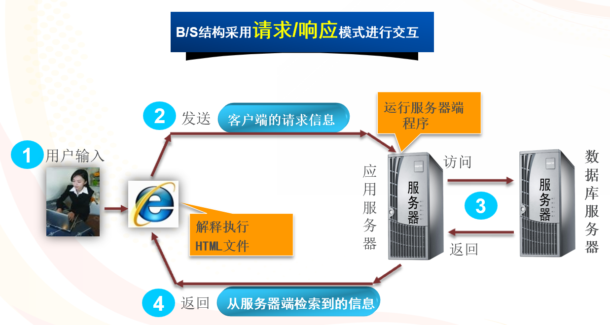
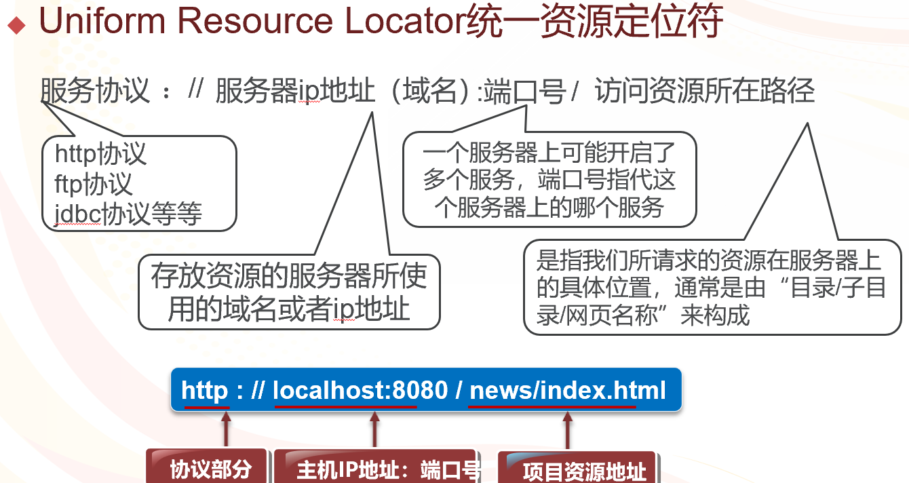
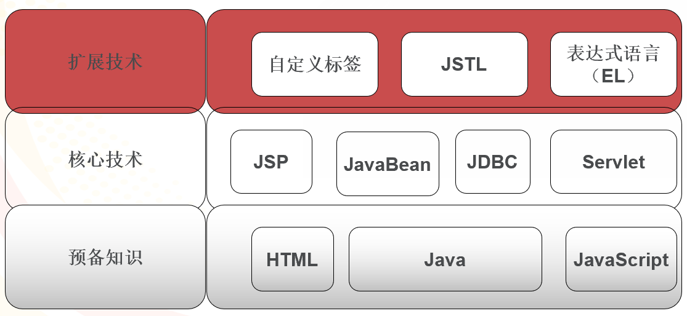
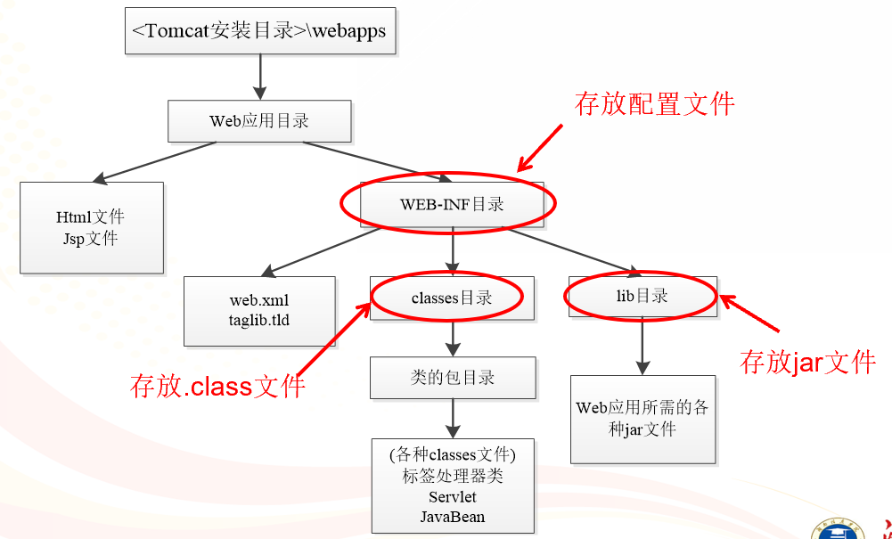
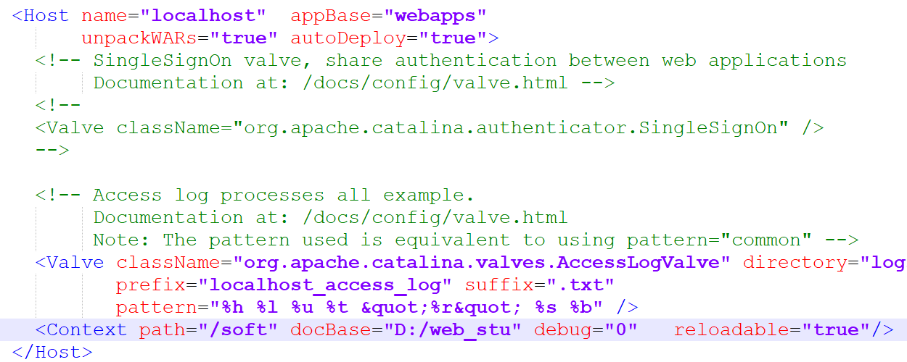

# JSP技术介绍

## B/S体系架构

- C/S的局限性：需要安装不同的客户端软件
- B/S的优点：Internet全球用户群中资源共享，无需安装客户端软件

### B/S技术的工作原理



## URL



## JSP知识体系结构



## Web应用

所谓Web应用就是**多个Web资源的集合**，它也称为Web应用程序或Web工程。



安装目录**webapps下的任何一个子目录**都可以作为一个Web服务目录。

例如：`webapps\test\test1.jsp`，通过http://localhost:8080/test/test1.jsp进行访问

### 新建Web服务目录

对于其他目录的文件，如`D:\web_stu\test1.jsp`，想要成为Web服务目录需要打开server.xml（conf目录下）文件，在< Host>< /Host>之间（server.xml文件尾部）加入以下代码：

```xml
<Context path="/soft" docBase="D:/web_stu" debug="0"   reloadable="true"/><!--需要重启Tomcat服务	startup.bat开启	shutdown.bat关闭-->
```

访问方式为：`http://localhost:8080/soft/test1.jsp`注意这里虚拟地址"/soft"代替了"D:/web_stu"



### 相对服务目录

Web服务目录下的目录称为**该Web服务目录下的相对Web服务目录**，如果D:/web_stu下存在次级目录example，则访问方式如下：

`http://localhost:8080/soft/example/test1.jsp`

**（Web下文件夹命名一定采用纯小写，如果有大写则要加数字）**