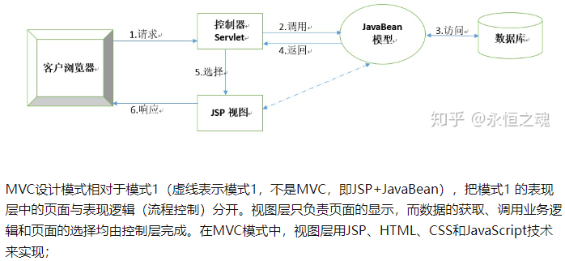

# MVC设计模式

**MVC**的全名是Model View Controller，是**模型(Model)－视图(view)－控制器(controller)**的缩写，是一种设计模式。它是**用一种**业务逻辑、数据与界面显示分离的方法来组织代码，**将众多的业务逻辑聚集到一个部件里面**，在需要改进和个性化定制界面及用户交互的同时，不需要重新编写业务逻辑，达到减少编码的时间，提高代码复用性

- 模型层（Model）：指从现实世界中抽象出来的对象模型，是应用逻辑的反应；它封装了数据和对数据的操作，是实际进行数据处理的地方（模型层与数据库才有交互）

- 视图层（View）：是应用和用户之间的接口，它负责将应用显示给用户 和 显示模型的状态。

- 控制器（Controller）:控制器负责视图和模型之间的交互，控制对用户输入的响应、响应方式和流程；它主要负责两方面的动作，一是把用户的请求分发到相应的模型，二是吧模型的改变及时地反映到视图上。

## 网页

- V即View视图是指用户看到并与之交互的界面。比如由html元素组成的网页界面，或者软件的客户端界面。MVC的好处之一在于它能为应用程序处理很多不同的视图。在视图中其实没有真正的处理发生，它只是**作为一种输出数据并允许用户操纵的方式**。

- M即model模型是指模型表示业务规则。在MVC的三个部件中，模型拥有最多的处理任务。被模型返回的数据是中立的，模型与数据格式无关，这样一个模型能为多个视图提供数据，由于**应用于模型的代码只需写一次就可以被多个视图重用**，所以减少了代码的重复性。

- C即controller控制器是指控制器接受用户的输入并调用模型和视图去完成用户的需求，**控制器本身不输出任何东西和做任何处理**。它只是接收请求并**决定调用哪个模型构件**去处理请求，然后再确定用哪个视图来显示返回的数据


## jsp+servlet+javabean模式

- JavaBean作为模型，既可以作为**数据模型来封装业务数据**，又可以作为业务逻辑模型来**包含应用的业务操作**。其中，数据模型用来存储或传递业务数据，而业务逻辑模型接收到控制器传过来的模型更新请求后，**执行特定的业务逻辑处理**，然后**返回相应的执行结果**。

- JSP作为视图层，负责提供页面为用户展示数据，提供相应的表单（form）来用于用户的请求，并在适当的时候（点击按钮）向控制器发出请求来请求模型进行更新。

- Serlvet作为控制器，用来**接收用户提交的请求**，然后获取请求中的数据，将之**转换为业务模型需要的数据模型**，然后**调用业务模型相应的业务方法进行更新**，同时**根据业务执行结果来选择要返回的视图**。



## 应用：实现用户查询功能


- 2个JSP页面：**首页index.jsp**和**结果列表显示页面listUser.jsp**
- 1个Servlet：负责**处理用户查询的请求的Servlet类FindAllServlet**
- 1个JavaBean类：**封装用户信息的JavaBean类Users**
- 1个**数据库连接与关闭的类DBUtil.java**，1个**操作数据库的类UserDaoImpl.java**

### index.jsp-->首页

```jsp
<%@ page contentType="text/html;charset=UTF-8" language="java" %>
<html>
<head>
    <title>Title</title>
</head>
<body>
    <a href="../findServlet">用户列表</a><br>
    <a href="add.jsp">添加用户</a><br>
</body>
</html>
```

### displayUsers.jsp(listUser.jsp)-->列表显示页面

```java
<%@ page contentType="text/html;charset=UTF-8" language="java" %>
<html>
<head>
    <title>Title</title>
</head>
<body>
    <table border="1">
        <tr>
            <td>ID</td>
            <td>用户名</td>
            <td>密码</td>
            <td>邮箱</td>
            <td>出生日期</td>
            <td>操作</td>
        </tr>
        <c:forEach var="user" items="${requestScope.userList}"><!--循环输出链表-->
        <tr>
            <td>${user.id}</td>
            <td>${user.name}</td>
            <td>${user.password}</td>
            <td>${user.email}</td>
            <td>${user.birthday}</td>
            <td><a href="javascript:del(${user.id})">删除</a></td><!--JS语法无法传递多个值-->
            <td><a href="/untitled_war_exploded/JDBC/update.jsp?id=${user.id}&name=${user.name}&password=${user.password}&email=${user.email}&birthday=${user.birthday}">修改</a></td><!--每个a都是一个块作用域-->
        </tr>
        </c:forEach>
    </table>
    <a href="/untitled_war_exploded/JDBC/add.jsp">添加</a>
    <script>
        function del(id){
            //弹出确认对话框，点击确认按钮返回值为true,点击取消按钮返回值为false
            if(window.confirm("你真的要删除本行数据吗？")){
                //地址栏跳转到delUserServlet，并传递id值
                location.href="deleteServlet?id="+id;//注意这里的地址
            }
        }
    </script>
</body>
</html>
```

### findServlet.java(FindAllServlet.java)-->处理用户请求

```java
package JDBC;

import DAO.UserDao;

@WebServlet(name = "findServlet",urlPatterns = "/findServlet")
public class findServlet extends HttpServlet {//处理用户请求

    @Override
    protected void doPost(HttpServletRequest req, HttpServletResponse resp) throws ServletException, IOException {
        req.setCharacterEncoding("UTF-8");//编码
        List<User> list = UserDao.findAllUser();//得到链表
        req.setAttribute("userList", list);
        req.getRequestDispatcher("/JDBC/displayUsers.jsp").forward(req, resp);
    }

    @Override
    protected void doGet(HttpServletRequest req, HttpServletResponse resp) throws ServletException, IOException {
        doPost(req, resp);
    }
}//省略了部分导入包的名称
```

### User.java(Users.java)-->JavaBean封装用户信息

```java
package JDBC;

import java.sql.Date;//是sql类的Date

public class User {//创建用户信息实体类
    private int id;
    private String name;
    private String password;
    private String email;
    private Date birthday;

    public User() {
    }

    public User(int id, String name, String password, String email, Date birthday) {
        this.id = id;
        this.name = name;
        this.password = password;
        this.email = email;
        this.birthday = birthday;
    }
}//省略了set和get方法 
```

### JDBCConnection.java(DBUtil.java)-->数据库连接与关闭类

```java
package utils;

import java.sql.*;

public class JDBCConnection {
    static Connection conn = null;
    public static Connection getConnection(){
        String driver = "com.mysql.jdbc.Driver";
        String url = "jdbc:mysql://localhost:3306/student?serverTimezone=GMT%2B8&characterEncoding=UTF-8";//数据库名称和编码方式，用&连接
        String username = "root";
        String password = "yuxingxuan";
            try {
                Class.forName(driver);//注册驱动
                conn = DriverManager.getConnection(url,username,password);
            } catch (ClassNotFoundException | SQLException e) {
                e.printStackTrace();
            }
        return conn;//将连接返回
    }
    public static void release(Connection conn,Statement stmt,ResultSet rs){//查询时需要使用的
        if(conn!=null){
            try {
                conn.close();
            } catch (SQLException e) {
                e.printStackTrace();
            }
        }
        if(stmt!=null){
            try {
                stmt.close();
            } catch (SQLException e) {
                e.printStackTrace();
            }
        }
        if(rs!=null){
            try {
                rs.close();
            } catch (SQLException e) {
                e.printStackTrace();
            }
        }
    }
    public static void release(Connection conn,Statement stmt){
        if(conn!=null){
            try {
                conn.close();
            } catch (SQLException e) {
                e.printStackTrace();
            }
        }
        if(stmt!=null){
            try {
                stmt.close();
            } catch (SQLException e) {
                e.printStackTrace();
            }
        }

    }
    public static void release(Connection conn,PreparedStatement ps){
        if(conn!=null){
            try {
                conn.close();
            } catch (SQLException e) {
                e.printStackTrace();
            }
        }
        if(ps!=null){
            try {
                ps.close();
            } catch (SQLException e) {
                e.printStackTrace();
            }
        }

    }
}//省略了部分导入包的名称
```

### UserDao.java(UserDaoImpl.java)-->数据库操作类

```java
package DAO;

import JDBC.User;
import utils.JDBCConnection;

public class UserDao {
    static Connection conn = null;
    static Statement stmt = null;
    static ResultSet rs = null;
    static PreparedStatement ps = null;
    public static List<User> findAllUser(){
        String sql = "select * from users";
        List<User> list = new ArrayList<>();//创建一个链表，将值输入此链表当中
        conn = JDBCConnection.getConnection();
        try {
            stmt = conn.createStatement();
            rs = stmt.executeQuery(sql);
            while (rs.next()){
                User user = new User();//创建一个user对象存储信息
                user.setId(rs.getInt(1));
                user.setName(rs.getString(2));
                user.setPassword(rs.getString(3));
                user.setEmail(rs.getString(4));
                user.setBirthday(rs.getDate(5));
                list.add(user);//将user对象存入链表
            }
        } catch (SQLException e) {
            e.printStackTrace();
        }finally {
            JDBCConnection.release(conn,stmt,rs);
        }
        return list;
    }
}//省略了部分导入包的名称
```

### 运行结果

首页：


显示：


## 实现用户添加addServlet类

```java
package JDBC;

import DAO.UserDao;
import utils.StringUtil;

@WebServlet(name = "updateServlet" , urlPatterns = "/updateServlet")
public class updateServlet extends HttpServlet {
    protected void doPost(HttpServletRequest req, HttpServletResponse resp)throws ServletException, IOException {
        req.setCharacterEncoding("UTF-8");
        User user = new User();
        if(StringUtil.isNotEmptyOrNull(req.getParameter("name"))
                &&StringUtil.isNotEmptyOrNull(req.getParameter("password"))
                &&StringUtil.isNotEmptyOrNull(req.getParameter("birthday"))
                &&StringUtil.isNotEmptyOrNull(req.getParameter("id"))) {
            user.setName(req.getParameter("name"));
            user.setPassword(req.getParameter("password"));
            user.setEmail(req.getParameter("email"));
            user.setBirthday(StringUtil.strToDate(req.getParameter("birthday")));//sql那里需要sql的Date格式数据
            user.setId(Integer.parseInt(req.getParameter("id")));
            Boolean b = UserDao.update(user);
            req.setAttribute("result",b);
            req.getRequestDispatcher("/JDBC/result.jsp").forward(req,resp);
        }else {
            Boolean c = false;
            req.setAttribute("result",c);
            req.getRequestDispatcher("/JDBC/result.jsp").forward(req,resp);
        }
    }
    protected void doGet(HttpServletRequest req, HttpServletResponse resp)throws ServletException, IOException{
        doPost(req,resp);
    }
}//省略了部分导入包的名称
```

## 实现用户添加add.jsp页

```jsp
<form action="/untitled_war_exploded/addServlet" method="post">
    名字：<input type="text" name="name"><br>
    密码：<input type="password" name="password"><br>
    邮箱：<input type="email" name="email"><br>
    生日：<input type="date" name="birthday">
    <input type="submit" value="提交">
    <input type="reset" value="重置">
</form>
```

## 实现用户删除deleteServlet类(不需要额外的jsp页)

```java
package JDBC;

import DAO.UserDao;

@WebServlet(name = "deleteServlet",urlPatterns = "/deleteServlet")
public class deleteServlet extends HttpServlet {//处理用户请求

    @Override
    protected void doPost(HttpServletRequest req, HttpServletResponse resp) throws ServletException, IOException {
        req.setCharacterEncoding("UTF-8");//编码
        int i = Integer.parseInt(req.getParameter("id"));//用接收表单的方式接收
        boolean b = UserDao.delete(i);
        req.setAttribute("result",b);
        req.getRequestDispatcher("/JDBC/result.jsp").forward(req,resp);
    }

    @Override
    protected void doGet(HttpServletRequest req, HttpServletResponse resp) throws ServletException, IOException {
        doPost(req, resp);
    }
}//省略了部分导入包的名称
```

## 实现用户修改updateServlet类

```java
package JDBC;

import DAO.UserDao;
import utils.StringUtil;

@WebServlet(name = "updateServlet" , urlPatterns = "/updateServlet")
public class updateServlet extends HttpServlet {
    protected void doPost(HttpServletRequest req, HttpServletResponse resp)throws ServletException, IOException {
        req.setCharacterEncoding("UTF-8");
        User user = new User();
        if(StringUtil.isNotEmptyOrNull(req.getParameter("name"))
                &&StringUtil.isNotEmptyOrNull(req.getParameter("password"))
                &&StringUtil.isNotEmptyOrNull(req.getParameter("birthday"))
                &&StringUtil.isNotEmptyOrNull(req.getParameter("id"))) {
            user.setName(req.getParameter("name"));
            user.setPassword(req.getParameter("password"));
            user.setEmail(req.getParameter("email"));
            user.setBirthday(StringUtil.strToDate(req.getParameter("birthday")));//sql那里需要sql的Date格式数据
            user.setId(Integer.parseInt(req.getParameter("id")));
            Boolean b = UserDao.update(user);
            req.setAttribute("result",b);
            req.getRequestDispatcher("/JDBC/result.jsp").forward(req,resp);
        }else {
            Boolean c = false;
            req.setAttribute("result",c);
            req.getRequestDispatcher("/JDBC/result.jsp").forward(req,resp);
        }
    }
    protected void doGet(HttpServletRequest req, HttpServletResponse resp)throws ServletException, IOException{
        doPost(req,resp);
    }
}//省略了部分导入包的名称
```

## 实现用户修改update.jsp

```jsp
<form action="/untitled_war_exploded/updateServlet" method="post">
    id:<input type="text" name="id0" value="${param.id}" disabled><br><!--不可修改,默认值也不会提交过去-->
    <input type="text" name="id" value="${param.id}" hidden>
    名字：<input type="text" name="name" value="${param.name}"><br>
    密码：<input type="password" name="password" value="${param.password}"><br>
    邮箱：<input type="email" name="email" value="${param.email}"><br>
    生日：<input type="date" name="birthday" value="${param.birthday}"><br>
    <input type="submit" value="提交">
    <input type="reset" value="重置">
</form>
```

## 中介结果处理result.jsp

```jsp
<%@ taglib prefix="c" uri="http://java.sun.com/jsp/jstl/core" %>
<c:if test="${requestScope.result}">
        操作成功
        <a href="/untitled_war_exploded/findServlet">返回用户列表</a>
    </c:if>
    <c:if test="${!requestScope.result}"><!--对布尔值取反-->
        操作失败（存在数据输入为空的情况）
        <a href="/untitled_war_exploded/findServlet">返回用户列表</a>
    </c:if>
```

## 完整的数据库操作类UserDao.java

```java
package DAO;

import JDBC.User;
import utils.JDBCConnection;

import java.sql.*;
import java.util.ArrayList;
import java.util.List;

public class UserDao {//所有对用户信息处理的方法
    static Connection conn = null;
    static Statement stmt = null;
    static ResultSet rs = null;
    static PreparedStatement ps = null;//可以对sql语句进行预编译
    public static List<User> findAllUser(){
        String sql = "select * from users";
        List<User> list = new ArrayList<>();//创建一个链表，将值输入此链表当中
        conn = JDBCConnection.getConnection();
        try {
            stmt = conn.createStatement();
            rs = stmt.executeQuery(sql);
            while (rs.next()){
                User user = new User();//创建一个user对象存储信息
                user.setId(rs.getInt(1));
                user.setName(rs.getString(2));
                user.setPassword(rs.getString(3));
                user.setEmail(rs.getString(4));
                user.setBirthday(rs.getDate(5));
                list.add(user);//将user对象存入链表
            }
        } catch (SQLException e) {
            e.printStackTrace();
        }finally {
            JDBCConnection.release(conn,stmt,rs);
        }
        return list;
    }
    public static boolean delete(int id){
        String sql = "delete from users where id = ?";
        conn = JDBCConnection.getConnection();
        try {
            ps = conn.prepareStatement(sql);//预编译
            ps.setInt(1,id);//告诉第一个'?'的内容
            ps.executeUpdate();//选择更新executeUpdate()，不是运行ps.executeQuery();
        } catch (SQLException e) {
            return false;
        }finally {
            JDBCConnection.release(conn,ps);
        }
        return true;
    }
    public static boolean add(User user){
        String sql = "insert into users(name,password,email,birthday) " + "values(?,?,?,?)";
        conn = JDBCConnection.getConnection();
        try {
            ps = conn.prepareStatement(sql);
            ps.setString(1,user.getName());
            ps.setString(2,user.getPassword());
            ps.setString(3,user.getEmail());
            ps.setDate(4,user.getBirthday());
            ps.executeUpdate();
        } catch (SQLException e) {
            return false;
        }finally {
            JDBCConnection.release(conn,ps);
        }
        return true;
    }
    public static boolean update(User user){
        String sql = "update users set name =?, password = ?, email = ?, birthday = ? where id = ?";//？号不能加引号，否则会当成字符处理
        conn = JDBCConnection.getConnection();
        try {
            ps = conn.prepareStatement(sql);
            ps.setString(1,user.getName());
            ps.setString(2,user.getPassword());
            ps.setString(3,user.getEmail());
            ps.setDate(4,user.getBirthday());
            ps.setInt(5,user.getId());
            ps.executeUpdate();
        } catch (SQLException e) {
            return false;
        }finally {
            JDBCConnection.release(conn,ps);
        }
        return true;
    }
}
```

## 判断以及转换日期工具类StringUtil.java

```java
package utils;

import java.sql.Date;
import java.text.SimpleDateFormat;

public class StringUtil {
    /**
     * 判断字符串是否为空
     * @param str
     * @return
     */
    public static boolean isNotEmptyOrNull(String str){
        if(str!=null&&!"".equals(str))//JSP表达式获取如果找不到变量或者值为空，则默认值就是什么都没有，而不是null
            return true;
        else
            return false;
    }

    /**
     * 将string转换成日期
     * @param sDate
     * @return
     */
    public static Date strToDate(String sDate)  {
        String str = sDate;
        SimpleDateFormat format = new SimpleDateFormat("yyyy-MM-dd");
        java.util.Date d = null;
        try {
            d = format.parse(str);
        } catch (Exception e) {
            e.printStackTrace();
        }
        java.sql.Date date = new java.sql.Date(d.getTime());//通过getTime方法转换
        return date;
    }
}
```

## 总览


## 运行结果

添加：


删除：


修改：


