# JDBC数据库连接池

## 数据库连接池

在JDBC编程中，每次**创建和断开Connection对象**都会消耗一定的时间和IO资源。

假如某网站一天的访问量是10万，那么该网站的服务器就需要创建、断开连接10万次，频繁地创建、断开数据库连接会影响数据库的访问效率，甚至导致数据库崩溃。

> 为了避免频繁的创建数据库连接，数据库连接池技术应运而生。数据库连接池负责分配、管理和释放数据库连接，它允许应用程序重复使用现有的数据库连接，而不是重新建立。简单地说，数据库连接池就是为数据库建立的一个“缓冲池”。预先在“缓冲池”中放入一定数量的连接，当需要建立数据库连接时，只需要从“缓冲池”中取出一个，使用完毕后再放回“缓冲池”即可。

原理图：

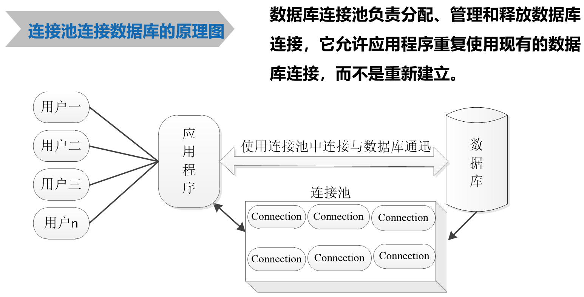

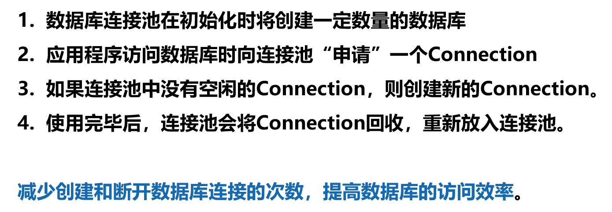

## DataSource接口

为了获取数据库连接对象（Connection），JDBC提供了**javax.sql.DataSource接口**，javax.sql.DataSource接口负责与数据库建立连接，并定义了返回值为Connection对象的方法，具体如下:

- Connection getConnection() 
- Connection getConnection(String username, String password)

> 接口通常都会有实现类，javax.sql.DataSource接口也不例外，通常习惯性的把实现了javax.sql.DataSource接口的类称为**数据源**，顾名思义，数据源即数据的来源。每创建一个数据库连接，这个数据库连接信息都会存储到数据源中。 


## C3P0数据库连接池

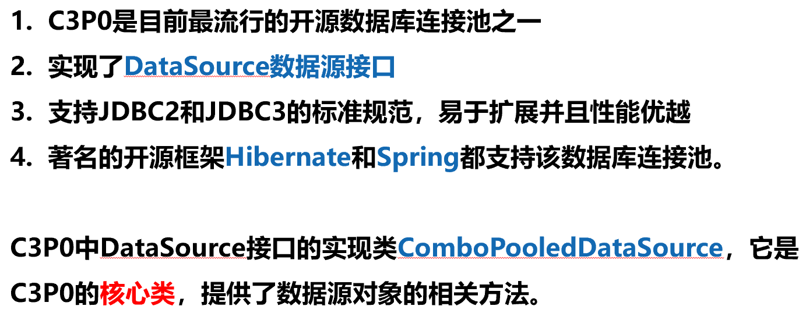

**ComboPooledDataSource类的常用方法**

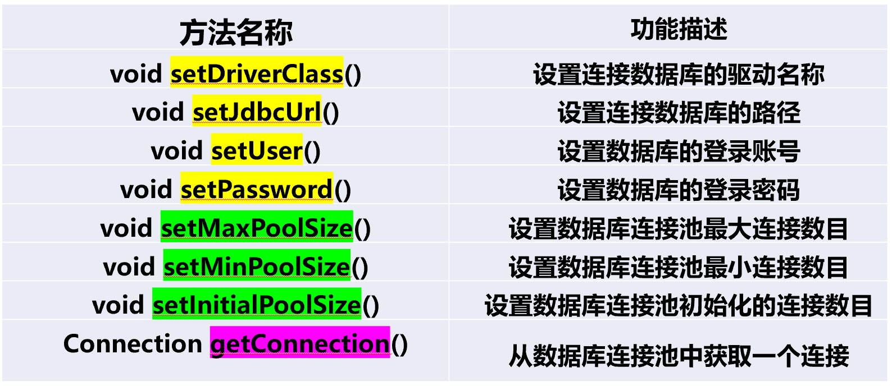

### 使用C3P0数据库连接池

**导入JAR包**


当使用C3P0数据库连接池时，首先需要创建数据源对象，创建数据源对象可以通过调用**ComboPooledDataSource类的构造方法**实现。

- ComboPooledDataSource()
- ComboPooledDataSource(String configName)。

### 通过ComboPooledDataSource()构造方法创建数据源对象

调用**ComboPooledDataSource()构造方法**创建数据源对象，需要手动给数据源对象设置属性值，然后获取数据库连接对象。

```java
import com.mchange.v2.c3p0.ComboPooledDataSource;
import javax.sql.DataSource;
import java.beans.PropertyVetoException;
import java.sql.SQLException;

public class Example03 {
    //定义接口对象
    public static DataSource ds = null;
    static{
        //拿到C3P0的实现类
        ComboPooledDataSource cpds = new ComboPooledDataSource();
        try {
            //设置数据源参数
            cpds.setDriverClass("com.mysql.cj.jdbc.Driver");
            cpds.setJdbcUrl("jdbc:mysql://localhost:3306/student?serverTimezone=GMT%2B8");
            cpds.setUser("root");
            cpds.setPassword("yuxingxuan");
            //设置数据库连接参数
            //连接池初始化连接数量，参数为int类型的值
            cpds.setInitialPoolSize(5);
            //最大连接数量
            cpds.setMaxPoolSize(15);
            //C3P0的数据池赋值给数据源
            ds=cpds;
        } catch (PropertyVetoException e) {
            e.printStackTrace();
        }
    }
    //主方法进行测试，抛出异常
    public static void main(String[] args) throws SQLException {
        //获得数据库连接对象
        //并输出控制台,可以看到已拿到连接对象，底层用动态代理的方式实现
        System.out.print(ds.getConnection());
    }
}
```

运行结果：

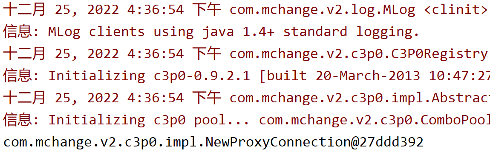

### 通过ComboPooledDataSource(String configName)构造方法创建数据源对象

调用**ComboPooledDataSource(String configName)构造方法**可以读取**c3p0-config.xml配置文件**(需要放在src目录下)，
根据配置文件中的配置信息创建数据源对象，然后获取数据库连接对象。

```java
import com.mchange.v2.c3p0.ComboPooledDataSource;
import javax.sql.DataSource;
import java.sql.SQLException;

public class Example04 {
    public static DataSource ds = null; //定义接口对象
    static{//使用静态代码块
        /* 1.没有参数的话(无参构造器)，直接读取c3p0-config.xml配置文件中的默认的连接池 ,c3p0-config.xml配置文件是放在src目录下，c3p0连接池会自动去读文件中的信息*/
        //2.获得name为itcast的连接对象
        ComboPooledDataSource cpds = new ComboPooledDataSource("mybatis");
        ds = cpds;
    }
    //主方法进行测试，异常抛出
    public static void main(String[] args) throws SQLException {
        System.out.println(ds.getConnection());
    }
}
```

c3p0-config.xml

```xml
<?xml version="1.0" encoding="UTF-8"?>
<c3p0-config>
    <!--配置了3套数据源，<default-config>是默认配置，在没有指定配置信息时默认使用该配置信息
    创建C3P0数据库连接池对象，<named-config name="itcast">是自定义配置-->
    <default-config>
        <property name="driverClass">com.mysql.cj.jdbc.Driver</property>
        <property name="jdbcUrl">
            jdbc:mysql://localhost:3306/student?serverTimezone=GMT%2B8
        </property>
        <property name="user">root</property>
        <property name="password">yuxingxuan</property>
        <!--连接超时时间，单位是毫秒-->
        <property name="checkoutTimeout">30000</property>
        <!--初始化连接池的数量 -->
        <property name="initialPoolSize">10</property>
        <!--最大超时的时间 -->
        <property name="maxIdleTime">30</property>
        <!--连接池最大数据和最小数据 -->
        <property name="maxPoolSize">100</property>
        <property name="minPoolSize">10</property>
        <!--最大的等待时间-->
        <property name="maxStatements">200</property>
    </default-config>

    <named-config name="itcast">
        <property name="driverClass">com.microsoft.sqlserver.jdbc.SQLServerDriver</property>
        <property name="jdbcUrl">
            jdbc:sqlserver://localhost:1433;DatabaseName=studentDatabase
        </property>
        <property name="user">sa</property>
        <property name="password">123456</property>
        <property name="initialPoolSize">5</property>
        <property name="maxPoolSize">15</property>
    </named-config>

    <named-config name="mybatis">
        <property name="driverClass">com.mysql.cj.jdbc.Driver</property>
        <property name="jdbcUrl">
            jdbc:mysql://localhost:3306/jdbc?serverTimezone=GMT%2B8
        </property>
        <property name="user">root</property>
        <property name="password">yuxingxuan</property>
        <property name="initialPoolSize">5</property>
        <property name="maxPoolSize">15</property>
    </named-config>
</c3p0-config>

```

运行结果：

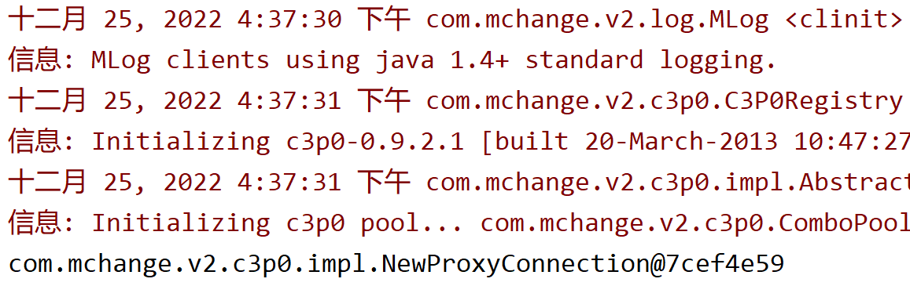

**值得注意的是**


## DBUtils工具


DBUtils工具的作用：

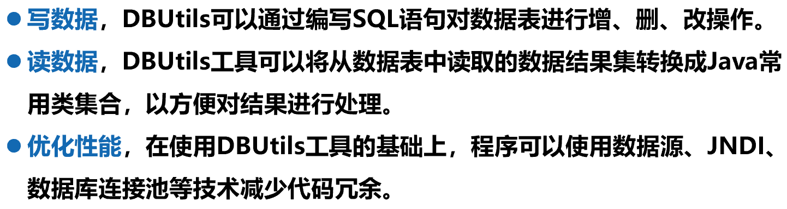

DBUtils的核心类库的三个核心API：

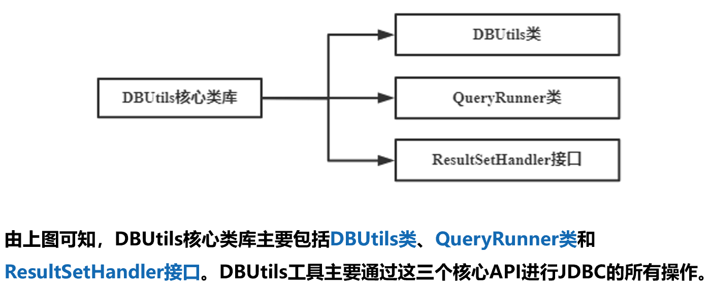

DBUtils类的常用方法：

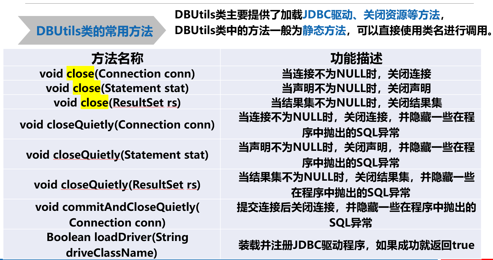

### QueryRunner类

QueryRunner类简化了执行SQL语句的代码，它与ResultSetHandler配合就能完成大部分的数据库操作。

> QueryRunner类提供了一个带有参数的构造方法，该方法**以javax.sql.DataSource的实例对象作为参数传递到QueryRunner的构造方法中来获取Connection对象**。针对不同的数据库操作，QueryRunner类提供不同的方法。

**常用方法**

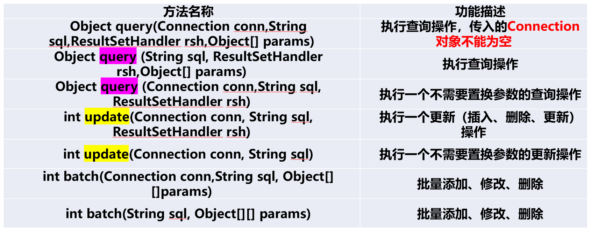

### ResultSetHandler接口

ResultSetHandler接口用于处理ResultSet结果集，它可以将结果集中的数据转换为不同的形式。ResultSetHandler提供了几种常见的实现类。

> BeanHandler：将结果集中的第一行数据封装到一个对应的JavaBean实例中。
> BeanListHandler：将结果集中的每一行数据都封装到一个对应的JavaBean实例中，并存放到List里。
> ColumnListHandler：将某列属性的值封装到List集合中。
> ScalarHandler：将结果集中某一条记录的某一列数据存储成Object对象。

> ResultSetHandler接口还提供了一个单独的方法handle (java.sql.ResultSet rs)，如果上述实现类没有提供想要的功能，可以自定义一个实现ResultSetHandler接口的类，然后通过重写handle()方法，实现结果集的处理

**BeanHandler和BeanListHandler**

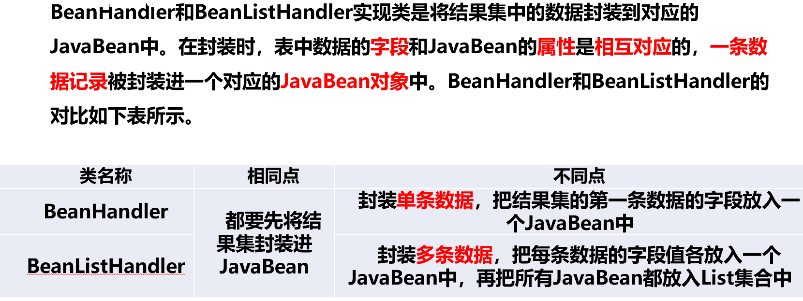


**ColumnListHandler和ScalarHandler**

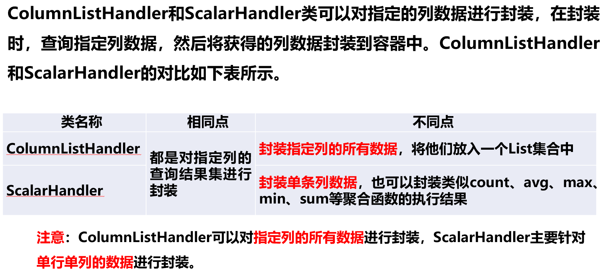

### 使用DBUtils实现增删改查的思路

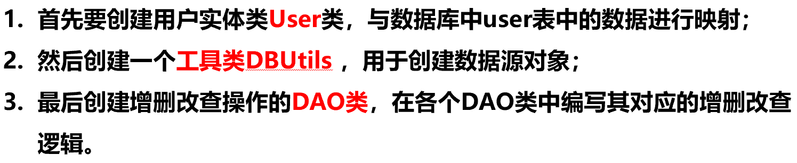

sql

```sql
USE jdbc;

CREATE TABLE USER(
id INT(3) PRIMARY KEY AUTO_INCREMENT,
NAME VARCHAR(20) NOT NULL,
PASSWORD VARCHAR(20) NOT NULL
);

INSERT INTO USER(NAME,PASSWORD) VALUES ('zhangsan','123456');
INSERT INTO USER(NAME,PASSWORD) VALUES ('lisi','123456');
INSERT INTO USER(NAME,PASSWORD) VALUES ('wangwu','123456');
```

User.java

```java
public class Users {
    private int id;
    private String name;
    private String password;
    //get和set方法

    public int getId() {
        return id;
    }

    public void setId(int id) {
        this.id = id;
    }

    public String getName() {
        return name;
    }

    public void setName(String name) {
        this.name = name;
    }

    public String getPassword() {
        return password;
    }

    public void setPassword(String password) {
        this.password = password;
    }

    @Override
    public String toString() {
        return "Users{" +
                "id=" + id +
                ", name='" + name + '\'' +
                ", password='" + password + '\'' +
                '}';
    }
}
```

**省略了JDBCUtils.java**

BaseDao.java

```java
import org.apache.commons.dbutils.ResultSetHandler;

import java.sql.Connection;
import java.sql.PreparedStatement;
import java.sql.ResultSet;
import java.sql.SQLException;

public class BaseDao {
    //查询优化
    //sql,结果集（?做为枚举替换），参数(可变的对象数组，写在最后）
    public Object query(String sql, ResultSetHandler<?> rsh, Object... params){
        Connection conn = null;
        PreparedStatement prst = null;
        ResultSet rs = null;
        //获得连接
        try {
            conn = JDBCUtils.getConnection();
            //预编译sql
            prst = conn.prepareStatement(sql);
            //将参数设置进去,params不能为空
            for(int i=0;i<params.length && params!=null;i++){
                prst.setObject(i+1,params[i]);
            }
            //发送sql
            rs = prst.executeQuery();
            //让调用者去实现对结果集的处理
            Object obj = rsh.handle(rs);
            return obj;
        } catch (SQLException | ClassNotFoundException e) {
            e.printStackTrace();
        } finally {
            //释放资源
            JDBCUtils.release(rs,prst,conn);
        }
        return null;
    }
}
```

ResultSetTest01.java

```java
import org.apache.commons.dbutils.handlers.BeanHandler;

import java.sql.SQLException;

public class ResultSetTest01 {
    public static void testBeanHandler() throws SQLException {
        //获得dao
        BaseDao baseDao = new BaseDao();
        //sql
        String sql = "select * from users where id=?";
        /*执行sql,传一个封装对象，BeanHandler需要一个泛型，参数为User的字节码对象，问号替换的参数*/
        //BeanHandler返回一个JavaBean，这里查找id=3的用户信息
        Users user =(Users)baseDao.query(sql,new BeanHandler(Users.class),3);
        System.out.println(user);
    }
    //main方法进行测试
    public static void main(String[] args) throws SQLException {
        testBeanHandler();
    }
}
//运行结果：Users{id=3, name='wangwu', password='123456'}
```

ResultSetTest02.java

```java
import org.apache.commons.dbutils.handlers.BeanListHandler;

import java.sql.SQLException;
import java.util.ArrayList;
import java.util.List;

public class ResultSetTest02 {
    public static void testBeanListHandler() throws SQLException {
        BaseDao baseDao = new BaseDao();//拿到baseDao
        String sql = "select * from users";
        List<Users> list = new ArrayList<Users>();
        //执行sql，这里BeanListHandler返回的是个链表
        list = (ArrayList)baseDao.query(sql,new BeanListHandler(Users.class));
        //循环遍历
        for(int i=0; i<list.size();i++){
            System.out.println(list.get(i));
        }
    }
    public static void main(String[] args) throws SQLException{
        testBeanListHandler();
    }
}
//运行结果：Users{id=1, name='zhangsan', password='123456'}
//Users{id=2, name='lisi', password='123456'}
//Users{id=3, name='wangwu', password='123456'}
```

ResultSetTest03.java

```java
import org.apache.commons.dbutils.handlers.ColumnListHandler;

import java.sql.SQLException;

public class ResultSetTest03 {
    public static void testColumnListHandler() throws SQLException {
        BaseDao baseDao = new BaseDao();
        String sql = "select * from users";
        //执行sql,封装指定列(name)的所有数据，将他们放入一个List集合中
        //ColumnListHandler的参数列名为name,即取name列的值
        Object arr = (Object)baseDao.query(sql,new ColumnListHandler("name"));
        System.out.println(arr);
    }
    public static void main(String[] args) throws SQLException{
        testColumnListHandler();
    }
}
//运行结果：[zhangsan, lisi, wangwu]
```

ResultSetTest04.java

```java
import org.apache.commons.dbutils.handlers.ScalarHandler;

import java.sql.SQLException;

public class ResultSetTest04 {
    public static void testScalarHandler() throws SQLException {
        BaseDao baseDao = new BaseDao();
        String sql = "select * from users where id=?";
        //输出id=1的用户的名称
        Object arr = baseDao.query(sql,new ScalarHandler<>("name"),1);
        System.out.println(arr);
    }
    public static void main(String[] args) throws SQLException{
        testScalarHandler();
    }
}
//运行结果：zhangsan
```

