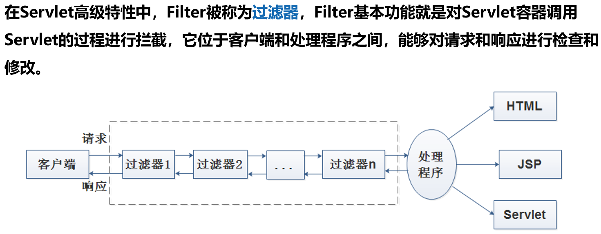

# Filter

## Filter概念



> 当客户端对服务器资源发出请求时，服务器会根据过滤规则进行检查，如果客户的请求满足过滤规则，则对客户请求进行拦截，对请求头和请求数据进行检查或修改，并依次通过过滤器链，最后把过滤之后的请求交给处理程序。

Filter中包含了3个接口，分别是**Filter接口、FilterConfig接口和FilterChain接口**，它们都位于javax.servlet包中

## Fileter接口


### FilterConfig接口


### FilterChain接口

FilterChain接口的doFilter()方法用于调用过滤器链中的下一个过滤器，如果这个过滤器是链上的最后一个过滤器，则将请求提交给处理程序或将响应发给客户端。

## Filter生命周期


## @WebFilter注解

> @WebFilter注解的属性filterName用于设置Filter的名称，urlPattern属性用于匹配用户请求的URL，例如“/MyServlet”，表示过滤器MyFilter会拦截发送到/MyServlet资源的请求。这个URL还可以使用通配符`“*”`表示，例如，`“*.do”`匹配所有以“.do”结尾的Servlet路径。


> 过滤器设置dispatcherTypes属性值为**REQUEST**时，如果用户通过**RequestDispatcher对象的include()方法或forward()方法访问**目标资源，那么过滤器不会被调用。除此之外，该过滤器会被调用。
>
> 过滤器设置dispatcherTypes属性值为**INCLUDE**时，如果用户通过**RequestDispatcher对象的include()方法访问目标资源**，那么过滤器将被调用。除此之外，该过滤器不会被调用。
>
> 过滤器设置dispatcherTypes属性值为**FORWARD**时，如果用户通过**RequestDispatcher对象的forward()方法访问目标资源**，那么过滤器将被调用。除此之外，该过滤器不会被调用。
>
> 过滤器设置dispatcherTypes属性值为**ERROR**时，如果通过**声明式异常处理机制调用目标资源，那么过滤器将被调用**。除此之外，过滤器不会被调用。

## Filter链拦截

在一个Web应用程序中可以注册多个Filter，每个Filter都可以针对某一个URL的请求进行拦截。如果多个Filter都对同一个URL的请求进行拦截，那么这些Filter就组成一个Filter链。**Filter链使用FilterChain对象**表示，FilterChain对象提供了一个**doFilter()**方法，该方法的作用是让Filter链上的当前过滤器放行，使请求进入下一个Filter。


> 当使用注解配置多个Filter时，用户无法控制它们的执行顺序，Filter的执行顺序是**按照Filter的类名控制的**，按自然排序的规则。例如，MyFilter01会比MyFilter02优先执行

Servlet.java

```java
import javax.servlet.ServletException;
import javax.servlet.annotation.WebServlet;
import javax.servlet.http.HttpServlet;
import javax.servlet.http.HttpServletRequest;
import javax.servlet.http.HttpServletResponse;
import java.io.IOException;

@WebServlet(name = "ServletTest" , urlPatterns = "/ServletTest")
public class Servlet extends HttpServlet {
    @Override
    protected void doGet(HttpServletRequest req, HttpServletResponse resp) throws ServletException, IOException {
        req.setCharacterEncoding("UTF-8");
        resp.getWriter().println("hello,servlet <br>");
    }

    @Override
    protected void doPost(HttpServletRequest req, HttpServletResponse resp) throws ServletException, IOException {
        doGet(req, resp);
    }
}
```

Filter.java

```java
import javax.servlet.*;
import javax.servlet.annotation.WebFilter;
import java.io.IOException;
//加上dispatcherTypes才能拦截对应的跳转
@WebFilter(filterName = "Filter",urlPatterns = "/ServletTest")
public class Filter implements javax.servlet.Filter {

    @Override
    public void init(FilterConfig filterConfig) throws ServletException {
        System.out.println("创建成功");
    }

    @Override
    public void doFilter(ServletRequest servletRequest, ServletResponse servletResponse, FilterChain filterChain) throws IOException, ServletException {
        servletRequest.setCharacterEncoding("utf-8"); // 响应内容转换为中文编码
        servletResponse.setContentType("text/html;charset=utf-8");// 请求浏览器转换为中文编码
        servletResponse.getWriter().println("hello,filter0-before <br>");
        //放行
        filterChain.doFilter(servletRequest,servletResponse);
        servletResponse.getWriter().println("hello,filter0-after <br>");
    }

    @Override
    public void destroy() {
        System.out.println("销毁成功");
    }
}
```

Filter1.java

```java
import javax.servlet.*;
import javax.servlet.annotation.WebFilter;
import java.io.IOException;
//加上dispatcherTypes才能拦截跳转
@WebFilter(filterName = "Filter1",urlPatterns = "/ServletTest")
public class Filter1 implements javax.servlet.Filter {

    @Override
    public void init(FilterConfig filterConfig) throws ServletException {
        System.out.println("创建成功");
    }

    @Override
    public void doFilter(ServletRequest servletRequest, ServletResponse servletResponse, FilterChain filterChain) throws IOException, ServletException {
        servletRequest.setCharacterEncoding("utf-8"); // 响应内容转换为中文编码
        servletResponse.setContentType("text/html;charset=utf-8");// 请求浏览器转换为中文编码
        servletResponse.getWriter().println("hello,filter01-before <br>");
        //放行
        filterChain.doFilter(servletRequest,servletResponse);
        servletResponse.getWriter().println("hello,filter01-after <br>");
    }

    @Override
    public void destroy() {
        System.out.println("销毁成功");
    }
}
```

访问/ServletTest的结果：


