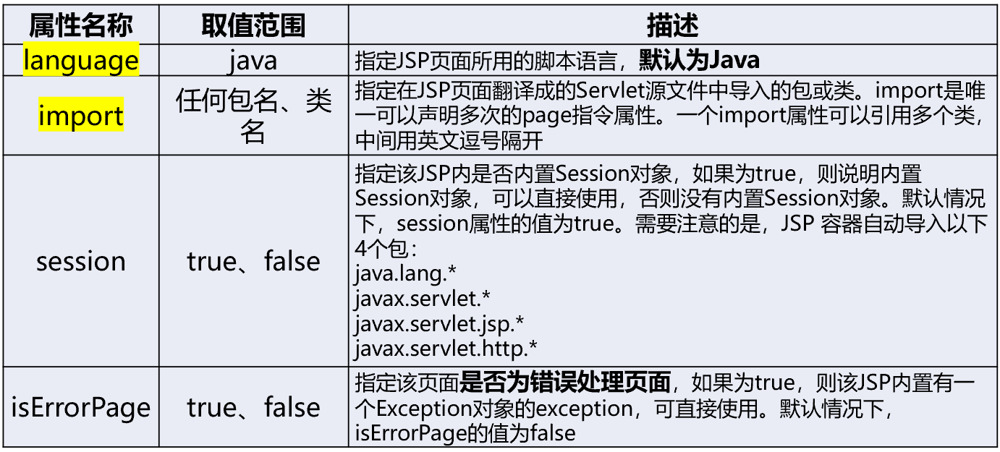
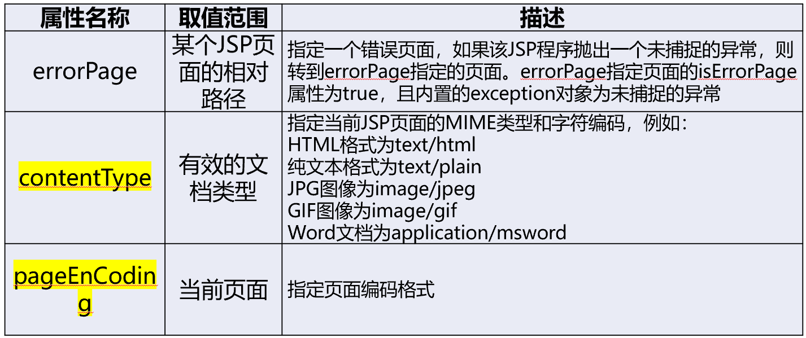
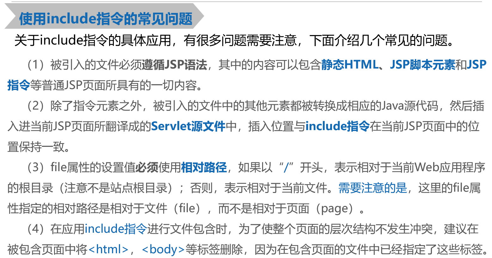

# JSP指令

## JSP的基本概念

### 定义：

JSP全名是**Java Server Pages**，即Java服务器页面。它是Servlet更高级别的扩展。
在JSP文件中，HTML代码与Java代码共同存在。

- HTML代码用来实现网页中静态内容的显示
- Java代码用来实现网页中动态内容的显示。

最终，JSP文件会通过Web服务器的Web容器编译成一个Servlet，用来处理各种请求。

### 特性：

1. 跨平台：应用于不同的系统，移植时不需要重新编译，**一次编译，到处运行**

2. 业务代码相分离：**HTML设计页面，JSP标签和脚本动态生成页面的内容**

3. 组件重用：**使用JavaBean编写业务组件**

4. 预编译：第一次请求，服务器对JSP进行编译，并且仅执行一次编译，**下次直接执行编译好的代码**

### 运行原理：


## JSP基本语法

### JSP页面组成


### JSP脚本元素

JSP脚本元素是指嵌套在“**<%**”和“**%>**”之中的一条或多条Java程序代码

1. **JSP Scriptlets ：<%java代码%>**
2. **声明标识 ：<%!定义变量或者方法等%>**
3. **JSP表达式：<%=expression%>**

#### JSP Scriptlets<% %>

JSP Scriptlets是一段代码片段，可以定义变量，进行输出，但**不能定义方法**

```java
<%
    int a = 1, b = 2; //定义两个变量a,b
    out.println(a+b);
%>
```

#### 声明标识<!% %>

声明标识定义**整个JSP页面**需要引用的变量或方法。


```java
<%!
    public int print() {     //定义print方法
        int a = 1, b = 2;    //定义两个变量a,b
        return a+b;
    }//值得注意的是，System.out.print可以在方法中使用，不过只会显示在控制台，方法中无法定义out.println语句
%>
<%
    out.println(print());  //调用print()方法，输出其返回值
%>//out.println才能输出在页面上
```

**两者对比**


#### JSP表达式<%=expression%>

JSP表达式（expression）用于**向页面输出信息**，该表达式最终运算结果将被转化为一个字符串。一般用于输出Java定义的变量，还可以在跳转时传值，例如：

```jsp
<%
	int id = re.getInt("id");
%>
<td><a href="../deleteServlet?id=<%=id%>">删除</a></td>
```

***

## JSP注释


**隐藏注释**：查看网页源代码的方式无法查看到

**动态注释**：由于HTML注释对JSP嵌入的代码不起作用，因此可以利用它们的组合注释构成**动态的HTML注释文本**。

```jsp
<!--<%=new Date()%-->//网页查看代码界面会显示时间
```

## JSP指令<%@ %>

### page指令

page指令的常用属性






### include指令

include指令只有一个file属性，用于指定要包含文件的路径。语法格式如下所示：

```jsp
<%@ include file="被包含的文件地址"%><!--插入文件的路径一般不以“/”开头，而是使用相对路径-->
```

demo.jsp

```jsp
<%@ page contentType="text/html;charset=UTF-8" language="java" %>
<html>
<head>
    <title>Title</title>
</head>
<body>
    <%!
        public String a(){
            return "你好";
        }
    %>
    <%
        out.print(a());
    %>
</body>
</html>
```

test.jsp

```jsp
<%@ page contentType="text/html;charset=UTF-8" language="java" %>
<html>
<head>
    <title>Title</title>
</head>
<body>
    <%@include file="demo.jsp"%><!--执行demo.jsp内容后会输出"你好"-->
</body>
</html>
```



### taglib指令


**小结**

- 作用：JSP指令用于控制对JSP页面的处理。

  - ①Page指令用于设置页面属性。

  - ②Include指令用于将所需的文件嵌入JSP页面。

  - ③Taglib指令允许用户创建个性化的标签。由用户创建的标签称为自定义标签。

- 特点： JSP 指令包括在 <%@ 和 %>内。
